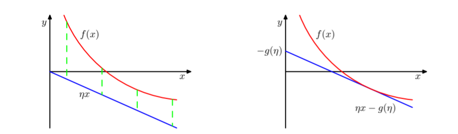

# Approximate Inference

概率模型的一个中心任务是在给定可见观测数据变量 $X$ 的情况下，计算潜在变量 $Z$ 的后验概率分布 $p(Z\mid X)$，以及计算这个概率分布的期望。对于实际应用中的许多模型来说，计算后验概率分布或者计算关于这个后验概率分布的期望是不可行的，这可能是由于：

- 潜在空间的维度过大以至于无法计算
- 后验概率分布的形式及其复杂，从而无法解析计算期望

在这种情况下，我们需要借助近似推断的方法。根据近似推断方法依赖于随即近似还是确定近似，可以将其分为两类：

- **随机方法：**例如 MCMC，这类方法的特点是在给定无限多计算资源的情况下可以产生相当精确的结果，近似的来源是使用了有限的处理时间
- **确定方法：**例如变分推断，这类方法适用于大规模的数据，基于对后验概率分布的解析近似，例如通过假设后验概率分布可以通过一种特定的方式分解，或者假设后验概率分布有一个具体的参数形式。这类方法永远不能产生精确的解。

## 1 Variational Inference

### 1.1 Functional and Calculus of  Variations

首先需要引入的是泛函和变分法的概念。泛函（functional）是这样一类函数，它以一个函数作为输入，并返回泛函的值作为输出，例如熵可以被看作是关于概率分布 $p$ 的泛函：
$$
H[p]=-\int p(x)\ln p(x)\mathrm{d}x
$$
另一个相关的概念是变分法（calculus of variations），变分法描述了求泛函的导数的方法，其规则与标准的微积分规则类似。

虽然变分方法本质上不涉及任何近似，但是其常用于寻找近似解，近似来源于对优化算法搜索的函数范围进行近似，在概率推断的应用中，限制条件的形式可以是可分解的假设。

考虑将变分法用于近似推断的具体方式，假设有一个纯贝叶斯模型，把所有观测变量的集合记作 $X$，把所有潜在变量和参数的集合记作 $Z$，模型本身确定了联合概率分布 $p(X,Z)$，目标是找到对后验概率分布 $p(Z\mid X)$ 和模型证据 $p(X)$ 的近似。我们对对数似然进行和 EM 算法中类似的分解：
$$
\ln p(X)=\mathcal{L}(q)+KL(q(Z)\Vert p(Z\mid X))\\
\mathcal{L}(q)=\int_Zq(Z)\ln\left[\frac{p(X,Z)}{q(Z)}\right]\mathrm{d}Z\\
KL(q(Z)\Vert p(Z\mid X))=-\int_Zq(Z)\ln\left[\frac{p(Z\mid X)}{q(Z)}\right]\mathrm{d}Z
$$
与之前的分解的区别是将参数向量 $\theta$ 整合至 $Z$ 中，并且将求和更改为积分以匹配连续变量。我们可以通过关于 $q(Z)$ 的最优化使得下界 $\mathcal{L}(q)$ 达到最大值，这等价于最小化 KL 散度，在此前，我们允许 $q(Z)$ 的任意选择，此时下界的最大值出现在 $q(Z)=p(Z\mid X)$ 的时刻 ，然而在现在的情况下，真实的 $p(Z\mid X)$ 是不可知的。

注意到这里的符号为 $KL(q(Z)\Vert p(Z\mid X))$，但是在一般的变分推断的框架中我们实际上使用  $q(Z\mid X)$ 近似 $p(Z\mid X)$，这里只是采用了简化的写法。

于是假设 $q(Z)$ 属于一个受限制的类别，然后在这个类别中寻找使得 KL 散最小的概率分布。在对 $q(Z)$ 的限制中，我们需要考虑：

- 充分限制，以使得范围内的所有概率分布均可处理
- 充分灵活，以使得近似分布足够接近真实后验概率分布

一种限制手段是使用参数概率分布 $q(Z\mid \omega)$，通过引入参数集合 $\omega$，我们可以利用标准的非线性优化方法确定参数的最优值。

### 1.2 Decomposition Approximation

首先考虑这样一种近似，我们首先假定 $Z$ 可以划分为 $M$ 个互不相交的组，并假设 $q(Z)$ 可以关于这些组进行分解：
$$
q(Z)=\prod_{i=1}^Mq_i(Z_i)
$$
那么下界的形式可以写作：
$$
\begin{aligned}
\mathcal{L}(q)&=\int_Z\prod_iq_i\left[\ln p(X,Z)-\sum_i\ln q_i\right]\\
&=\int_Z\prod_iq_j\left[\int_{Z_i}\ln p(X,Z)\prod_{i\not =j }q_i\mathrm{d}Z_i\right]-\int_{Z_j}q_j\ln q_j\mathrm{d}Z_j+\mathrm{const}\\
&=\int_Z\prod_iq_j\ln \widetilde{p}(X,Z_j)\mathrm{d}-\int_{Z_j}q_j\ln q_j\mathrm{d}Z_j+\mathrm{const}\\
&=-KL(q_j(Z_j)\Vert \widetilde{p}(X,Z_j))\\
\end{aligned}
$$
我们定义一个新的概率分布 $\widetilde{p}(X,Z_j)$，形式为：
$$
\ln \widetilde{p}(X,Z_j)=\mathbb{E}_{i\not =j}[\ln p(X,Z)]+\mathrm{const}=\int_{Z_i}\ln p(X,Z)\prod_{i\not =j }q_i\mathrm{d}Z_i
$$
现在，我们假定 $\{q_{i\not =j}\}$ 保持不变，关于概率分布 $q_j(Z_j)$ 的所有可能形式最大化 $\mathcal{L}(q)$，等价于最小化 $KL(q_j(Z_j)\Vert \widetilde{p}(X,Z_j))$，其最小值出现在 $q_j(Z_j)=\widetilde{p}(X,Z_j)$ 的位置，于是，最优解的一般形式为：
$$
\ln q_j^*(Z_j)=\mathbb{E}_{i\not =j}[\ln p(X,Z)]+\mathrm{const}
$$
解的形式表明，为了得到 $\ln q_j^*(Z_j)$，我们只需要考虑所有隐含变量和可见变量上的联合概率分布的对数，然后关于其他所有因子求期望即可。可加性常数项通过对概率分布 $q_j^*(Z_j)$ 进行归一化的方式来设定，因此如果我们对两侧取指数，然后进行归一化，有：
$$
q_j^*(Z_j)=\frac{\exp(\mathbb{E}_{i\not=j}[\ln p(X,Z)])}{\int\mathbb{E}_{i\not=j}[\ln p(X,Z)]\mathrm{d}Z_j}
$$
但是在实际运算中，更方便的做法是对 $\ln q_j^*(Z_j)$ 进行操作，然后在必要的时候恢复归一化常数。

对于 $j=1,2,\dotsb,M$ 给定的 $\ln \widetilde{p}(X,Z_j)$ 方程的集合描述了在概率分解限制下下界的最大值满足的相容性条件，但这些条件并没有直接给出一组显式解，因为每个表达式的右侧都依赖于其他因子（$q_i,i\not=j$）计算的期望。因此我们考虑使用迭代的方式寻找相容性的解：

- 首先对所有因子进行恰当的初始化
- 在各因子上将进行循环，每一轮使用表达式的右侧对因子的估计进行修正

算法保证收敛，因为下界关于每个因子 $q_j(Z_j)$ 是凸函数。

考虑两个相关变量 $z=(z_1,z_2)$ 的上的高斯分布 $p(z)=\mathcal{N}(z\mid \mu,\Lambda^{-1})$，其中均值和精度矩阵的元素可以表示为：
$$
\mu=\begin{pmatrix}\mu_1\\\mu_2\end{pmatrix},\Lambda=\begin{pmatrix}\Lambda_{11}&\Lambda_{12}\\\Lambda_{21}&\Lambda_{22}\end{pmatrix}
$$
根据 $q_j^*(Z_j)$ 的形式，有：
$$
\begin{aligned}
\ln q_j^*(Z_j)&=\mathbb{E}_{z_2}[\ln p(z)]+\mathrm{const}\\
&=\mathbb{E}_{z_2}\ln\frac{1}{(2\pi)^\frac{D}{2}\mid \Lambda^{-1}\mid ^{\frac{1}{2}}}\exp(-\frac{(z_1-\mu_1)^2\Lambda_{11}+(z_1-\mu_1)\Lambda_{12}(z_2-\mu_2)+(z_2-\mu_2)^2\Lambda_{22}}{2})+\mathrm{const}\\
&=\mathbb{E}_{z_2}\left[-\frac{1}{2}(z_1-\mu_1)^2\Lambda_{11}-(z_1-\mu_1)\Lambda_{12}(z_2-\mu_2)\right]+\mathrm{const}\\
&=-\frac{1}{2}z_1^2\Lambda_{11}+z_1\mu_1\Lambda_{11}-z_1\Lambda_{12}(\mathbb{E}[z_2]-\mu_2)+\mathrm{const}\\
\end{aligned}
$$
由于等式的右侧是一个关于 $z_2$ 的二次函数，因此 $q_j(Z_j)$ 服从高斯分布，这并非来自我们事先施加的限制，而是自然推导出的。使用配方法，我们你可以得到该分布的具体形式：
$$
q_1^*(z_1)=\mathcal{N}(z_1\mid \mu_1-\Lambda_{11}^{-1}\Lambda_{12}(\mathbb{E}[z_2]-\mu_2)，\Lambda_{11}^{-1})
$$
同理：
$$
q_2^*(z_2)=\mathcal{N}(z_2\mid \mu_2-\Lambda_{22}^{-1}\Lambda_{12}(\mathbb{E}[z_1]-\mu_1)，\Lambda_{22}^{-1})
$$
由于这些解之间存在相互依赖，因此我们通常将变分解看作重估计方程，然后在变量之间循环更新，直到满足某个收敛准则。我们注意到该问题存在一个明显的解，即：
$$
q_1^*(z_1)=\mathcal{N}(z_1\mid \mu_1，\Lambda_{11}^{-1})\\
q_2^*(z_2)=\mathcal{N}(z_2\mid \mu_2，\Lambda_{22}^{-1})
$$
只要概率分布非奇异，即精度矩阵 $\Lambda$ 正定且可逆，那么这个解就是唯一的解，在这个形式中，均值被正确估计，但是 $q(Z)$ 的方差由 $p(Z)$ 最小方差 的方向决定，因此变分近似对后验概率分布的近似倾向于过于紧凑。

此前我们进行的优化等价于最小化 $KL(q\Vert p)$，考虑另一种优化目标，即最小化 $KL(p\Vert q)$，这是期望传播算法使用的目标，可以写成：
$$
KL(q\Vert p)=-\int p(Z)\left[\sum_{i=1}^M\ln q_i(Z_i)\right]\mathrm{d}Z+\mathrm{const}
$$
如果使用拉格朗日乘数法对每个因子进行最优化，可以得到：
$$
q^*_j(Z_j)=\int p(Z)\prod_{i\not=j}\mathrm{d}Z_ip(Z_j)
$$
这直接给出了解的解析形式，即 $q_j^*(Z_j)$ 对应于真实的边缘概率分布 $p(Z_j)$，无需进行迭代求解：
$$
q_1^*(z_1)=\mathcal{N}(z_1\mid \mu_1,\frac{\Lambda_{22}}{\Lambda_{11}\Lambda_{22}-\Lambda_{12}^2})\\
q_2^*(z_2)=\mathcal{N}(z_2\mid \mu_2，\frac{\Lambda_{11}}{\Lambda_{22}\Lambda_{11}-\Lambda_{21}^2})
$$
与之前一样，解对均值的估计是正确的，但是它把相当多的概率质量放到了实际上具有很低的概率的变量空间中，因此这种方式得到的近似过于宽松。

在以一个单峰分布近似一个多峰分布的问题中，基于最小化最小化 $KL(q\Vert p)$ 的变分方法倾向于找到这些峰值中的一个，基于最小化 $KL(p\Vert q)$ 的变分方法倾向于在所有均值上取平均，在混合模型中，这是一个很糟糕的近似。

一般的观点是，两种形式的 KL 散度均可以看作散度的 alpha 家族的成员：
$$
D_\alpha(p\Vert q)=\frac{4}{1-\alpha^2}\left(1-\int p(x)^{\frac{1+\alpha}{2}}q(x)^{\frac{1-\alpha}{2}}\right)\mathrm{d}x
$$
其中 $\alpha$ 为一个连续参数，$KL(p\Vert q)$ 对应于 $\alpha\rightarrow1$ 的情况，而$KL(q\Vert p)$ 对应于 $\alpha\rightarrow-1$ 的情况 ，对于所有的 $\alpha$ 值，均有 $D_\alpha\geq0$，当且仅当 $p=q$ 时取等。$D_\alpha(p\Vert q)$有这样的性质：

- 对于 $\alpha\leq -1$ 的情况，散度是零强制的，即对于使得 $p(x)=0$ 成立的任何 $x$ 值，均有 $q(x)=0$，通常 $q(x)$ 会低估 $p(x)$ 的支持，因此倾向于寻找具有最大质量的峰值
- 对于 $\alpha\geq1$ 的情况，散度是零避免的，即对于使得 $p(x)>0$ 成立的的任何 $x$ 值，均有 $q(x)>0$，通常 $q(x)$ 会高估 $p(x)$ 的支持，因此倾向于进行拉伸来覆盖到所有的p(x) 值

## 2Variational Inference for the Unitary Gaussian Distribution

现在考虑一元高斯分布的情况，我们的目的是给定观测数据集 $\mathcal{D}=\{x_1,\dotsb,x_N\}$ 的情况下，推断均值 $\mu$ 和精度 $\tau$ 的后验分布，我们假定数据独立同分布，似然函数表示为：
$$
p(\mathcal{D}\mid \mu,\tau)=\left(\frac{\tau}{2\pi}\right)^{\frac{N}{2}}\exp\left(-\frac{\tau\sum_{n=1}^N(x_n-\mu)^2}{2}\right)
$$
我们假定 $\mu$ 和 $\tau$ 有 Gauss-Gamma 分布形式的共轭先验分布，形式为：
$$
p(\mu\mid \tau)=\mathcal{N}(\mu\mid \mu_0,(\lambda_0\tau)^{-1})\\
p(\tau)=\mathrm{Gam}(\tau\mid a_0,b_0)
$$
在这个先验的条件下，后验概率可以求出精确解，并且依然保持 Gauss-Gamma 分布的形式。但是在这里我们考虑后验概率分布的一个分解变分近似：
$$
q(\mu,\tau)=q_\mu(\mu)q_\tau(\tau)
$$
真实的后验概率分布实际上并不能进行这种形式的分解。在这种情况下有 $Z=\{\mu,\tau\}$，最优的因子形式可以从之前的一般形式中导出，对于 $q_\mu(\mu)$ 有：
$$
p(\mathcal{D}\mid \mu,\tau)=\prod_{n=1}^N\mathcal{N}(x_n\mid \mu,\tau^{-1})\propto\tau^{N/2}\exp\left(-\frac{\tau}{2}\sum_{n=1}^N(x_n-\mu)^2\right)\\
p(\mu\mid \tau)=\mathcal{N}(\mu\mid \mu_0,(\lambda_0\tau)^{-1})\propto\tau^{1/2}\exp\left(-\frac{\lambda_0\tau}{2}(\mu-\mu_0)^2\right)\\
\begin{aligned}
\ln q_\mu^*&=\mathbb{E}_\tau[\ln p(\mathcal{D}\mid \mu,\tau)+\ln p(\mu\mid \tau)]+\mathrm{const}\\
&=-\frac{\mathbb{E}[\tau]}{2}\left[\lambda_0(\mu-\mu_0)^2+\sum_{n=1}^N(x_n-\mu)^2\right]+\mathrm{const}\\
\end{aligned}
$$
因此，$q_\mu(\mu)$ 是一个高斯分布 $\mathcal{N}(\mu\mid \frac{\lambda_0\mu_0+N\bar{x}}{\lambda_0+N},((\lambda_0+N)\mathbb{E}[\tau])^{-1})$，对于 $N\rightarrow \infty$ 该结果与极大似然的结果一致，其中 $\mathbb{E}[\mu]=\frac{1}{N}\sum_{n=1}^Nx_n=\bar{x}$，精度为无穷大。

类似的，我们可以给出因子 $q_\tau(\tau)$ 的最优解：
$$
\begin{aligned}
\ln q_\tau^*(\tau)&=\mathbb{E}_\mu[\ln p(\mathcal{D}\mid \mu,\tau)+\ln p(\mu\mid \tau)]+\ln p(\tau)+\mathrm{const}\\
&=(a_0-1)\ln \tau-b_0\tau+\frac{N+1}{2}\ln \tau-\frac{\tau}{2}\mathbb{E}_\mu\left[\sum_{n=1}^N(x_n-\mu)^2+\lambda_0(\mu-\mu_0)^2\right]+\mathrm{const}\\
\end{aligned}
$$
因此， $q_\tau(\tau)$ 服从 Gamma 分布 $\mathrm{Gam}(\tau\mid a_0+\frac{N+1}{2},b_0+\frac{1}{2}\mathbb{E}_\mu\left[\sum_{n=1}^N(x_n-\mu)^2+\lambda_0(\mu-\mu_0)^2\right])$，当 $N\rightarrow \infty$ 该结果与极大似然的结果一致，$\frac{1}{\mathbb{E}[\tau]}=\frac{1}{N}\sum_{n=1}^N(x_n-\bar{x})^2=s^2$。

现在我们得到了最优概率分布的表达式，但是每个表达式都依赖于其他变量的矩。对于这种简单的情况，我们有一种进行精确求解的方式，首先使用无信息先验简化表达式。在无信息先验分布中，有 $\mu_0=a_0=b_0=\lambda_0=0$，在这种情况下 $\mu\sim\mathcal{N}(\mu\mid \bar{x},\frac{1}{N\mathbb{E}[\tau]})$， $\tau\sim\mathrm{Gam}(\tau\mid \frac{N+1}{2},\frac{1}{2}\mathbb{E}_\mu\left[\sum_{n=1}^N(x_n-\mu)^2\right])$

由此可以得到的矩的形式为：
$$
\mathbb{E}[\mu]=\bar{x}\\
\mathbb{E}[\mu^2]=\bar{x}^2+\frac{1}{N\mathbb{E}[\tau]}\\
\mathbb{E}[\tau]=\mathbb{E}\left[\frac{N+1}{\sum_{n=1}^N(x_n-\mu)^2}\right]=\frac{N+1}{N(\bar{x^2}-2\bar{x}\mathbb{E}[\mu]+\mathbb{E}[\mu^2])}
$$
通过带入求解，可以得到：
$$
\frac{1}{\mathbb{E}[\tau]}=(\bar{x^2}-\bar{x}^2)=\frac{1}{N}\sum_{n=1}^N(x_n-\bar{x})^2
$$
此外，对于更复杂的情况，可以使用一些迭代求解的方式，例如先猜测一个 $\mathbb{E}[\tau]$ 值，然后使用其计算概率分布 $q_\mu(\mu)$，然后计算所需的矩 $\mathbb{E}[\mu]$ 和 $\mathbb{E}[\mu^2]$，并使用所得的结果更新对 $\mathbb{E}[\tau]$ 的估计，循环往复直至收敛。

## 3 Variational Mixture of Gaussian Distributions

### 3.1 Variational Inference

现在考虑高斯混合模型，将观测变量集合记作 $X=\{x_1,\dotsb,x_N\}$，潜在变量集合记作 $Z=\{z_1,\dotsb,z_N\}$，给定混合系数 $\pi$，$Z$  的条件概率为：
$$
p(Z\mid \pi)=\prod_{n=1}^N\prod_{k=1}^K\pi_k^{z_{nk}}
$$
给定潜在变量和分量参数，我们可以写出观测数据向量的条件概率分布，形式为：
$$
p(X\mid Z,\mu,\Lambda)=\prod_{n=1}^N\prod_{k=1}^K\mathcal{N}(x_n\mid \mu_k,\Lambda_k^{-1})^{z_{nk}}
$$
然后，引入参数上的共轭先验分布。使用狄利克雷分布作为混合系数上的共轭先验分布：
$$
p(\pi)=\mathrm{Dir}(\pi\mid \alpha_0)=C(\alpha_0)\prod_{k=1}^K\pi_k^{\alpha_0-1}
$$
根据对称性，为每个分量选择同样的参数 $\alpha_0$，可以看作与混合分布每个分量关联的的观测的有效先验数量，当 $\alpha_0$ 很小时，后验概率主要被数据集影响，受先验概率分布影响很小，$C(\alpha_0)$ 是狄利克雷分布的归一化常数。

引入一个独立的 Gauss-Wishart 先验分布（对于单维情况，选择 Gamma 分布作为精度的先验分布，选择卡方分布作为方差的先验分布，对于多维情况，选择 Wishart 分布作为精度的先验分布，选择逆 Wishart 分布作为方差的先验分布），控制每个高斯分布的均值和精度，形式为：
$$
p(\mu,\Lambda)=p(\mu\mid \Lambda)p(\Lambda)=\prod_{k=1}^K\mathcal{N}(\mu_k\mid m_0,(\beta_0\Lambda_k)^{-1})\mathcal{W}(\Lambda_k\mid W_0,v_0)
$$
根据对称性，通常选择 $m_0=0$， 模型可以表示为概率图的形式：

从图中我们可以看到潜在变量和参数之间的区别，像 $z_n$ 这样出现在方框内部的变量被称为潜在变量，它们的规模随数据集的增大而增大，像  $\mu$ 这样出现在方框外部的变量被称为参数 ，它们的规模与数据集的规模无关，但是从图模型的角度来看，二者没有本质的区别。

所有随机变量的联合分布可以表示为：
$$
p(X,Z,\pi,\mu,\Lambda)=p(X\mid Z,\mu,\Lambda)p(Z\mid \pi)p(\pi)p(\mu\mid ,\Lambda)p(\Lambda)
$$
使用一个变分分布对潜在变量和参数之间的联合概率分布进行近似：
$$
q(Z,\pi,\mu,\Lambda)=q(Z)q(\pi,\mu,\Lambda)
$$
因子 $q(Z)$ 的更新方程的形式可以表示为：
$$
\ln q^*(Z)=\mathbb{E}_{\pi,\mu,\Lambda}[\ln p(X,Z,\pi,\mu,\Lambda)]+\mathrm{const}
$$
进一步分解：
$$
\begin{aligned}
\ln q^*(Z)&=\mathbb{E}_\pi[\ln p(Z\mid \pi)]+\mathbb{E}_{\mu,\Lambda}[\ln p(X\mid Z,\mu,\Lambda)]+\mathrm{const}\\
&=\sum_{n=1}^N\sum_{k=1}^Kz_{nk}\left(\mathbb{E}[\ln\pi_k]+\frac{1}{2}\mathbb{E}[\ln\mid \Lambda_k\mid ]-\frac{D}{2}\ln(2\pi)-\frac{1}{2}\mathbb{E}_{\mu_k,\Lambda_k}[(x_k-\mu_k)^\top\Lambda_k(x_n-\mu_k)]\right)\\
&=\sum_{n=1}^N\sum_{k=1}^Kz_{nk}\ln\rho_{nk}\\
\end{aligned}
$$
$D$ 表示特征空间的维度，对等式两侧取指数：
$$
q^*(Z)\propto\prod_{n=1}^N\prod_{k=1}^K\rho_{nk}^{z^{nk}}
$$
归一化处理：
$$
q^*(Z)=\prod_{n=1}^N\prod_{k=1}^K\left(\frac{\rho_{nk}}{\sum_{j=1}^K\rho_{nj}}\right)^{z^{nk}}
$$
可见，因子 $q(Z)$ 的最优解的函数形式与 $p(Z\mid \pi)$ 的形式一致，对于离散概率分布，标准结果为：
$$
\mathbb{E}[z_{nk}]=r_{nk}=\frac{\rho_{nk}}{\sum_{j=1}^K\rho_{nj}}
$$
 $q^*(Z)$ 的形式依赖于关于其他变量计算得到的矩，因此变分更新方程必须用迭代的方式求解。

定义观测数据关于 $r_{nk}$ 的三个统计量：
$$
N_k=\sum_{n=1}^Nr_{nk}\\
\bar{x}_k=\frac{1}{N_k}\sum_{n=1}^Nr_{nk}x_n\\
S_k=\frac{1}{N_k}\sum_{n=1}^Nr_{nk}(x_n-\bar{x}_k)(x_n-\bar{x}_k)^\top
$$
这些统计量与 EM 算法中计算的量类似，这里 $r_{nk}$ 扮演了类似责任的角色。

现在处理因子 $q(\pi,\mu,\Lambda_k)$，最优解的一般形式为：
$$
\ln q^*(\pi,\mu,\Lambda)=\ln p(\pi)+\sum_{k=1}^K\ln p(\mu_k,\Lambda_k)+\mathbb{E}_Z[\ln p(Z\mid \pi)]+\sum_{k=1}^K\sum_{n=1}^N\mathbb{E}[z_{nk}]\ln \mathcal{N}(x_n\mid \mu_k,\Lambda_k^{-1})+\mathrm{const}
$$
等式右侧一些项只与 $\pi$ 相关，一些项只与 $\mu$ 和 $\Lambda$ 相关，只与 $\mu$ 和 $\Lambda$ 相关的项又可以分解为 $K$ 个的项的乘积，表明 $q(\pi,\mu,\Lambda)=q(\pi)\prod_{k=1}^Kq(\mu_k,\Lambda_k)$ 。首先分离出只与 $\pi$ 相关的项：
$$
\ln q^*(\pi)=(\alpha_0-1)\sum_{k=1}^K\ln \pi_k+\sum_{k=1}^K\sum_{n=1}^Nr_{nk}\ln\pi_k+\mathrm{const}
$$
两侧取指数，将 $q^*(\pi)$ 看作狄利克雷分布：
$$
q^*(\pi)=\mathrm{Dir}(\pi\mid \alpha)
$$
其中 $\alpha=\{\alpha_k\}$，$\alpha_k=N_k+\alpha_0$，最后将 $q^*(\mu_k,\Lambda_k)$ 分解为 $q^*(\mu_k\mid \Lambda_k)q^*(\Lambda_k)$，结果是一个 Gauss-Wishart 分布，形式为：
$$
q^*(\mu_k,\Lambda_k)=\mathcal{N}(\mu_k\mid m_k,(\beta_k\Lambda_k)^{-1})\mathcal{W}(\Lambda_k\mid W_k,v_k)
$$
其中我们已经定义了：
$$
\beta_k=\beta_0+N_k\\
M_K=\frac{1}{\beta_k}(\beta_0m_0+N_k\bar{x}_k)\\
W_k^{-1}=W_0^{-1}+N_kS_k+\frac{\beta_0N_k}{\beta_0+N_k}(\bar{x}_k-m_0)(\bar{x}_k-m_0)^\top\\
v_k=v_0+N_k
$$
更新方程类似于 EM 算法中 M 步的方程，为了对变分后验分布进行更新，需要进行的在数据集上进行的求和操作也与最大似然方法中的求和操作相同。

为了进行变分 M 步骤，我们需要得到表示责任的期望 $\mathbb{E}[z_{nk}]=r_{nk}$。这可以通过对 $\rho_{nk}$ 进行归一化的方式得到，而 $\rho_{nk}$ 涉及对变分分布的参数求期望：
$$
\mathbb{E}_{\mu_k,\Lambda_k}[(x_k-\mu_k)^\top\Lambda_k(x_n-\mu_k)=D\beta_k^{-1}+v_k(x_n-m_k)^\top W_k(x_n-m_k)\\
\ln \widetilde{\Lambda}_k=\mathbb{E}[\ln \mid \Lambda_k\mid ]=\sum_{i=1}^D\psi(\frac{v_k+1-i}{2})+D\ln 2+\ln \mid W_k\mid \\
\ln \widetilde{\pi}_k=\mathbb{E}[\ln \pi_k]=\psi(\alpha_k)-\psi(\hat{\alpha})
$$
$\psi(\sdot)$ 是定义的 Digamma 函数，表示 Gamma 函数的对数倒数，$\psi(z)=\frac{\mathrm{d}}{\mathrm{d}z}\ln\Gamma(z)$， $\hat{\alpha}=\sum_k\alpha_k$。$\ln \widetilde{\Lambda}_k$ 和 $\ln \widetilde{\pi}_k$ 是从 Wishart 和狄利克雷分布的标准性质中得到的。将这些表达式带入 $\ln q^*(Z)$ 的表达式，就可以得到：
$$
r_{nk}\propto\widetilde{\pi}_k\widetilde{\Lambda}_k^{\frac{1}{2}}\exp\{-\frac{D}{2\beta_k}-\frac{v_k}{2}(x_n-m_k)^\top W_k(x_n-m_k)\}
$$
而 EM 算法中得到的责任的对应结果为：
$$
r_{nk}\propto\widetilde{\pi}_k\widetilde{\Lambda}_k^{\frac{1}{2}}\exp\{-\frac{1}{2}(x_n-m_k)^\top W_k(x_n-m_k)\}
$$
因此，类似于 EM 算法，变分后验概率的优化在两个阶段之间进行循环，在类似于 E 步的步骤中，我么们使用当前状态下模型参数上的概率分布计算所需的各阶矩，然后使用 $r_{nk}=\mathbb{E}[r_{nk}]$ 计算责任。在类似 M 步的步骤中，我们令责任不变，对参数上的变分分布进行更新。

对于 $N\rightarrow\infty$ 的极限情况，那么变分估计的结果就收敛于 EM 算法的结果，对于不是很小的数据集来说，变分方法与 EM 算法的计算代价基本没有差异，但是变分方法有一些重要的优点：

- 在极大似然算法中，如果一个高斯分量退化至一个一个数据点，会产生奇异性，而这种奇异性在贝叶斯方法中不存在，无论是变分方法还是通过简单地引入一个先验分布然后使用 MAP 均能够有效地消除这种奇异性，此时先验分布起到了类似正则化的作用
- 在混合分布中 $K$ 的取值过大时，这种方法可以避免出现过拟合
- 这种方法使得我们无需借助交叉验证技术就可以确定混合分量的最佳数量

### 3.2 ELBO

我们还可以计算模型的下界，对于高斯分布的变分混合，下界为：
$$
\begin{aligned}
\mathcal{L}&=\sum_Z\iiint q(Z,\pi,\mu,\Lambda)\ln\left[\frac{p(X,Z,\pi,\mu,\Lambda)}{q(Z,\pi,\mu,\Lambda)}\right]\\
&=\mathbb{E}[\ln p(X,Z,\pi,\mu,\Lambda)]-\mathbb{E}[q(Z,\pi,\mu,\Lambda)]\\
&=\mathbb{E}[\ln p(X\mid Z,\mu,\Lambda)]+\mathbb{E}[\ln p(Z\mid X)]+\mathbb{E}[\ln p(\pi)]+\mathbb{E}[\ln p(\mu,\Lambda)]-\mathbb{E}[\ln q(Z)]-\mathbb{E}[\ln q(\pi)]-\mathbb{E}[\ln q(\mu,\Lambda)]\\
\end{aligned}
$$
下界的各项都很容易计算：
$$
\mathbb{E}[\ln p(X\mid Z,\mu,\Lambda)]=\frac{1}{2}\sum_{k=1}^KN_k\{\ln \widetilde{\Lambda}_k-D\beta^{-1}_k-v_k\mathrm{Tr}(S_kW_k)-v_k(\bar{x}_k-m_k)^\top W_k(\bar{x}_k-m_k)-D\ln(2\pi)\}\\
\mathbb{E}[\ln p(Z\mid \pi)]=\sum_{n=1}^N\sum_{k=1}^Kr_{nk}\ln \widetilde{\pi}_{k}\\
\mathbb{E}[\ln p(\pi)]=\ln C(\alpha_0)+(\alpha_0-1)\sum_{k=1}^K\ln\widetilde{\pi}_k\\
\mathbb{E}[\ln p(\mu,\Lambda)]=\frac{1}{2}\sum_{k=1}^K\left\{D\ln\left(\frac{\beta_0}{2\pi}\right)+\ln \widetilde{\Lambda}_k-\frac{D\beta_0}{\beta_k}-\beta_0v_0(m_k-m_0)^\top W_k(m_k-m_0)\right\}+K\ln B(W_0,v_0)+\frac{v_0-D-1}{2}\sum_{k=1}^K\ln \widetilde{\Lambda}_k-\frac{1}{2}\sum_{k=1}^Kv_k\mathrm{Tr}(W_0^{-1}W_k)\\
\mathbb{E}[\ln q(Z)]=\sum_{n=1}^{N}\sum_{k=1}^Kr_{nk}\ln r_{nk}\\
\mathbb{E}[\ln q(\pi)]=\sum_{k=1}^K (\alpha_k-1)\ln\widetilde{\pi}_k+\ln C(\alpha)
\mathbb{E}[\ln q(\mu,\Lambda)]=\sum_{k=1}^K\left\{\frac{1}{2}\ln\widetilde{\Lambda}_k+\frac{D}{2}\ln\left(\frac{\beta_k}{2\pi}\right)-\frac{D}{2}-H[q(\Lambda_k)]\right\}\\
C(\alpha)=\frac{\Gamma(\hat{\alpha})}{\Gamma(\alpha_1)\dotsb\Gamma(\alpha_K)}\\
B(W,v)=\mid W\mid ^{\frac{v}{2}}\left(2^{\frac{vD}{2}}\pi^{\frac{D(D-1)}{4}}\prod_{i=1}^D\Gamma\left(\frac{v+1-i}{2}\right)\right)^{-1}
$$
下界提供了另一种推导变分重估计方程的方法，由于模型有共轭先验，因此变分后验分布（$Z$ 的离散分布，$\pi$ 的狄利克雷分布以及 $(\mu_k,\Lambda_k)$ 的Gauss-Wishart 分布）的函数形式是已知的，通过使用这些分布的一般的参数形式，我们可以推导出下界的形式，将下界作为概率分布的参数的函数，关于这些参数最大化下界就会得到所需的重估计方程。

我们常常对观测变量的新值 $\hat{x}$ 的预测概率密度感兴趣，与这个观测相关联的有一个潜在变量 $\hat{z}$，从而预测概率分布为：
$$
p(\hat{x}\mid X)=\sum_{\hat z}\iiint p(\hat x\mid \hat z,\mu,\Lambda)p(\hat z\mid \pi)p(\pi,\mu,\Lambda\mid X)\mathrm d\pi\mathrm d\mu\mathrm d\Lambda
$$

### 3.3 Predictive Density

假设出现了新的观测 $\hat{x}$，与之对应的潜在变量为 $\hat{z}$，因此新的观测的预测概率密度可以表示为：
$$
p(\hat{x}\mid X)=\sum_{\hat{z}}\iiint p(\hat{x}\mid \hat{z},\mu,\Lambda)p(\hat{z}\mid \pi)p(\pi,\mu,\Lambda\mid X)\mathrm{d}\pi\mathrm{d}\mu\mathrm{d}\Lambda
$$
其中 $p(\mu,\pi,\Lambda\mid X)$ 是参数的真实后验分布（未知），我们首先对 $\hat{z}$ 上求和：
$$
p(\hat{x}\mid X)=\sum_{\hat{k}}\iiint \pi_k\mathcal{N}(\hat{x}\mid \mu_k,\Lambda^{-1}_k)p(\pi,\mu,\Lambda\mid X)\mathrm{d}\pi\mathrm{d}\mu\mathrm{d}\Lambda
$$
使用真实后验的变分近似来近似预测概率分布：
$$
p(\hat{x}\mid X)\simeq\sum_{\hat{k}}\iiint \pi_k\mathcal{N}(\hat{x}\mid \mu_k,\Lambda^{-1}_k)q(\pi)q(\mu_k,\Lambda_k)\mathrm{d}\pi\mathrm{d}\mu_k\mathrm{d}\Lambda_k
$$
剩余积分可以解析计算，得到一个学生 t 分布的混合：
$$
p(\hat{x}\mid X)\simeq \frac{1}{\hat{\alpha}}\sum_{k=1}^K\alpha_k\mathrm{St}(\hat{x}\mid m_k,L_k,v_k+1-D)\\
L_k = \frac{(v_k+1-D)\beta_k}{1+\beta_k}W_k
$$
当数据集的规模 $N$ 很大时，预测分布就是高斯混合分布。

### 3.4 Determination of Component Quantities

之前提及模型不可分的问题，在最大似然方法中，EM 算法依赖参数的初始值，找到一个特定的解，因此这种冗余性不起作用，而基于最小化 $KL(q\Vert p)$ 的变分推断方法倾向于在某一个峰值的邻域内近似这个分布，而忽略其他的峰值。当我们只是考虑具有确定的分量数量的模型时，这不成问题，但是在比较不同的 K 值时，我们就需要对这种多峰性进行考虑，一个近似的解法是在进行模型比较时在下界中加入一项 $\ln K!$ 。

另一种确定合适的 K 值的方式是将 $\pi$ 看作参数，并通过关于 $\pi$ 极大化下界的方式对其进行点估计，得到下面的方程：
$$
\pi_k = \frac{1}{N}\sum_{n=1}^Nr_{nk}
$$
对于解释数据集较小的分量的混合系数会在优化的过程中趋近于零，因此它们可以通过自动相关性确定的方式从模型中移除。

### 3.5 Induced Factorizations

在推导高斯混合模型的变分更新方程时，我们假定对变分后验分布有一种特定的分解方式，然而，不同最优解的形式给出了额外的分解，例如，$q^*(\mu,\Lambda)$ 可以分解为每个分量上的独立分布 $q^*(\mu_k,\Lambda_k)$ 的乘积，而 $q^*(Z)$ 可以分解为每个观测 $n$ 的独立概率分布 $q^*(z_n)$ 的乘积，这些额外的分解并不是直接来自于我们的假设，而是假定的分解方式与真实分布的条件独立性相互作用的结果，我们称之为诱导分解（induced factorizations）。

使用一种基于 d-划分的检测方法可以很容易地检测到这些分解方式，我们假定可以将潜在变量划分为三个组，并假定这样一种分解方式：
$$
q(A,B,C)=q(A,B)q(C)
$$
$q(A,B)$ 的最优解的形式为：
$$
\ln q^*(A,B)=\mathbb{E}_C[\ln p(X,A,B,C)]+\mathrm{const}=\mathbb{E}_C[\ln p(A,B\mid X,C)]+\mathrm{const}
$$
现在考虑这个解能否在 $A$、$B$ 之间进行分解，即是否有 $q^*(A,B)=q^*(A)q^*(B)$，当且仅当 $\ln p(A,B\mid X,C)=\ln p(A\mid X,C)+\ln p(B\mid X,C)$ 时，这种情况成立，也就是说在给定 $X$、$C$ 时，$A$ 与 $B$ 条件独立，而这可以使用 d-划分进行检测。

## 4 Variational Linear Regression

此前我们讨论过贝叶斯线性回归，如果我们对所有的超参数和参数进行积分，那么精确的积分往往是无法计算的，但是变分方法可以获取一个可处理的近似。如果我们假定噪声精度 $\Lambda$ 已知并固定于真实值，而 $\boldsymbol w$ 的似然函数及先验可以写作：
$$
p(Y\mid\boldsymbol w)=\prod_{n=1}^N\mathcal{N}(t_n\mid\boldsymbol w^\top\phi_n,\Lambda^{-1})\\
p(\boldsymbol w\mid \alpha)=\mathcal{N}(0,\alpha^{-1}I)\\
\phi_n=\phi(x_n)
$$
现在引入参数 $\alpha$ 上的共轭 Gamma 先验分布：
$$
p(\alpha)=\mathrm{Gam}(\alpha\mid a_0,b_0)
$$
因此所有变量上的联合概率分布可以表示为：
$$
p(Y,\boldsymbol w,\alpha)=p(Y\mid\boldsymbol w)p(\boldsymbol w\mid \alpha)p(\alpha)
$$
这可以表示为有向图模型：

然后，我们使用概率分解：
$$
q(\boldsymbol w,\alpha)=q(\boldsymbol w)q(\alpha)
$$
然后，我们可以写出重估计方差：
$$
\begin{aligned}
\ln q^*(\alpha)&=\ln p(\alpha)+\mathbb{E}_w[\ln p(\boldsymbol w\mid \alpha)]+\mathrm{const}\\
&= (\alpha_0-1)\ln \alpha_0-b_0\alpha+\frac{M}{2}\ln \alpha-\frac{\alpha}{2}\mathbb{E}[\boldsymbol w^\top\boldsymbol w]+\mathrm{const}
\end{aligned}
$$
这表明：
$$
q^*(\alpha)=\mathrm{Gam}(\alpha\mid a_N,b_N)\\
a_N=a_0+\frac{M}{2}\\
b_N=b_0+\frac 1 2\mathbb{E}[\boldsymbol w^\top\boldsymbol w]
$$
类似地，我们可以得到 $\boldsymbol w$ 上的变分重估计方程：
$$
\begin{aligned}
\ln q^*(\boldsymbol w)&=\ln p(Y\mid \boldsymbol w)+\mathbb{E}_\alpha[\ln p(\boldsymbol w\mid\alpha)]+\mathrm{const}\\
&=-\frac \Lambda 2\sum_{n=1}^N\{\boldsymbol w^\top\phi_n-t_n\}^2-\frac 12\mathbb{E}[\alpha]\boldsymbol w\top\boldsymbol w+\mathrm{const}\\
&=-\frac12\boldsymbol w^\top(\mathbb{E}[\alpha]I+\Lambda\boldsymbol\Phi^\top\boldsymbol\Phi)\boldsymbol w+\Lambda\boldsymbol w^\top\boldsymbol \Phi^\top Y+\mathrm{const}
\end{aligned}
$$
由于这是一个二次型，因此分布 $q^*(\boldsymbol w)$ 是一个高斯分布，因此我们可以使用配方法得到均值和协方差：
$$
q^*(\boldsymbol w)=\mathcal{N}(\boldsymbol w\mid\boldsymbol m_N,\boldsymbol S_N)\\
\boldsymbol m_N=\Lambda\boldsymbol S_N\boldsymbol \Phi^\top Y\\
\boldsymbol S_N^{-1}=\mathbb{E}[\alpha]I+\Lambda\boldsymbol \Phi^\top\boldsymbol \Phi
$$
我们将这一结果与在证据框架中讨论的固定超参数后得到的 $\boldsymbol w$ 的后验比较：
$$
\boldsymbol m_N=\Lambda S_N\boldsymbol \Phi^\top Y\\
\boldsymbol S_N^{-1}=\alpha I+\Lambda \Phi^\top\Phi
$$
可见区别在于 $\alpha$ 被替换为了它在变分分布下的期望 $\mathbb{E}(\alpha)$。

据此我们可以写出计算 $q^*(\alpha)$ 和 $q^*(\boldsymbol w)$ 所需的矩：
$$
\mathbb{E}[\alpha]=\frac{a_n}{b_n}\\
\mathbb{E}[\boldsymbol w^\top\boldsymbol w]=\boldsymbol m_N^\top\boldsymbol m_N+\boldsymbol S_N
$$
对于 $a_0=b_0=0$ 即先验无限宽的情况，变分后验 $q(\alpha)$ 的均值可以写作：
$$
\mathbb E[\alpha]=\frac{a_N}{b_N}=\frac{\frac{M}{2}}{\frac{\mathbb E[\boldsymbol w^\top\boldsymbol w]}{2}}=\frac{M}{\boldsymbol m_N^\top\boldsymbol m_N+\mathrm{Tr(\boldsymbol S_N)}}
$$
这与使用 EM 算法得到的解一致，这是由于 $q(\boldsymbol w)$ 只通过期望 $\mathrm E[\alpha]$ 对 $q(\alpha)$ 产生依赖，因此对于无限宽的先验会给出相同的结果。

使用参数的高斯变分后验可以很容易地计算出预测分布：
$$
\begin{aligned}
p(y\mid x,Y)&=\int p(y\mid x,\boldsymbol w)p(\boldsymbol w\mid x)\mathrm d \boldsymbol w\\
&\simeq \int p(y\mid x,\boldsymbol w)q(\boldsymbol w)\mathrm d \boldsymbol w\\
&=\int \mathcal{N}(y\mid \boldsymbol w^\top\phi(x),\Lambda^{-1})\mathcal{N}(\boldsymbol w\mid \boldsymbol m_N,\boldsymbol S_N)\mathrm d\boldsymbol w\\
&=\mathcal{N}(y\mid\boldsymbol m_N^\top\phi(x),\sigma^2(x))
\end{aligned}
$$
其中 $\sigma^2(x)=\frac{1}{\Lambda}+\phi(x)^\top\boldsymbol S_N\phi(x)$。

此外，我们还可以从分布中导出下界 $\mathcal{L}$，定义为：
$$
\mathbb{E}[\ln p(Y\mid \boldsymbol w)]_{\boldsymbol w}=\frac{N}{2}\ln\left(\frac{\Lambda}{2\pi}\right)-\frac{\Lambda}{2}Y^\top Y+\Lambda\boldsymbol m_N^\top\boldsymbol \Phi^\top Y-\frac{\Lambda}{2}\mathrm{Tr}[\boldsymbol \Phi^\top\boldsymbol \Phi(\boldsymbol m_N\boldsymbol m_N^\top+\boldsymbol S_N)\\
\mathbb E[\ln p(\boldsymbol w\mid \alpha)]_{\boldsymbol w,\alpha}=-\frac{M}{2}\ln(2\pi)+\frac{M}{2}(\psi(a_N)-\ln b_N)-\frac{a_N}{2b_N}[\boldsymbol m_N^\top \boldsymbol m_N+\mathrm{Tr}(\boldsymbol S_N)]\\
\mathbb E[\ln p(\alpha)]_\alpha=a_0\ln b_0+(a_0-1)[\psi(a_N)-\ln b_N]-b_0\frac{a_N}{b_N}-\ln \Gamma(a+0)\\
-\mathbb E[\ln q(\boldsymbol w)]_{\boldsymbol w}=\frac12\ln|\boldsymbol S_N|+\frac{M}{2}|1+\ln(2\pi)|\\
-\mathbb E[\ln q(\alpha)]_\alpha=\ln\Gamma(a_N)-(a_N-1)\psi(a_N)-\ln b_N+a_N
$$

## 5 Local Variational Methods

### 5.1 Convex Duality

凸函数的性质对局部变分的框架起重要的作用，我们使用凸对偶的框架形式化地描述寻找凸函数下界的方法。

对于一个一般的凸函数 $f(x)$，起切线是紧致的下界，我们将斜率为 $\eta$ 的切线表示为 $\eta x-g(\eta)$，其中截距的负值可以表示为 $g(\eta)$ 依赖于切线的斜率。我们可以将其表示为：
$$
g(\eta)=-\min_x\{f(x)-\eta x\}=\max_x\{\eta x-f(x)\}
$$

我们可以写出这一表达的对偶形式：
$$
f(x)=\max_{\eta}\{\eta x-g(\eta)\}
$$
对于凹函数及其上界有类似的形式：
$$
f(x)=\min_x\{\eta x-g(x)\}\\
g(\eta)=\min_x\{\eta x-f(x)\}
$$
对于一些非凸/凹的函数，我们可以先通过可逆变换转化为凸/凹函数的形式，然后求其下/上界，例如，对于常见的 sigmoid 函数 $\sigma(x)=\frac{1}{1+e^{-x}}$，我们可以先取对数得到一个凹函数 $f(x)=-\ln(1+e^{-x})$，然后得到：
$$
g(\eta)=\min_x\{\eta x-f(x)\}=-\eta\ln\eta-(1-\eta)\ln(1-\eta)
$$
我们看到这恰好是一个二值变量的熵，这个变量取值为 1 的概率是 $\eta$，进而我们可以得到对数 sigmoid 函数的一个上界：
$$
\sigma(x)\leq\exp(\eta x-g(\eta))
$$
类似地我们可以得到其上界：
$$
\ln \sigma(x)=-\ln (1+e^{-x})=-\ln \{e^{-\frac{x}{2}}(e^{\frac x2}+e^{-\frac x2})\}=\frac x2-\ln(e^{\frac x2}+e^{-\frac x2})
$$
函数 $f(x)=\ln(e^{\frac x2}+e^{-\frac x2})$ 是变量 $x^2$  的一个线性函数，这产生了 $f(x)$ 的下界：
$$
g(\eta)=\max_{x^2}\{\eta x^2-f(\sqrt{x^2}\}
$$
根据一阶条件：
$$
\eta x^2-\frac{\mathrm d x}{\mathrm d x^2}\frac{\mathrm d}{\mathrm d x}f(x)=\eta+\frac{1}{4x}\tanh(\frac x2)=0 \Rightarrow \eta=-\frac{1}{4x}\tanh(\frac x2)
$$
我们定义：
$$
\lambda(\xi)=-\eta=\frac{1}{4x}\tanh(\frac x2)=\frac{1}{2\xi}\left[\sigma(\xi)-\frac 12\right]
$$
我们将 $\xi$ 看作变分参数，这会产生共轭函数的简化形式：
$$
g(\lambda(\xi))=-\lambda(\xi)\xi^2-f(\xi)=-\lambda(\xi)\xi^2+\ln(e^{\frac{\xi}{2}}+e^{-\frac{\xi}{2}})
$$
因此 $f(x)$ 的界限可以写作：
$$
f(x)\geq-\lambda(\xi)x^2-g(\lambda(\xi))=-\lambda(\xi)x^2-\lambda(\xi)\xi^2-\ln(e^{\frac{\xi}{2}}+e^{-\frac{\xi}{2}})
$$
那么，sigmoid 函数的下界可以写作：
$$
\sigma(x)\geq\sigma(\xi)\exp\left\{\frac{x-\xi}{2}-\lambda(\xi)(x^2-\xi^2)\right\}
$$
关于这些界限如何被使用，我们首先考虑一个一般的例子：
$$
I=\int\sigma(a)p(a)\mathrm a
$$
其中 $\sigma(a)$ 表示一个 logistic sigmoid 函数，而 $p(a)$ 表示一个 Gauss PDF，根据上面的推导，我们可以写出这个积分的变分界限：
$$
I\geq\int f(a,\xi)p(a)\mathrm a=F(\xi)
$$
积分现在转换为了两个指数-二次函数的乘积，因此可以解析地计算。

我们可以自由地选择变分参数 $\xi$，通常选择最大化函数 $F(\xi)$ 的值 $\xi^*$。

### 5.2 Variational Logistic Regression

对于贝叶斯 logistic regression 模型，边缘似然函数的形式可以表示为：
$$
p(Y)=\int p(Y\mid \boldsymbol w)p(\boldsymbol w)\mathrm d\boldsymbol w=\int\left[\prod_{n=1}^N p(y_n\mid\boldsymbol w)\right]p(\boldsymbol w)\mathrm d \boldsymbol w
$$
首先注意到 $t$ 的条件概率分布可以写作：
$$
\begin{aligned}
p(y\mid \boldsymbol w)&=\sigma(a)^t\{1-\sigma(a)\}^{1-t}\\
&=\left(\frac{1}{1+e^{-a}}\right)^t\left(1-\frac{1}{1+e^{-a}}\right)^{1-t}\\
&=e^{at}\frac{e^{-a}}{1+e^{-a}}=e^{at}\sigma(-a)\\
\end{aligned}
$$
其中，$a=\boldsymbol w^\top \phi$，我们使用 sigmoid 函数的下界重写这个等式：
$$
p(y\mid \boldsymbol w)=e^{at}\sigma(-a)\geq e^{at}\sigma(\xi)\exp\left\{-\frac{a+\xi}{2}-\lambda(\xi)(a^2-\xi^2)\right\}
$$
进而可以写出联合概率分布的下界：
$$
p(Y,\boldsymbol w)=p(Y\mid \boldsymbol w)\geq h(\boldsymbol w,\boldsymbol \xi)p(\boldsymbol w)\\
h(\boldsymbol \xi, \boldsymbol w)=\prod_{n=1}^N \sigma(\xi_n)\exp\{\boldsymbol w^\top\phi_ny_n-(\boldsymbol w^\top\phi_n+\xi_n)/2-\lambda(\xi_n)(|\boldsymbol w^\top\phi_n|^2-\xi^2_n)\}
$$
进而推出对数似然的下界，并通过配方法确定 $\boldsymbol w$ 的变分后验分布：
$$
\begin{aligned}
\ln \{p(Y\mid \boldsymbol w)p(\boldsymbol w)\}&\geq\ln p(\boldsymbol w)+\sum_{n=1}^N\{\ln \sigma(\xi_n)+\boldsymbol w^\top\phi_ny_n-(\boldsymbol w^\top\phi_n+\xi_n)/2-\lambda(\xi_n)(|\boldsymbol w^\top\phi_n|^2-\xi_n^2)\}\\
&\geq -\frac12(\boldsymbol w-\boldsymbol m_0)^\top\boldsymbol S_0^{-1}(\boldsymbol w-\boldsymbol m_0)+\sum_{n=1}^N\{\boldsymbol w^\top\phi_n(y_n-1/2)-\lambda(\xi_n)\boldsymbol w^\top(\phi_n\phi_n^\top)\boldsymbol w\}+\mathrm{const}
\end{aligned}
$$

$$
q(\boldsymbol w)\sim\mathcal{N}(\boldsymbol w\mid\boldsymbol m_N,\boldsymbol S_N)\\
\boldsymbol m_N=\boldsymbol S_N\left(\boldsymbol S_0^{-1}\boldsymbol m_0+\sum_{n=1}^N\left(y_n-\frac12\right)\right)\\
\boldsymbol S_N^{-1}=\boldsymbol S_0^{-1}+2\sum_{n=1}^N\lambda(\xi_n)\phi_n\phi_n^\top
$$

这样我们就得到了后验概率的一个高斯近似，相较于拉格朗日框架，变分参数提供了额外的灵活性。

关于变分参数的最优化，有两种思路：

- 解析地求出联合概率分布对 $\boldsymbol w$ 的积分并对其关于变分参数最大化
- 将 $\boldsymbol w$ 看作一个潜在变量，然后使用 EM 算法迭代优化

在 EM 算法中，我们首先你选择变分参数的初始值，然后在期望步骤中，使用这些参数值找到 $\boldsymbol w$ 上的后验概率分布，然后在最大化步骤中关于 $\{\xi_n\}$ 最大化完整对数似然的期望：
$$
Q(\boldsymbol \xi,\boldsymbol \xi^{old})=\mathbb E[\ln \{h(\boldsymbol w,\boldsymbol \xi)p(\boldsymbol \xi)\}]
$$
其中的期望是关于使用 $\boldsymbol \xi^{old}$ 得到的后验概率分布 $q(\boldsymbol w)$ 进行计算的，代入 $h(\boldsymbol w,\boldsymbol \xi)$ 可以得到：
$$
Q(\boldsymbol \xi,\boldsymbol \xi^{old})=\sum_{n=1}^N\left\{\ln\sigma(\xi_n)-\frac{\xi_n}{2}-\lambda(\xi_n)(\phi_n^\top\mathbb E[\boldsymbol w\boldsymbol w^\top]\phi_n)\right\}+\mathrm{const}\\
$$
关于 $\xi_n$ 求导可以得到最大化步骤中的重估计方程：
$$
\lambda'(\xi_n)(\phi_n^\top\mathbb E[\boldsymbol w^\top\boldsymbol w]\phi_n-\xi_n^2)=0\Rightarrow(\xi^{new}_n)^2=\phi^\top_n\mathbb E[\boldsymbol w \boldsymbol w^\top]\phi_n=\phi^\top_n(\boldsymbol S_N+\boldsymbol m_N\boldsymbol m_N^\top)\phi_n
$$
另一类优化方式是直接解析地计算积分，这种方法的可行性来自于被积函数的形式类似于高斯分布，用这种方式得到的冲估计方程与通过 EM 算法得到的方程一致。

在变分方法中计算下界是很有意义的：
$$
\ln p(Y)=\ln\int p(Y\mid\boldsymbol w)p(\boldsymbol w)\mathrm d \boldsymbol w\geq\ln \int h(\boldsymbol w,\boldsymbol \xi)p(\boldsymbol w)\mathrm d \boldsymbol w=\mathcal{L}(\boldsymbol \xi)
$$
正如上面提到的，这个积分是可以精确计算的：
$$
\mathcal{L}(\boldsymbol \xi)=\frac 12\frac{|\boldsymbol S_n|}{|\boldsymbol s_0|}+\frac 12\boldsymbol m_N^\top\boldsymbol S_N^{-1}\boldsymbol m_N-\frac 12\boldsymbol m_0^\top\boldsymbol S_0^{-1}\boldsymbol m_0+\sum_{n=1}^N\left\{\ln\sigma(\xi_n)-\frac12\xi_n+\lambda(\xi_n)\xi_n^2\right\}
$$
关于模型的超参数估计，我们假定 $\boldsymbol w$ 有一个简单的各向同性先验 $\mathcal{N}(\boldsymbol w\mid 0, \alpha^{-1}I)$，然后考虑超参数 $\alpha$ 上的一个共轭超先验 $\mathrm{Gam}(\alpha\mid a_0,b_0)$，联合概率分布的形式可以写作：
$$
p(\boldsymbol w,\alpha,Y)=p(Y\mid\boldsymbol w)p(\boldsymbol w\mid \alpha)p(\alpha)
$$
我们不能直接计算关于 $\boldsymbol w$ 和 $\alpha$ 的积分，我们可以通过在同一个模型中使用局部和全局变分方法解决这个问题。首先，我们引入一个变分分布 $q(\boldsymbol w,\alpha)$ ，然后进行分解：
$$
\ln p(Y)=\mathcal{L}(q)+\mathrm{KL}(q\|p)\\
\mathcal{L}(q)=\iint q(\boldsymbol w,\alpha)\ln\left\{\frac{p(\boldsymbol w,\alpha,Y)}{q(\boldsymbol w,\alpha)}\right\}~\mathrm d \boldsymbol w~\mathrm d \alpha\\
\mathrm{KL}(q\|p)=-\iint q(\boldsymbol w,\alpha)\ln \left\{\frac{p(\boldsymbol w,\alpha\mid Y)}{q(\boldsymbol w,\alpha)}\right\}~\mathrm d \boldsymbol w~\mathrm d \alpha\\
p(\boldsymbol w,\alpha,Y)=p(Y\mid \boldsymbol w)p(\boldsymbol w\mid \alpha)p(\alpha)
$$
由于似然因子 $p(t\mid \boldsymbol w)$ 的形式，下界仍然无法求解，因此我们考虑对每个 logistic sigmoid 因子应用一个局部的变分界限，这使得我们可以得到 $\mathcal{L}(q)$ 的下界，这个下界也是对数似然函数一个下界：
$$
\ln p(Y)\geq\mathcal{L}(q)\geq\widetilde{\mathcal{L}}(q,\boldsymbol \xi)=\iint q(\boldsymbol w,\alpha)\ln\left\{\frac{h(\boldsymbol w,\boldsymbol \xi)p(\boldsymbol w\mid \alpha)p(\alpha)}{q(\boldsymbol w,\alpha)}\right\}~\mathrm d\boldsymbol w~\mathrm d\alpha
$$
然后我们假设变分分布可以在参数和超参数之间进行分解，即：
$$
q(\boldsymbol w,\alpha)=q(\boldsymbol w)q(\alpha)
$$
根据这个结果，我们可以得到最优因子的表达式：
$$
\begin{aligned}
\ln q(\boldsymbol w)&=\mathbb E[\ln\{h(\boldsymbol w,\boldsymbol \xi)p(\boldsymbol w\mid\alpha)p(\alpha)\}]+\mathrm{const}\\
&=\ln h(\boldsymbol w,\boldsymbol \xi)+\mathbb E_\alpha[\ln p(\boldsymbol w\mid \alpha)]+\mathrm{const}\\
&=-\frac{\mathbb E[\alpha]}{2}\boldsymbol w^\top\boldsymbol w+\sum_{n=1}^N\left\{(t_n-\frac{1}{2})\boldsymbol w^\top\phi_n-\lambda(\xi_n)\boldsymbol w^\top\phi_n\phi_n^\top\boldsymbol w\right\}+\mathrm{const}
\end{aligned}
$$
由于这是一个二次函数，我们照例使用配方的方式求解：
$$
q(\boldsymbol w)=\mathcal{N}(\boldsymbol w\mid \boldsymbol \mu_N,\boldsymbol \Sigma_N)\\
\boldsymbol \Sigma_N^{-1}\mu_N=\sum_{n=1}^N\left(t_n-\frac12\right)\phi_n\\
\boldsymbol \Sigma_N^{-1}=\mathbb E[\alpha]I+2\sum_{n=1}^N\lambda(\xi_n)\phi_n\phi_n^\top\\
$$
类似地，可以求出 $q(\alpha)$ 是一个共轭的 Gamma 分布，其形式为：
$$
q(\alpha)=\mathrm{Gam}(\alpha\mid a_N,b_N)=\frac{1}{\Gamma(a_N)}a_N^{b_N}\alpha^{a_N-1}e^{-b_N\alpha}\\
a_N = a_0+\frac M2\\
b_N=b_0+\frac12\mathbb E_{\boldsymbol w}[\boldsymbol w^\top\boldsymbol w]
$$
为了优化变分参数 $\xi_n$，我们可以最大化下界 $\widetilde{\mathcal{L}}(q,\boldsymbol \xi)$，略去与 $\boldsymbol  \xi$ 无关的项，对 $\alpha$ 积分，我们有：
$$
\widetilde{\mathcal{L}}(q,\boldsymbol \xi)=\int q(\boldsymbol w)\ln h(\boldsymbol w,\boldsymbol \xi)~\mathrm d \boldsymbol w+\mathrm{const}
$$
其形式与不考虑 $\alpha$ 先验时的形式完全一致，因此可以得到相同的重估计方程：
$$
(\xi_m^{new})^2=\phi^\top_n(\Sigma_N+\mu_N\mu_N^\top)\phi_n
$$
要使用迭代的方式更新这些参数，我们还需要的矩是：
$$
\mathbb E[\alpha]=\frac{a_N}{b_N}\\
\mathbb E[\boldsymbol w\boldsymbol w^\top]=\boldsymbol \Sigma_N+\mu_N\mu_N^\top
$$

## 7 Expectation Propagation

期望传播是另一类确定性近似推断算法，它对 KL 散度的另一种形式 $KL(p\Vert q)$ 进行最优化。

首先考虑关于 $q(z)$ 最小化 $KL(p\|q)$ 的问题，其中 $p(z)$ 是一个固定的概率分布，$q(z)$ 是指数族分布的一个成员，因此可以写作：
$$
q(z)=h(z)g(\boldsymbol\eta)\exp\{\boldsymbol\eta^\top\boldsymbol u(z)\}
$$
作为 $\boldsymbol \eta$ 的一个函数，KL 散度可以写成：
$$
KL(p\|q)=-\ln g(\boldsymbol\eta)-\boldsymbol\eta^\top\mathbb E_{p(z)}[\boldsymbol u(z)]+\mathrm{const}
$$
通过令关于 $\eta$ 的导数为零最小化 KL 散度，可以得到：
$$
-\nabla\ln g(\boldsymbol\eta)=\mathbb E_{p(z)}[\boldsymbol u(z)]
$$
由于对数配分函数的负梯度等价于充分统计量的期望，因此：
$$
\mathbb E_{q(z)}[\boldsymbol u(z)]=\mathbb E_{p(z)}[\boldsymbol u(z)]
$$
因此最优解等价于对充分统计量进行匹配，这种优化方式被称为矩匹配（moment matching）。

对于许多概率模型来说，数据和隐变量（参数）$\theta$ 的联合概率分布由一组因子的乘积组成，形式为：
$$
p(D,\theta)=\prod_{i}f_i(\theta)
$$
 例如对于独立同分布的数据的模型，对于每个数据点 $x_i$ 都有一个对应的因子 $f_n(\theta)=p(x_n\mid \theta)$，其中 $f_0(\theta)=p(\theta)$，我们感兴趣的是计算后验概率分布 $p(\theta\mid D)$ 用于预测及计算证据 $p(D)$ 用于模型比较：
$$
p(\theta\mid D)=\frac{1}{p(D)}\prod_i f_i(\theta)\\
p(D)=\int\prod_if_i(\theta)~\mathrm d\theta
$$
为了使用期望传播的框架，我们建立一个近似后验概率分布：
$$
q(\theta)=\frac1Z\prod_i \widetilde{f}_i(\theta)
$$

其中，我们假定近似中的每个因子都与真实后验中的因子相对应，并对近似因子施加一些限制，一般假定其来自于指数族分布，那么归一化的因子的乘积也是指数族分布。理想情况下，我们通过最小化真实后验概率分布与近似分布之间的 KL 散度的方式确定 $\widetilde{f}_i(\theta)$：
$$
KL(p\|q)=KL\left(\frac{1}{p(D)}\prod_if_i(\theta)\|\frac1Z\prod_i\widetilde f_i(\theta)\right)
$$
这个最小化是无法直接进行的，因为 KL 散度涉及关于真实概率分布求平均。作为近似，我们可以最小化近似因子和真实因子之间的 KL 散度，这个算法相对简单且无需迭代进行。但是对每个因子独立进行近似，乘积的近似效果可能会很差。而期望传播通过在剩余因子的环境中对单个因子进行近似，因此效果好很多。

在期望传播的框架中，假如我们想更新因子 $\widetilde f_j(\theta)$，我们首先将其从乘积中去除，得到 $\prod_{i\not=j}\widetilde{f}_i(\theta)$ ，然后确定一个目标因子的修正形式，使得乘积 $\widetilde f_i(\theta)\prod_{i\not=j}\widetilde f_i(\theta)$ 尽可能接近 $f_i(\theta)\prod_{i\not=j}\widetilde f_i(\theta)$，在近似的过程中我们保持其余因子不变，这使得近似在由其余因子定义的后验概率较高的区域最精确。

单因子的优化过程是，首先构建 $q^{\backslash j}(\theta)=\frac{q(\theta)}{\widetilde f_j(\theta)}$ ，然后将其与真实因子结合得到 $\frac1{Z_j}f_j(\theta)q^{\backslash j}(\theta),Z_j=\int f_j(\theta)q^{\backslash j}(\theta)~\mathrm d\theta$，然后通过最小化 KL 散度 $KL\left(\frac{f_j(\theta)q^{\backslash j}(\theta)}{Z_j}\|q^{new}(\theta)\right)$，更新近似后验中的目标因子，这可以通过匹配充分统计量的方式进行，我们首先令 $q^{new}(\theta)$ 的矩等于 $f_j(\theta)q^{\backslash j}(\theta)$ 的充分统计量，然后更新之后的因子可以表示为：
$$
\widetilde f_j(\theta)=K\frac{q^{new}(\theta)}{q^{\backslash j}(\theta)}
$$
归一化因子可以表示为 $K=\int\widetilde f_i(\theta)q^{\backslash j}(\theta)~\mathrm d\theta$，通过匹配零阶矩，我们可以得到 $K=Z_j$，于是我们就可以得到更新之后的目标因子。

期望传播的一个确定是其不保证迭代收敛，但是对于来自指数族分布的近似分布，如果迭代收敛，那么求得的解是特定势函数的驻点。
