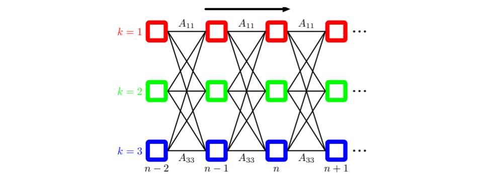
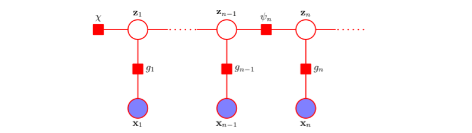
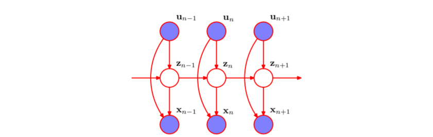
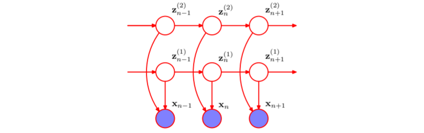

# Sequential Data

## 1 Markov Model

处理顺序数据的最简单的方式是忽略顺序的性质，将观测看做独立同分布，但是这种处理无法利用数据中的顺序模式。为了在概率模型中表示这种效果，我们需要放松独立同分布的假设，一种最简单的方式是考虑马尔科夫模型，首先，我们可以使用概率的乘积规则来表示观测序列的联合概率分布：
$$
p(x_1,\dotsb,x_N)=p(x_1)\prod_{n=2}^Np(x_n\mid x_1,\dotsb,x_{n-1})
$$
如果我们假设右侧的每个条件概率分布只与最近的一次观测有关，就可以得到一阶的马尔科夫链：
$$
p(x_n\mid x_1,\dotsb,x_{n-1})=p(x_n\mid x_{n-1})\\
p(x_1,\dotsb,x_N)=p(x_1)\prod_{n=1}^Np(x_n\mid x_{n-1})
$$
在这种模型的大部分应用中，条件概率分布 $p(x_n\mid x_{n-1})$ 被限制为相等的，对应于静止时间序列的假设，这类模型被称为同质马尔科夫链（homogeneous Markov chain）。

如果我们允许预测除了与当前观测有关外，还与当前观测的前一次观测有关，那么我们就得到了二阶马尔科夫链：
$$
p(x_1,\dotsb,x_N)=p(x_1)p(x_1\mid x_2)\prod_{n=3}^Np(x_n\mid x_{n-2},x_{n-1})
$$
类似地，我们可以拓展至 $M$ 阶马尔科夫链，但是这种拓展是有代价的：

对于离散变量的情况，假定每个节点的取值有 $K$ 种情况，对于一阶马尔可夫模型，参数量可以表示为 $K(K-1)$，而对于M阶的马尔科模型，参数量表示为 $K!(K-1)$，可见模型的参数量随 $M$ 以指数级增长。

对于连续变量的情况，有两种简化建模的形式：

- 自回归模型（AR model）：基于线性高斯条件概率分布，当前时刻的观测值 $x_n$ 是其过去 *M* 个值的线性组合加高斯噪声：

$$
x_n = c+\sum_{i=1}^M\phi_ix_{n-i}+\epsilon_n,\epsilon_n\sim\mathcal{N}(0,\sigma^2)
$$

- 抽头延迟线模型（tapped delay line）：通过参数化模型（如神经网络）建立条件概率分布 ，利用存储的过去$M$个观测值预测当前值（的均值）：

$$
x_n=f_\theta(x_{n-1},\dotsb,x_{n-M})
$$

假设我们希望构造任意阶数的不受马尔可夫假设限制的序列模型，同时能够使用较少数量的自由参数确定，我们可以引入额外的潜在变量。对于每个观测 $x_n$ 我们引入一个额外的潜在变量 $z_n$，我们现在假设潜在变量构成了马尔科夫链，得到的图结构被称为状态空间模型（state space model）：

可以看到现在序列 $\{z_n\}$ 具有与一阶马尔科夫链类似的条件独立性，这个模型的联合概率分布为：
$$
p(x_1,\dotsb,x_N,z_1,\dotsb,z_N)=p(z_1)\left[\prod_{n=2}^Np(z_n\mid z_{n-1})\right]\prod_{n=1}^Np(x_n\mid z_n)
$$
对于顺序数据来说，这个图描述了两个重要的模型。如果潜在变量是离散的，那么我们得到 了隐马尔科夫模型（HMM），如果潜在变量和观测变量都是高斯变量（结点的条件概率分布对于父节点的依赖是线性高斯的形式），那么我们就得到了线性动态系统（linear dynamical system）。

## 2 Hidden Markov Models

### 2.1 Introduction to HMM

在 HMM 中，潜在变量是离散的服从多项式分布的 $z_n$，我们使用转移概率 $A$，描述条件概率分布 $p(z_{n}\mid z_{n-1})$，由于潜在变量是离散的，因此转移概率可以使用简单的矩阵表示：$A_{ij}=p(z_{n,j}=1\mid z_{n-1,k}=1)$，因此其满足 $0\leq A_{ij}\leq1$ 且 $\sum_j A_{ij}=1$，因此 $A$ 的独立参数量为 $K(K-1)$，我们可以将条件概率分布写成：
$$
p(z_n\mid z_{n-1},A)=\prod_{i=1}^K\prod_{j=1}^KA_{ij}^{z_{n-1,i},z_{n,j}}
$$
对于初始节点，由于其并没有父节点，因此其边缘概率有一个额外的概率向量 $\pi$ 表示，元素为 $\pi_i=p(z_{1i}=1)$，即：
$$
p(z_1\mid \pi)=\prod_{i=1}^K\pi_{i}^{z_{1i}}
$$
一种比较有用的表示是将状态转移在时间上展开，这就得到了晶格图：

要建立 HMM，还需要定义的量是观测变量的条件概率分布 $p(x_n\mid z_n,\phi)$，其中 $\phi$ 为控制概率分布的参数集合，这些条件概率被称为发射概率，对于连续型的观测变量，$\phi$ 可以表示高斯分布，对于离散型的观测变量，$\phi$ 可以表示条件概率表格。我们可以将发射概率表示为：
$$
p(x_n\mid z_n,\phi)=\prod_{i=1}^Kp(x_n\mid\phi_i)^{z_{ni}}
$$
我们主要关注同质的模型，其中所有控制潜在变量的条件概率分布都共享相同的参数 $A$，所有的发射概率都共享相同的参数 $\phi$ 。从⽽观测变量和潜在变量上的联合概率分布为：
$$
p(X,Z\mid \theta)=p(z_1\mid \pi)\left[\prod_{n=2}^N p(z_n\mid z_{n=1},A)\right]\prod_{m=1}^Np(x_m\mid z_m,\phi),\theta=\{\pi,A,\phi\}
$$
这个标准的 HMM 形式有很多变体，其中之一是从左到右 HMM（left-to-right HMM），它将 $A$ 中 $j<i$ 的元素 $A_{ij}$ 设置为零，此外对于初始状态概率，设置 $p(z_{11})=1$。

隐马尔科夫模型的⼀个强⼤的性质是它对于时间轴上局部的变形（压缩和拉伸）具有某种程度的不变性。

### 2.2 Maximum Likelihood for the HMM

我们可以使用极大似然的方式确定 HMM 中的参数：
$$
\theta=\arg\max_\theta p(X\mid \theta)=\arg\max_\theta\sum_Zp(X,Z\mid\theta)
$$

但是 HMM 的特殊之处在于联合概率分布无法在 $n$ 上分解，因此我们不能在每个 $z_n$ 上显式地进行求和。
此外，我们也不能显式地完成这个求和，因为有 $N$ 个潜在变量需要求和，每个变量有 $K$ 个状态，从而总计有 $K^N$ 个求和项，因此求和式中的项的数目随着链的长度指数级增长。
另一个问题是由于似然函数对应于混合概率分布的一个推广，因此它表示潜在变量的不同配置下对发射概率进行求和。因此直接对这个似然函数进行最大化会导致复杂的表达式，从而没有解析解。
EM 算法是对 HMM 进行极大似然估计的一个可行方法，首先我们定义两个后验概率分布的记号：
$$
\gamma(z_n)=p(z_n\mid X,\theta^{old})\\
\xi(z_{n-1},z_n)=p(z_{n-1},z_n\mid X,\theta^{old})
$$

对于每个 $n$ 值，我们使用 $K$ 个非负数存储 $\gamma(z_n)$，使用一个 $K\times K$ 的矩阵来存储 $\xi(z_{n-1},z_n)$：
$$
\gamma(z_{n,i})=\mathbb E[z_{n,i}]=\sum_{z_n}\gamma(z)z_{n,i}\\
\xi(z_{n-1,i},z_{n,j})=\mathbb E[z_{n-1,i},z_{n,j}]=\sum_{z_{n-1},z_{n}}\xi(z_{n-1},z_n)z_{n-1,i}z_{n,j}
$$

从而我们能写出 EM 算法中 $Q$ 函数的形式：
$$
\ln p(X,Z\mid \theta)=\ln\pi_{k}+\sum_{n=2}^N\ln A_{ij}+\sum_{n=1}^N\ln p(x_n\mid \phi_k)
$$

$$
\begin{aligned}
Q(\theta,\theta^{old})&=\sum_Zp(Z\mid X,\theta^{old})\ln p(X,Z\mid \theta)\\
&=\mathbb E[\ln\pi_{k}]+\mathbb E\left[\sum_{n=2}^N\ln A_{ij}\right]+\mathbb E\left[\sum_{n=1}^N\ln p(x_n\mid \phi_k)\right]\\
&=\sum_{k=1}^K\gamma(z_{1,k})\ln\pi_{k}+\sum_{n=2}^N\sum_{i=1}^K\sum_{j=1}^K\xi(z_{n-1,i},z_{n,j})\ln A_{ij}+\sum_{n=1}^N\sum_{k=1}^K\gamma(z_{nk})\ln p(x_n\mid \phi_k)
\end{aligned}
$$
在 M 步骤中，我们关于所有参数最大化 $Q$ 函数，关于 $\pi$ 和 $A$ 的最大化使用拉格朗日乘数法可以得出：
$$
\pi_k=\frac{\gamma(z_{1,k})}{\sum_{i=1}^K\gamma(z_{1,i})}\\
A_{ij}=\frac{\sum_{n=2}^N\xi(z_{n-1,i}z_{n,j})}{\sum_{k=1}^K\sum_{n=2}^N\xi(z_{n-1,i},z_{n,k})}
$$

为了关于 $\phi_k$ 最大化 $Q$ 函数，我们注意到只有最后一项依赖于 $\phi_k$，并且这一项的形式与独⽴同分布数据的标准混合分布的对应的函数中的数据依赖项完全相同，如果对于不同的 $k$ 值，参数 $\phi$ 独立，那么这一项可以分解为一组项的加和形式，每一项对应于一个 $k$ 值，每一项可以独立地最大化，因此我们可以简单地最大化发射概率密度 $p(x\mid \phi_k)$ 的加权的对数似然函数，权值为 $\gamma(z_{nk})$，对于高斯发射密度 $p(x\mid \phi_k)=\mathcal{N}(x\mid\mu_k,\Sigma_k)$ 的情况：
$$
\mu_k=\frac{\sum_{n=1}^N\gamma(z_{nk})x_n}{\sum_{n=1}^N\gamma(z_{nk})}\\
\Sigma_k=\frac{\sum_{n=1}^N\gamma(z_{nk})(x_n-\mu_k)(x_n-\mu_k)^\top}{\sum_{n=1}^N\gamma(z_{nk})}
$$

对于观测变量服从离散多项式分布的情形，观测变量的条件概率分布为：
$$
p(x\mid z)=\prod_{i=1}^D\prod_{k=1}^K \mu_{ik}^{x_iz_k}
$$

对应的 M 步骤的方程为：
$$
\mu_{ik}=\frac{\sum_{n=1}^N\gamma(z_{nk}x_{ni})}{\sum_{n=1}^N\gamma(z_{nk})}
$$

EM 算法要求设置发射概率分布的参数的初始值，一种设置的方式是将数据集看成独立同分布的，然后通过最大似然方法调节发射概率密度，之后使用得到的值初始化 EM 的参数。

### 2.2 Forward-Backward Algorithm

现在的问题是如何高效地计算 $\gamma(z_n)$ 和 $\xi(z_{n-1},z_n)$，对应于 EM 算法中的 E 步骤。

解决这一问题的方法是前向-后向算法，或者称为 Baum-Welch 算法。

对 HMM 的概率图进行 d-划分，我们可以得到下面的条件独立性质：
$$
p(X\mid z_{n-1},z_n)=p(x_1,\dotsb,x_{n-1}\mid z_{n-1})p(x_n\mid z_n)p(x_{n+1},\dotsb,x_N\mid z_n)\\
p(x_{n+1}\mid X,z_{n+1})=p(x_{n+1}\mid z_{n+1})\\
p(z_{n+1}\mid z_n,X)=p(z_{n+1}\mid z_n)
$$
因此：
$$
\gamma(z_n)=p(z_n\mid X)=\frac{p(X\mid z_n)p(z_n)}{p(X)}=\frac{p(x_1,\dotsb,x_n,z_n)p(x_{n+1},\dotsb,x_N\mid z_n)}{p(X)}=\frac{\alpha(z_n)\beta(z_n)}{p(X)}
$$
其中：
$$
\alpha(z_n)=p(x_1,\dotsb,x_n,z_n)\\
\beta(z_n)=p(x_{n+1},\dotsb,x_N\mid z_n)
$$
$\alpha(z_n)$ 和 $\beta(z_n)$ 均为 $z_n$ 的函数，可以用 $K$ 值的向量表示。

然后我们可以推导二者的递推表示：
$$
\begin{aligned}
\alpha(z_n)&=p(x_1,\dotsb,x_n,z_n)\\
&=p(x_1,\dotsb,x_n\mid z_n)p(z_n)\\
&=p(x_n\mid z_n)p(x_1,\dotsb,x_{n-1}\mid z_n)p(z_n)\\
&=p(x_n\mid z_n)p(x_1,\dotsb,x_{n-1}, z_n)\\
&=p(x_n\mid z_n)\sum_{x_{n-1}}p(x_1,\dotsb,x_{n-1},z_{n-1},z_n)\\
&=p(x_n\mid z_n)\sum_{x_{n-1}}p(x_1,\dotsb,x_{n-1},z_n\mid z_{n-1})p(z_{n-1})\\
&=p(x_n\mid z_n)\sum_{x_{n-1}}p(x_1,\dotsb,x_{n-1}\mid z_{n-1})p(z_n\mid z_{n-1})p(z_{n-1})\\
&=p(x_n\mid z_n)\sum_{x_{n-1}}p(x_1,\dotsb,x_{n-1}, z_{n-1})p(z_n\mid z_{n-1})\\
\end{aligned}
$$

$$
\alpha(z_n)=p(x_n\mid z_n)\sum_{z_{n-1}}\alpha(z_{n-1})p(z_n\mid z_{n-1})
$$

$\alpha$ 每一步递归的计算代价是 $O(K^2)$ 。为了开始递归过程，我们需要一个初始条件：
$$
\alpha(z_1)=p(x_1,z_1)=p(z_1)p(x_1\mid z_1)=\prod_{k=1}^K\{\pi_k p(x_1\mid \phi_k)\}^{z_{1k}}
$$
即 $\alpha(z_{1k})=\pi_kp(x_1\mid \phi_k)$，从链的起点开始，我们可以沿着链计算每个潜在节点的 $\alpha$ 值，由于递归的每一步涉及到与一个 $K\times K$ 矩阵相乘，因此计算这些量的整体复杂度是 $O(K^2N)$。

类似地：
$$
\begin{aligned}
\beta(z_n)&=p(x_{n+1},\dotsb,x_N\mid z_n)\\
&=\sum_{z_n+1}p(x_{n+1},\dotsb,x_N,z_{n+1}\mid z_n)\\
&=\sum_{z_n+1}p(x_{n+1},\dotsb,x_N\mid z_n,z_{n+1})p(z_n\mid z_{n+1})\\
&=\sum_{z_n+1}p(x_{n+1},\dotsb,x_N\mid z_{n+1})p(z_n\mid z_{n+1})\\
&=\sum_{z_n+1}p(x_{n+2},\dotsb,x_N\mid z_{n+1})p(x_{n+1}\mid z_{n+1})p(z_n\mid z_{n+1})\\
\end{aligned}
$$

$$
\beta(z_n)=\sum_{z_{n+1}}\beta(z_{n+1})p(x_{n+1}\mid z_{n+1})p(z_n\mid z_{n+1})
$$

与 $\alpha$ 类似，我们赋予递归一个起始条件：
$$
\beta(z_N)=1
$$
在 M 步方程中，由于：
$$
\mu_k=\frac{\sum_{n=1}^N\gamma(z_{nk})x_n}{\sum_{n=1}^N\gamma(z_{nk})}=\frac{\sum_{n=1}^N\alpha(z_{nk})\beta(z_{nk})x_n}{\sum_{n=1}^N\alpha(z_{nk})\beta(z_{nk})}
$$
因此 $p(X)$ 被消去，但是表示 $p(X)$ 的值是很有意义的：
$$
p(X)=\sum_{z_n}p(z_n, X)=\sum_{z_n}\alpha(z_n)\beta(z_n)
$$
因此似然函数的计算可以使用任意方便的 $n$，例如可以令 $n=N$：
$$
p(X)=\sum_{z_n}\alpha(z_N)
$$
然后考虑一下 $\xi(z_{n-1},z_n)$ 的计算：
$$
\begin{aligned}
\xi(z_{n-1},z_n)&=p(z_{n-1},z_n\mid X)\\
&=\frac{p(X\mid z_{n-1},z_n)p(z_{n-1},z_n)}{p(X)}\\
&=\frac{p(x_1m,\dotsb,x_{n-1}\mid z_{n-1})p(x_n\mid z_n)p(x_{n+1},\dotsb,x_N\mid z_n)p(z_n\mid z_{n-1})p(z_{n-1})}{p(X)}\\
&=\frac{\alpha(z_{n-1})p(x_n\mid z_n)p(z_n\mid z_{n-1})\beta(z_n)}{p(X)}\\
\end{aligned}
$$
因此通过前向-后向算法，$\xi(z_{n-1},z_n)$ 也是可表示的。

除了学习之外，HMM 的另一个应用是预测，即求解 $p(x_{N+1}\mid X)$：
$$
\begin{aligned}
p(x_{n+1}\mid X)&=\sum_{z_{N+1}}p(x_{N+1},z_{N+1}\mid X)\\
&=\sum_{z_{N+1}}p(x_{N+1}\mid z_{N+1})p(z_{N+1}\mid X)\\
&=\sum_{z_{N+1}}p(x_{N+1}\mid z_{N+1})\sum_{z_N}p(z_{N+1},z_N\mid X)\\
&=\sum_{z_{N+1}}p(x_{N+1}\mid z_{N+1})\sum_{z_N}p(z_{N+1}\mid z_N)p(z_N\mid X)\\
&=\sum_{z_{N+1}}p(x_{N+1}\mid z_{N+1})\sum_{z_N}p(z_{N+1}\mid z_N)\frac{p(z_N,X)}{p(X)}\\
&=\frac{1}{p(X)}\sum_{z_{N+1}}p(x_{N+1}\mid z_{N+1})\sum_{z_N}p(z_{N+1}\mid z_N)\alpha(z_N)\\
\end{aligned}
$$

### 2.3 The Sum-Product Algorithm for the HMM

实际上，HMM 的概率图是树的形式，因此我们恰好可以使用加和-乘积算法求解寻炸局部边缘概率的问题，这种方法与前向-后向算法是等价的。

对于原始的因子图形式，我们注意到在解决推断问题的过程中，我们总是以变量 $X$ 为条件，因此可以将发射概率因子整合至转移概率因子中：

$$
h(z_1)=p(z_1)p(x_1\mid z_1)\\
f_n(z_{n-1},z_n)=p(z_n\mid z_{n-1})p(x_n\mid z_n)
$$
为了推导前向-后向算法，我们将 $z_N$ 看作根节点，首先从叶节点 $h$ 向根节点传递信息：
$$
\mu_{z_{n-1}\rightarrow f_n}(z_{n-1})=\mu_{f_{n-1}\rightarrow z_{n-1}}(z_{n-1})\\
\mu_{f_n\rightarrow z_n}(z_n)=\sum_{z_{n-1}}f_n(z_{n-1},z_n)\mu_{z_{n-1}\rightarrow f_n}(z_{n-1})
$$
根据两种信息的形式，我们有：
$$
\mu_{f_n\rightarrow z_n}(z_n)=\sum_{z_{n-1}}f_n(z_{n-1},z_n)\mu_{f_{n-1}\rightarrow z_{n-1}}(z_{n-1})
$$
如果令 $\alpha(z_n)=\mu_{f_n\rightarrow z_n}(z_n)$ ，我们就可以得到 $\alpha$ 的递归方程，由于 $\alpha(z_1)=h(z_1)=p(z_1)p(x_1\mid z_1)$

然后我们研究从根节点传递回叶子节点的信息：
$$
\mu_{f_{n+1}\rightarrow z_n}(z_n)=\sum_{z_{n+1}}f_{n+1}(z_n,z_{n+1})\mu_{f_{n+2}\rightarrow z_{n+1}}(z_{n+1})
$$
同样，我们定义 $\beta(z_n)=\mu_{f_{n+1}\rightarrow z_n}(z_n)$ 就可以得到 $\beta$ 的递归方程，可以验证它与之前的定义是等价的。

加和-乘积算法也给出了计算边缘概率的方式：
$$
p(z_n,X)=\mu_{f_n\rightarrow z_n}(z_n)\mu_{f_{n+1}\rightarrow z_n}(z_n)=\alpha(z_n)\beta(z_n)
$$
两侧同时除以 $p(X)$，我们有：
$$
\gamma(z_n)=\frac{p(z_n,X)}{p(X)}=\frac{\mu_{f_n\rightarrow z_n}(z_n)\mu_{f_{n+1}\rightarrow z_n}(z_n)}{p(X)}
$$

### 2.4 Scaling Factors

在前向-后向算法中，随着路径的延长，$\alpha(z_n)$ 会指数地趋于零，在独⽴同分布数据的情形，我们使⽤取对数的⽅式，隐式地避开了计算似然函数的这个问题，但是这里由于我们需要对很小的数字的乘积进行求和，因此这种方法没有作用。因此我们使⽤重新缩放的 $\alpha(z_n)$ 和 $\beta(z_n)$ 来计算，它们的值保持与单位长度在同⼀个量级上。

此前，我们定义 $\alpha(z_n)=p(x_1,\dotsb,x_n,z_n)$ ，现在我们定义 $\alpha$ 的归一化形式：
$$
\hat\alpha(z_n)=p(z_n\mid x_1,\dotsb,x_n)=\frac{\alpha(z_n)}{p(x_1,\dotsb,x_n)}
$$
为了建立归一化与未归一化的因子之间的联系，我们有：
$$
c_n=p(x_n\mid x_1,\dotsb,x_{n-1})\\
p(x_1,\dotsb,x_n)=\prod_{m=1}^nc_m\\
a(z_n)=\left(\prod_{m=1}^nc_m\right)\hat\alpha(z_n)
$$
然后我们可以将 $\alpha$ 的递归方程转换为 $\hat \alpha$  的递归方程：
$$
c_n\hat\alpha(z_n)=p(x_n\mid z_n)\sum_{z_{n-1}}\hat\alpha(z_{n-1})p(z_n\mid z_{n-1})
$$
类似地：
$$
\hat\beta(z_n)=\frac{p(x_{n+1},\dotsb,x_N\mid z_n)}{p(x_{n+1},\dotsb,x_N\mid x_1,\dotsb,x_n)}\\
\beta(z_n)=\left(\prod_{m=n+1}^Nc_m\right)\hat\beta(z_n)\\
c_{n+1}\hat\beta(z_n)=\sum_{z_{n+1}}\hat\beta(z_{n+1})p(x_{n+1}\mid z_{n+1})p(z_{n+1}\mid z_n)
$$
使用归一化的迭代因子也可以推导出边际似然：
$$
p(X)=\prod_{n=1}^Nc_m\\
\gamma(z_n)=\hat\alpha(z_n)\hat\beta(z_{n})\\
\xi(z_{n-1},z_n)=c_n^{-1}\hat\alpha(z_{n-1})p(x_n\mid z_n)p(z_n\mid z_{n-1})\hat\beta(z_n)
$$
最后，实际上后向传递过程可以基于 $\gamma(z_n)=\hat\alpha(z_n)\hat\beta(z_{n})$ 定义，而无需依赖 $\hat\beta$，这种后向过程要求前向过程先完成，这种迭代形式常见于线性动态系统。

### 2.5  Viterbi Algorithm

在 HMM 中，另一个有意义的问题是给定观测序列，寻找概率最高的潜在状态序列，这对应于概率图模型中的最大加和算法，在 HMM 中，它被称为 Viterbi 算法。

与加和-乘积算法类似，我们首先将 $z_N$ 作为根节点，从根节点向叶节点传递信息：
$$
\mu_{z_n\rightarrow f_{n+1}}(z_n)=\mu_{f_n\rightarrow z_n}(z_n)\\
\mu_{f_{n+1}\rightarrow z_{n+1}}(z_{n+1})=\max_{z_n}\{\ln f_{n+1}(z_n,z_{n+1})+\mu_{z_n\rightarrow f_{n+1}}(z_n)\}
$$
根据两种因子的形式，我们同样可以得到：
$$
\omega(z_n)=\mu_{f_n\rightarrow z_n}(z_n)=\ln p(x_{n}\mid z_{n})+\max_{z_{n-1}}\left\{\ln p(z_{n}\mid z_{n-1})+\omega(z_{n-1})\right\}
$$
初始化：
$$
\omega(z_1)=\ln p(z_1)+\ln p(x_1\mid z_1)
$$
一旦完成最大化过程，就可以得到概率最大的联合概率分布：
$$
\omega(z_n)=\max_{z_1,\dotsb,z_{n-1}}\ln p(z_1,\dotsb,x_n,z_1,\dotsb,z_n)
$$
我们还希望找到对应于这条路径的潜在变量值的序列，这需要使用反向追踪。我们注意到 $z_n$ 上的最大化过程必须在 $z_{n+1}$ 的 $K$ 个可能值上进行，假设对于 $z_{n+1}$ 的 $K$ 个值中的每一个值，我们都记录下与最大值相对应的 $z_n$ 的值，我们将这个函数记作 $\psi(k_n)$，其中 $k\in\{1,\dotsb,K\}$，一旦信息传递至末端，我们就可以使用这个函数恢复序列：
$$
k_{n-1}^{\max}=\psi(k_{n}^{\max})
$$

### 2.6 Extensions of the HMM

标准 HMM 的⼀个局限性是它在描述观测变量的长距离相关性时，效果很差，因为这些相关性必须被隐含状态的⼀阶马尔科夫链所调解。一种解决方法是自回归 HMM，这是通过向标准 HMM 中添加额外链接的⽅式实现的：

在自回归 HMM 中，我们应当对附加链接进行限制，避免自由参数的量过多。

另一个拓展是输入输出 HMM（input-output hidden Markov model），其中我们有一个观测变量的序列 $u_1,\dotsb,u_N$，以及输出变量的序列 $x_1,\dotsb,x_N$，观测变量的值要么影响潜在变量的分布，要么影响输出变量的分布，或者对二者均有影响：

注意到，在这种变体中，$z_{n-1}$与 $z_{n+1}$ 在给定 $z_n$ 时依然保有条件独立性，这使得高效的学习算法可以实现。

另一个变体是因子 HMM（factorial hidden Markov model），其中存在多个独⽴的潜在变量马尔科夫链，并且在⼀个给定的时刻，观测变量的概率分布以相同时间的所有对应的潜在变量的状态为条件：

在这种变体中，$z_{n}^{(1)}$ 和因子 $z_{n}^{(2)}$ 在节点 $x_{n}$ 处有一个 head-to-head 的观测节点，因此 d-划分不成立。此外，$z_{n-1}$ 与 $z_{n+1}$ 的关键的条件独立性质也不成立，从而⽆法独⽴地运⾏前向和后向递归。如果我们将共有 $M$ 条 $K$ 维的潜在变量链的因子 HMM 转化为标准的 HMM，潜在变量将有 $K^M$ 个维度，前向后向算法的复杂度将是 $O(NK^{2M})$，因此除了 $M$ 很小的情况外均无法计算。一些解决办法是使用采样或变分推断。

## 3 Linear Dynamical Systems
