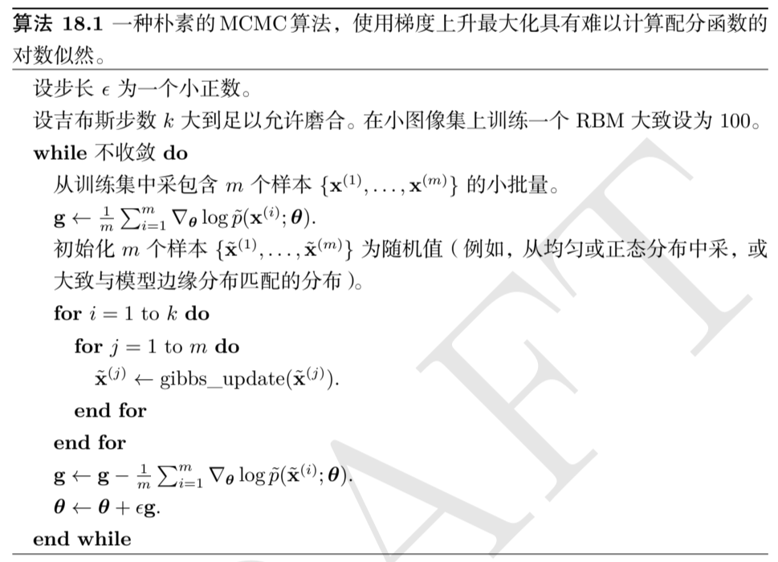
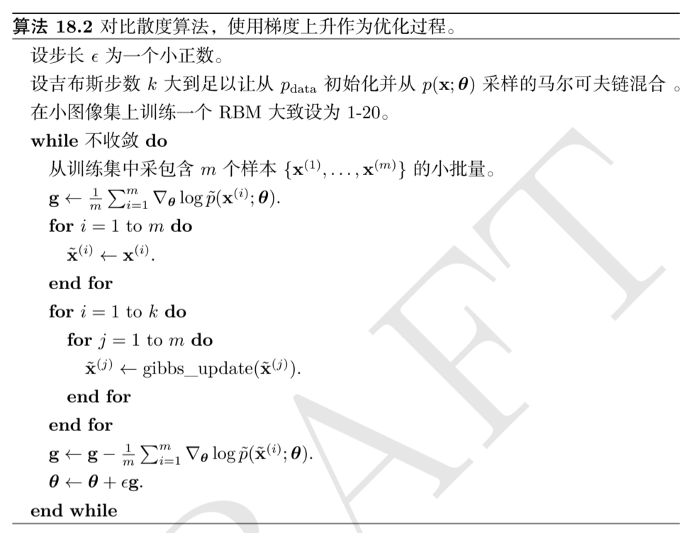
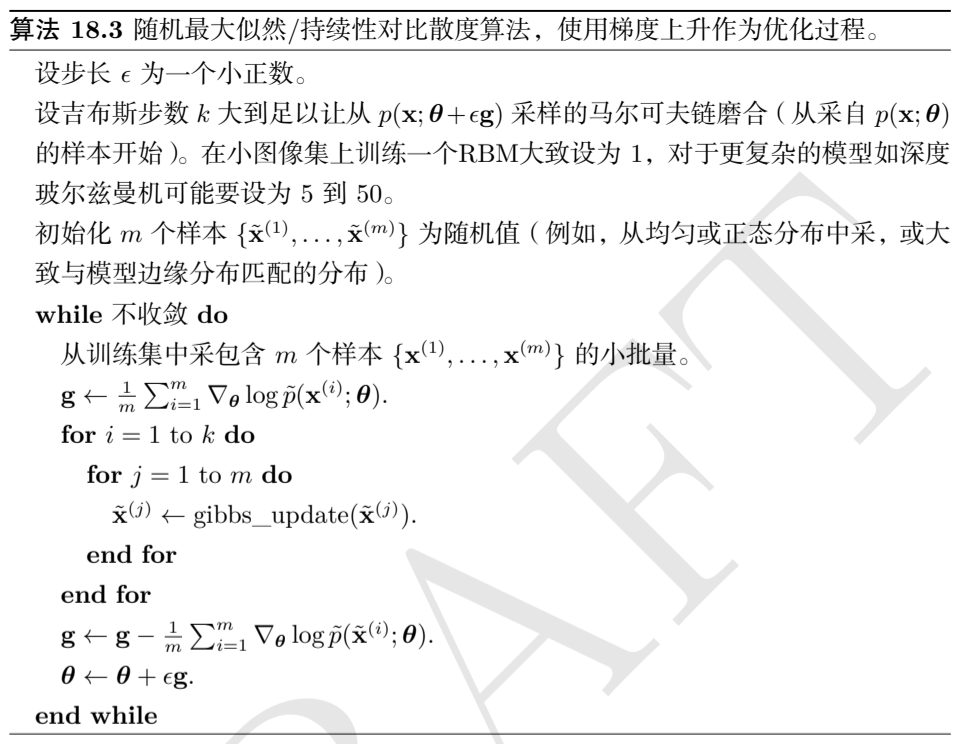

# Confronting Partition Function

配分函数的直接来源是概率图模型（通常是无向图，因为有向图的联合概率因子分解形式是天然归一化的）中未归一化的概率分布 $\widetilde p(x\mid\theta)$：
$$
p(x\mid \theta)=\frac{1}{Z(\theta)}\widetilde p(x\mid \theta)
$$
配分函数可以表示为未归一化的所有状态的积分（或求和）：
$$
\int \widetilde p(x)~\mathrm dx
$$
而对于一般的情况来说。上面的求和或积分是难以计算的。

## 1 The Log-Likelihood Gradient

如果对对数似然的梯度进行拆解，会包含一项依赖于配分函数的梯度：
$$
\nabla_{\theta}\log p(x\mid \theta)=\nabla_\theta\log \widetilde p(x\mid \theta)-\nabla_\theta\log Z(\theta)
$$
这种分解方式被称为正相（positive phase）和负相（negative phase）的分解。

通常来说，没有潜在变量或潜在变量之间的相互作用较少的情况下，正相是易于计算的，对于难以计算的正相（例如模型中存在复杂的相互依赖关系），可以通过近似推断解决。

而大多数无向图模型都有难以计算的负相。

我们可以进一步处理对数配分函数的梯度：
$$
\nabla_\theta\log Z=\frac{\nabla_\theta Z}{Z}=\frac{\nabla_\theta\sum_x\widetilde p(x)}{Z}=\frac{\sum_x\nabla_\theta\widetilde p(x)}{Z}
$$
对于那些保证未归一化的概率密度大于零的模型：
$$
\frac{\sum_x\nabla_\theta\widetilde p(x)}{Z}=\frac{\sum_x\nabla_\theta\exp(\log \widetilde p(x))}{Z}=\frac{\sum_x\widetilde p(x)\nabla_\theta\log \widetilde p(x)}{Z}=\sum_xp(x)\nabla_\theta\log \widetilde p(x)=\mathbb E_{x\sim p(x)}\nabla_\theta\log\widetilde p(x)
$$
上面的结论通常对于连续变量的情景（积分）也同样适用。

因此，我们可以将对数似然梯度写成：
$$
\nabla_{\theta}\log p(x\mid \theta)=\mathbb E_{x\sim p_{data}}\nabla_\theta\log \widetilde p(x\mid \theta)-\mathbb E_{x\sim p(x)}\nabla_\theta\log\widetilde p(x)
$$

## 18.2 Stochastic Maximum Likelihood and Contrastive Divergence
蒙特卡洛方法为学习无向图模型提供了直观的框架，我们增大从数据中采样得到的 $\nabla_\theta\log \widetilde p(x\mid \theta)$，减小模型分布中采样得到的 $\nabla_\theta\log \widetilde p(x\mid \theta)$。

然而朴素的 MCMC 算法涉及到在内循环中进行吉布斯采样，成本巨大通常难以实现。通过将 MCMC 采样的初始分布设置为一个非常接近模型分布的分布就能够减小磨合马氏链需要的成本，这就是对比散度算法的核心。

对比散度算法或 CD-k 算法在每个步骤中初始化马尔科夫链为采样自数据分布中的样本，从数据中获取样本的成本是较低的，经过 $k$ 次 Gibbs 采样之后得到近似的模型分布。在算法的初始阶段，模型分布和数据分布之间的差距较大，因此 CD 算法进行的近似并不准确，但是正相依然能够提供有效的优化梯度，随着优化进行，模型分布逐渐接近数据分布，此时负相也会逐渐准确。

但是即便在训练的后期，CD 算法仍然只能提供一个真实负相的近似，这主要是因为它不能抑制原理真实样本的高概率区域，这些区域在模型上具有高概率，但在数据生成区域具有低概率，被称为虚拟模态（spurious modes），一种直观的解释是除非 $k$ 极大，否则这些高概率分布无法被 Gibbs 采样访问到。

由于 CD 算法并不收敛至极大似然的最优解，因此通常被用于初始化模型，然后可以使用精度更高的 MCMC 方法进行微调。

CD 算法并不直接有助于初始化更深层的模型，这是因为给定可见单元样本的情况下，较难获得隐藏单元的样本，因此即使我们使用数据初始化可见单元，我们仍然需要在内循环中磨合隐藏单元条件分布上采样的马氏链。

CD 算法可以被看作惩罚那些马氏链会快速改变来自数据的输入的模型，这意味着使用 CD 算法某种程度上类似于训练自编码器。

一个解决 CD 中的问题的不同策略是在每个梯度步骤中初始化马尔科夫链为先前梯度步骤的状态值，这种方法被称为随机最大似然（SML）或持续性对比散度（PCD）。其基本思想是只要在每次优化中模型的改变足够小，那么两个优化步骤中相邻的会有相似的模型分布。这种方法允许马氏链探索更广泛的概率区域，从而抑制虚假模态的问题。此外，这种方式还可以应用于深层模型的训练，因为可以从之前的模型中获取潜在状态的信息。

当 Gibbs 采样轮数  $k$ 过小，或优化步长 $\epsilon$ 过大时，SML 容易不准确，而这些超参数的取值高度依赖于问题的具体形式，目前没有方法测试马氏链能否在迭代步骤之间成功混合。

从使用 SML 训练的模型中评估采样时有必要从一个随机起点初始化的新马尔科夫链中抽取样本，用于训练的连续负相链中的样本受到了最近几个版本的影响，会使模型看起来具有比其实际更大的容量。

CD 比基于精确采样的估计有更低的方差，而 SML 相对而言方差更高，CD 低方差的来源时其在正相和负相中使用了相同的训练点。如果从不同的训练点初始化负相，那么方差会比基于精确采样估计的方差更大。

另一种思路是不改变 MCMC 技术，而是改变参数化和代价函数，快速持续性对比散度（FPCD）使用以下的方式替换传统模型的参数 $\theta$：
$$
\theta=\theta^{slow}+\theta^{fast}
$$
现在的参数量是之前的两倍，快速复制参数可以使用更大的学习率训练，使其快速响应学习的负相，促使马氏链探索新的区域，这使得马氏链可以快速混合，尽管这种效应只发生在学习期间快速权重可以自由改变的时候。通常在短时间将快速权重设为大值并保持足够长的时间，使马尔科夫链改变峰值之后我们会对快速权重使用显著的权重衰减，使其收敛至较小的值。

这些基于 MCMC 的方法的优势是其对于正相和负相的处理是相对独立的，这允许我们使用几乎任意的方式处理正相，然后只需要将对负相的处理添加到梯度中。这同时意味着它可以和只在 $\widetilde p(x)$ 上提供下界的其他方法一起使用。

## 3 Pseudolikelihood

有一些方法通过训练不需要配分函数的模型绕过对配分函数的计算或近似。这主要是基于无向图模型中概率的比率是容易计算的，因为配分函数同时出现在比率的分子和分母中：
$$
\frac{p(x)}{p(y)}=\frac{\widetilde p(x)}{\widetilde p(y)}
$$
伪似然是一种基于这种比率的方法，因此可以在没有配分函数的情况下计算。假设可以将 $x$  分为 $a$、$b$、$c$ 三个部分，其中 $a$ 包含我们想要的条件分布的变量，$b$ 包含我们想要条件化的变量，$c$ 包含除此之外的变量：
$$
p(a\mid b)=\frac p{p(a,b)}{p(b)}=\frac{p(a,b)}{\sum_{a,c} p(a,b,c)}=\frac{\widetilde p(a,b)}{\sum_{a,c}\widetilde p(a,b,c)}
$$
以上计算需要对 $a$ 进行边缘化，假设 $a$ 和 $c$ 包含的变量并不多，那么计算可以相当高效地完成，在极端条件下，$a$ 是单个变量，而 $c$ 为空，那么该计算仅需要与估计单个随机变量值一样多的 $\widetilde p$ 。

但是,为了计算对数似然,我们需要对很多变量进行边缘化，如果总共有 $n$ 个变量，我们必须对 $n-1$ 个变量进行边缘化：
$$
\log p(x)=\log p(x_1)+\log p(x_2\mid x_1)+\dotsb+\log p(x_n\mid x_{1:n-1})
$$
在这种情况下，我们已经使得 $a$ 尽可能小，但是 $c$ 最大可以为 $x_{2:n}$（$p(x_1)$），如果我们简单地将 $c$ 移动到 $b$ 中以减小计算代价，就能够产生伪似然目标函数的概念：
$$
\sum_{i=1}^n\log p(x_i\mid x_{-i})
$$
如果每个随机变量有 $k$ 个不同的值，那么计算 $\widetilde p$ 需要 $k\times n$ 次估计，而计算配分函数需要 $k^n$ 次估计。

最大化伪似然与最大化似然的估计是渐近一致的，但在数据集不趋近于大采样极限的情况下，伪似然可以表现出与最大似然估计不同的结果。

我们可以使用广义伪似然估计权衡计算复杂度与最大似然估计之间的偏差。广义伪似然估计使用 $m$ 个不同的集合 $\mathbb S^{(i)},i=1,\dotsb,m$ 作为变量的指标出现在条件概率的左侧，在 $m=1$ 的极端情况下，广义伪似然会退化为似然函数，在$m=n$ 的极端情况下，广义伪似然恢复为伪似然：
$$
\sum_{i=1}^n\log p(x_{\mathbb S^{(i)}}\mid x_{\mathbb -S^{(i)}})
$$
基于伪似然方法的性能很大程度上取决于模型的使用方式，对于完全联合分布 $p(x)$ 模型的任务（如密度估计和采样），伪似然通产效果不好，而对于在训练期间只需要使用条件分布的任务（如填充少量缺失值）而言，它的效果由于最大似然。

如果数据具有规则结构，使得 $\mathbb S$ 索引集可以被设计为表现最重要的相关性质，同时略去相关性可忽略的变量，那么广义伪似然策略会十分有效。

伪似然方法的一个缺点是它不能与仅在 $\widetilde p(x)$ 上提供下界的其他方法一起使用，因为 $\widetilde p$ 出现在了分母中，而分母的下界只提供了整个表达式的上界，最大化上界是无意义的。这使得伪似然方法难以用于那些较深层的模型。

伪似然比 SML 在每个梯度步骤中的计算代价要大很多，这是由于其对所有条件进行显式计算。

虽然伪似然没有显式最小化对数配分函数，但是我们仍然认为其具有类似负相的效果。

## 4 Score Matching and Ratio Matching

得分匹配（score matching）提供了另一种无需估计配分函数及其导数的训练模型的方式，对数密度关于参数的导数 $\nabla_x\log p(x)$ 被称为得分，得分匹配采用的策略是最小化模型对数密度和对数密度关于输入的导数之间的平方差期望：
$$
L(x,\theta)=\frac12 \|\nabla_x\log p_{model}(x\mid\theta)-\nabla_x\log p_{data}(x)\|^2_2\\
J(\theta)=\frac12\mathbb E_{p_{data}(x)}L(x,\theta)\\
\theta^*=\min_\theta J(\theta)
$$
由于 $Z$ 并非 $x$ 的函数，因此 $\nabla_x Z=0$ 。现在的问题是计算数据分布的得分需要知道真实的数据分布 $p_{data}$，而这往往是不可知的，但是最小化 $L(x,\theta)$ 的期望等价于最小化下式的期望：
$$
\widetilde L(x,\theta)=\sum_{j=1}^n\left[\mathrm{Tr}(\nabla_x^2\log p_{model}(x\mid \theta))+\frac12\left(\nabla_x\log p_{model}(x\mid \theta)\right)^2\right]
$$
其中 $n$ 是 $x$ 的维度。

因为得分匹配涉及 $\log \widetilde p$ 关于 $x$ 的导数及二阶导数，因此其不能适用于含有离散观测变量的模型，或者与仅提供下界的方式兼容（因为下界不能提供梯度信息）。这意味着得分匹配不能应用于隐藏单元之间具有复杂相互作用的模型估计。

一种将得分匹配的基本想法拓展至离散数据的方式是比率匹配，尤其适用于二值数据，其目标是最小化以下目标函数在样本上的均值：
$$
L^{RM}(x,\theta)=\sum_{j=1}^n\left[{1}/\left({1+\frac{p_{model}(x,\theta)}{p_{model(f(x,j\mid \theta)}}}\right)\right]^2
$$
其中 $f(x,j)$ 返回在 $j$ 处取反的 $x$，比率匹配同时沿用了伪似然的思路，配分函数在两个概率的比率中抵消。

类似于伪似然估计，比率匹配对每个数据点都需要 $n$ 个 $\widetilde p$ 的估计，因此每次更新的计算代价是 SML 的 $n$ 倍。

与伪似然估计一样，我们可以认为比率匹配减小了所有只有一个变量不同于训练样本的状态的概率。由于比率匹配尤其适用于二值数据，这意味着在与数据的汉明距离为 $1$ 内的所有状态上，比率匹配是有效的。

## 5 Denoising Score Matching

在某些情况下，我们希望拟合以下分布来正则化得分匹配：
$$
p_{smoothed}(x)=\int p_{data}(y)q(x\mid y)~\mathrm dy
$$
而不是拟合真实分布 $p_{data}$，其中分布 $q(x\mid y)$ 可以看作一个损坏过程，通常在形成 $x$ 的过程中向 $y$ 中添加少量噪声。

去噪得分匹配的意义在于，在实践中，我们并不能获取真实的 $p_{data}$，而只能得到由其样本确定经验分布，给定足够容量，任何一致估计都会使得 $p_{model}$ 成为一组以训练点为中心的 Dirac 分布。

## 6 Noise-Contrastive Estimation

噪声对比估计提供了一种与 SML框架和分数匹配框架均不同的策略，它将模型估计的概率分布表示为：
$$
\log p_{model}(x)=\log \widetilde p_{model}(x\mid \theta)+c
$$
其中 $c$ 是 $-\log Z(\theta)$ 的近似，噪声对比估计过程将 $c$ 视为另一参数，适用相同的算法同时估计 $\theta$ 和 $c$，因此，其所得到的  $\log p_{model}(x)$ 可能并不完全对应有效的概率分布，但随着 $c$ 估计的改进，它将变得越来越接近有效值。

这种方式不能简单地使用极大似然作为估计的标准，因为那会导致 $c$ 倾向于取任意大的值，而不是形成有效的概率分布。

NCE 将估计 $p(x)$ 的无监督学习问题转化为学习一个二元分类，其中一个类别对应模型生成的数据。该监督学习中的最大似然估计定义了原始问题的渐近一致估计。

然后引入第二个分布，噪声分布（noise distribution）$p_{noise}(x)$，噪声分布应该易于估计和从中采样，我们现在构造一个联合数据 $x$ 和二值标识变量 $y$ 的模型：
$$
p_{joint}(y=1)=\frac12\\
p_{joint}(x\mid y=1)=p_{model}(x)\\
p_{joint}(x\mid y=0)=p_{model}(x)
$$
我们可以在训练数据上构造一个类似的联合模型，标识变量决定是从数据还是从噪声分布中抽取 $x$。正式地，$P_{train}(y=1)=\frac12$，$p_{train}(x\mid y=1)=p_{data}(x)$ 和 $p_{train}(x\mid y=0)=p_{noise}(x)$ 。

现在我们可以使用标准的最大似然学习拟合 $p_{joint}$ 到 $p_{train}$ 的监督学习问题：
$$
\theta,c=\arg\max_{\theta,c}\mathbb E_{x,y\sim p_{train}}\log p_{joint(y\mid x)}
$$
分布 $p_{joint}$ 本质上是将逻辑回归模型应用于模型和噪声分布之间的对数概率之差：
$$
\begin{aligned}
p_{joint}(y=1\mid x)&=\frac{p_{model}(x)}{p_{model}(x)+p_{noise}(x)}\\
&=\frac{1}{1+\frac{p_{noise}(x)}{p_{model}(x)}}\\
&=\frac{1}{1+\exp(-\log\frac{p_{noise}(x)}{p_{model}(x)})}\\
&=\sigma(-\log \frac{p_{noise}(x)}{p_{model}(x)})\\
&=\sigma(\log p_{model}(x)-\log p_{noise}(x))\\
\end{aligned}
$$
因此，只要 $\log \widetilde p_{model}$ 易于反向传播，并且 $p_{noise}$ 易于估计和采样，那么 NCE 就适用。

NCE 非常适用于随机变量较少的问题，但即使随机变量有很多可取值时，它也非常有效。例如，它已经成功地应用于给定单词的上下文建模单词的条件分布，虽然单词可以采样自一个很大的词汇表，但是只能采样一个单词。

当随机变量的数量较多时，NCE 的效率会下降，当逻辑回归分类器发现某个变量的取值不太可能时，它会拒绝这个噪声样本。这意味着在 $p_{model}$ 学习了基本的边缘统计之后，学习进程会大大减缓。

噪声分布 $p_{noise}$ 可能过于严格以至于其只能采用极其简单的分布，当 $p_{noise}$ 比较简单时，大多数采样可能与数据有明显不同，而不会迫使 $p_{model}$ 产生明显改变。

该方法同样对于只给出下界的方式不适用。

如果在每个梯度步骤之前，复制模型分布来定义新的噪声分布，就可以产生一种特殊的 NCE 形式，被称为自对比噪声估计（SNCE），其梯度期望等价于最大似然的梯度期望。

特殊情况的 NCE（噪声采样由模型生成）表明最大似然可以被解释为使模型不断学习以将现实与自身发展的信念区分的过程，而噪声对比估计通过让模型区分现实和固定的基准（噪声模型），我们降低了计算成本。

噪声对比估计为 GAN 提供了原型。

## 7 Estimating the Partition Function

此前讨论的方法均旨在避免复杂配分函数的计算，但有一些方法提供了对原始配分函数的直接近似，近似配分函数对于模型评估、训练监控和模型比较来说是相当重要的。

假设我们有两个模型：
$$
\mathcal M_A:p_A(x\mid \theta_A)=\frac{1}{Z_A}\widetilde p_A(x\mid \theta_A)\\
\mathcal M_B:p_B(x\mid \theta_B)=\frac{1}{Z_B}\widetilde p_B(x\mid \theta_B)\\
$$
我们通过比较两个模型分配给独立同分布数据集的似然比较模型，对于包含 $m$ 个样本的测试集 $\{x^{(1)},\dotsb,x^{(m)}\}$，如果：
$$
\prod_ip_A(x^{(i)}\mid \theta_A)>\prod_ip_B(x^{(i)}\mid \theta_B)
$$
或者等价地：
$$
\sum_i\log p_A(x^{(i)}\mid \theta_A)-\sum_i\log p_B(x^{(i)}\mid \theta_B)>0
$$
我们就可以认为 $\mathcal M_A$ 优于 $\mathcal M_B$ 。但是这个测试条件直接依赖于配分函数，我们可以将这个条件转换成：
$$
\sum_i\log \frac{\widetilde p_A(x^{(i)}\mid \theta_A)}{\widetilde p_B(x^{(i)}\mid \theta_B)}-m\log \frac{Z(\theta_A)}{Z(\theta_B)}>0
$$
这种转换使得模型比较能够在只知道两个模型的配分函数的比值的情况下进行。在两个模型相似的情况下，我们可以使用采样方法来对比率进行估计。

但是，如果要知道似然的真实值，我们就必须得到配分函数的真实值，如果我们知道两个配分函数的比率，并且我们知道二者之一的实际值，我们就可以计算另一个配分函数的值。

一种估计配分函数的简单方法是使用蒙特卡洛算法，例如重要性采样。我们使用一个提议分布 $p_0(x)=\frac{1}{Z_0}\widetilde p_0(x)$，其在配分函数 $Z_0$ 和未归一化的 $\widetilde p_0(x)$ 上易于采样和估计：
$$
\begin{aligned}
Z_1&=\int \widetilde p_1(x)~\mathrm dx\\
&=\int\frac{p_0(x)}{p_0(x)}\widetilde p_1(x)~\mathrm dx\\
&=Z_0\int p_0(x)\frac{\widetilde p_1(x)}{\widetilde p_0(x)}~\mathrm dx\\
\end{aligned}
$$
或者对于一个具体的采样过程：
$$
\hat Z_1=\frac{Z_0}{K}\sum_{k=1}^K\frac{\widetilde p_1(x^{(k)})}{\widetilde p_0(x^{(k)})}~~s.t.:x^{(k)}\sim p
$$
或者估计两个模型配分函数之间的比率：
$$
\frac{1}{K}\sum_{k=1}^K\frac{\widetilde p_1(x^{(k)})}{\widetilde p_0(x^{(k)})}~~s.t.:x^{(k)}\sim p_0
$$
但是，重要性采样要求两个分布之间是相似的，对于大多数复杂的模型来说找到一个充分近似的简单分布是难以实现的。当两个分布相差较大，以至于只有少数几个采样得到的样本具有显著权重，那么将会由于高方差导致估计的效果很差，这可以通过估计 $\hat Z_1$ 的方差来定量地理解：
$$
\mathrm{Var}(\hat Z_1)=\frac{Z_0}{K^2}\sum_{k=1}^K\left(\frac{\widetilde p_1(x^{(k)})}{\widetilde p_0(x^{(k)})}-\hat Z_1\right)^2
$$

### 7.1 Annealed Importance Sampling (AIS)

退火重要性采样的方法通过引入中间分布缩小分布之间的差距。考虑分布序列 $p_{\eta_0},\dotsb,p_{\eta_n}$，其中 $0=\eta_0<\eta_1<\dotsb<\eta_{n-1}<\eta_n=1$，分布序列的第一个和最后一个分别是 $p_0$ 和 $p_1$，这种方法使得我们能够估计定义在高维空间多峰分布上的配分函数。

我们可以将比率 $\frac{Z_1}{Z_0}$ 写作：
$$
\frac{Z_1}{Z_0}=\frac{Z_1}{Z_0}\frac{Z_{\eta_1}}{Z_{\eta_1}}\dotsb\frac{Z_{\eta_{n-1}}}{Z_{\eta_{n-1}}}=\frac{Z_{\eta_1}}{Z_0}\frac{Z_{\eta_2}}{Z_{\eta_1}}\dotsb\frac{Z_1}{Z_{\eta_{n-1}}}=\prod_{j=0}^{n-1}\frac{Z_{\eta_j+1}}{Z_{\eta_j}}
$$
如果对于所有 $0\leq j\leq n-1$，分布 $p_{\eta_j}$ 和 $p_{\eta_{j+1}}$ 足够接近，我们就可以通过对每个因子单独使用重要性采样，从而最终确定 $\frac{Z_1}{Z_0}$ 的估计。

现在的问题是如何确定的，一个通用的选择是使用目标分布和协议分布的加权几何平均：
$$
p_{\eta_j}\propto p_1^{\eta_j}p_0^{1-\eta_j}
$$
为了从这些中间分布中采样，我们可以定义一组马尔科夫链转移函数 $T_{\eta_j}(x'\mid x)$，定义了给定 $x$ 转移到 $x’$ 的条件概率分布。转移算子 $T_{\eta_j}(x'\mid x)$ 的定义是：
$$
p_{\eta_j}(x)=\int p_{\eta_j}(x')T_{\eta_j}(x\mid x')~\mathrm dx'
$$
 这些转移可以被构造为任何 MCMC 方法，包括涉及多次遍历所有随机变量或其他的迭代的方法。

然后 AIS 采样方法从 $p_0$ 开始生成样本，并使用转移算子从中间分布顺序地采样，直到得到目标分布 $p_1$ 的采样。

对于任意一个采样 $k$，我们可以表示出重要性权重：
$$
w^{(k)}=\frac{\widetilde p_{\eta_1}(x_{\eta_1}^{(k)})}{\widetilde p_0(x_{\eta_1}^{(k)})}\dotsb\frac{\widetilde p_1(x_1^{(k)})}{\widetilde p_{\eta_{n-1}}(x_{\eta_n}^{(k)})}
$$
然后我们可以将配分函数的估计写成：
$$
\frac{Z_1}{Z_0}\simeq \frac{1}{K}\sum_{k=1}^Kw^{(k)}
$$
可以证明，AIS 过程对应扩展状态空间上的简单重要采样，其中数据点采样自乘积空间 $[x_{\eta_1},\dotsb,x_{1}]$，我们将扩展空间上的分布定义为：
$$
\widetilde p(x_{\eta_1},\dotsb,x_1)=\widetilde p_1(x_1)\widetilde T_{\eta_{n-1}}(x_{\eta_{n-1}}\mid x_1)\dotsb \widetilde T_{\eta_1}(x_{\eta_1}\mid x_{\eta_2})
$$
其中，$\widetilde T_a(x'\mid x)$ 是由 $T_a(x'\mid x)$ 定义的转移算子的逆（应用贝叶斯规则）：
$$
\widetilde T_a(x'\mid x)=\frac{p_a(x')}{p_x(x)}T_a(x\mid x')=\frac{\widetilde p_a(x')}{\widetilde p_x(x)}T_a(x\mid x')
$$
将这个表达式代入扩展状态空间中的联合分布中：
$$
\begin{aligned}
&\widetilde p(x_{\eta_1},\dotsb,x_1)\\
=&\widetilde p_1(x_1)\frac{\widetilde p_{\eta_{n-1}}(x_{\eta_{n-1}})}{\widetilde p_{\eta_{n-1}}(x_{1})}T_{\eta_{n-1}}(x_1\mid x_{\eta_{n-1}})\prod_{i=1}^{n-1}\frac{\widetilde p_{\eta_i}(x_{\eta_i})}{\widetilde p_{\eta_i}(x_{\eta_{i+1}})}T_{\eta_i}(x_{\eta_{i+1}}\mid x_{\eta_i})\\
=&\frac{\widetilde p_1(x_1)}{\widetilde p_{\eta_{n-1}}(x_{1})}T_{\eta_{n-1}}(x_1\mid x_{\eta_{n-1}})\widetilde p_{\eta_1}(x_{\eta_1})\prod_{i=1}^{n-1}\frac{\widetilde p_{\eta_{i+1}}(x_{\eta_{i+1}})}{\widetilde p_{\eta_i}(x_{\eta_{i+1}})}T_{\eta_i}(x_{\eta_{i+1}}\mid x_{\eta_i})\\
\end{aligned}
$$
现在我们可以从扩展样本上的联合提议分布 $q$ 上生成采样：
$$
q(x_{\eta_1},\dotsb,x_1)=p_0(x_{\eta_1})T_{\eta_1}(x_{\eta_2}\mid x_{\eta_1})\dotsb T_{\eta_1}(x_1\mid x_{\eta_{n-1}})
$$
因此我们得以表示重要性权重：
$$
w^{(k)}=\frac{\widetilde p(x_{\eta_1},\dotsb,x_1)}{q(x_{\eta_1},\dotsb,x_1)}=\frac{\widetilde p_{\eta_1}(x_{\eta_1}^{(k)})}{\widetilde p_0(x_{\eta_1}^{(k)})}\dotsb\frac{\widetilde p_1(x_1^{(k)})}{\widetilde p_{\eta_{n-1}}(x_{\eta_n}^{(k)})}
$$
这与之前导出的形式一致，因此我们可以将 AIS 解释为应用于扩展状态上的简单重要采样，其有效性直接来自于重要采样的有效性。

### 7.2 Bridge Sampling

桥式采样与 AIS 不同，其依赖于单个分布 $p_*$ 在已知配分函数的分布 $p_0$ 和分布 $p_1$ 之间插值。

桥式采样中，对目标比率的估计形式是：
$$
\frac{Z_1}{Z_0}\simeq \frac{\sum_{k=1}^K\frac{\widetilde p_*(x_0^{(k)})}{\widetilde p_0(x_0^{(k)})}}{\sum_{k=1}^K\frac{\widetilde p_*(x_0^{(k)})}{\widetilde p_1(x_1^{(k)})}}
$$
如果仔细选择桥式采样分布，使其与两个分布均有较大的重合的话，呢么采样可以允许目标分布和协议分布之间有较大的差距。

可以证明的是，最优的桥式采样是 $p_*^{(opt)}(x)\propto\frac{\widetilde p_0(x)\widetilde p_1(x)}{r\widetilde p_0(x)+\widetilde p_1(x)}$，其中 $r=Z_1/Z_0$，这似乎并不可行，因为 $r$ 的值本身就是估计的对象，但是我们可以从较为粗糙的初始化开始，然后使用桥式采样的结果逐渐更新以改进估计。

