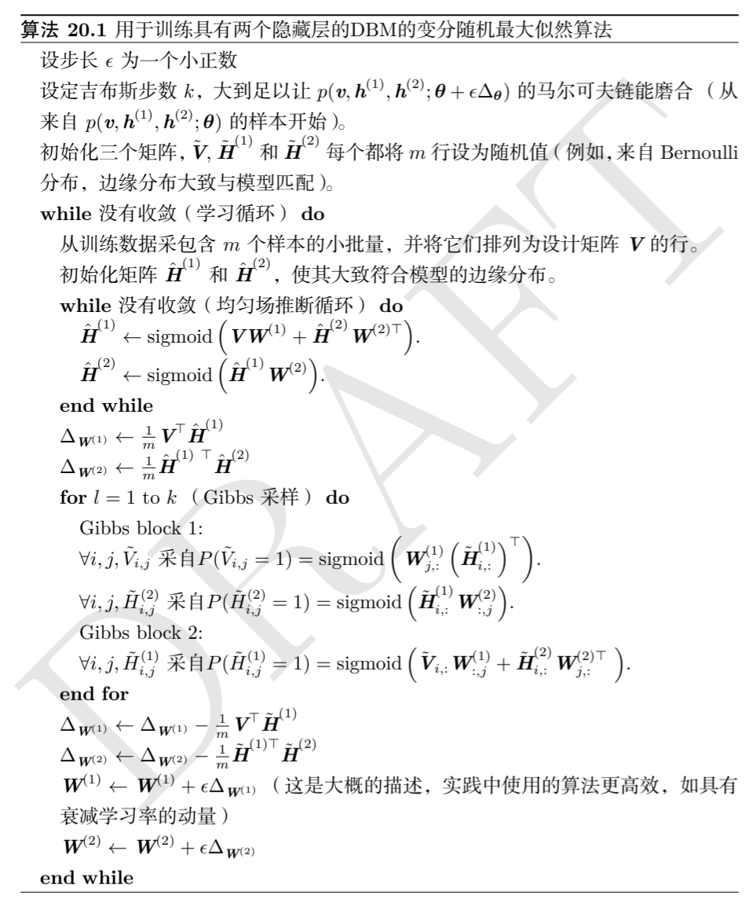
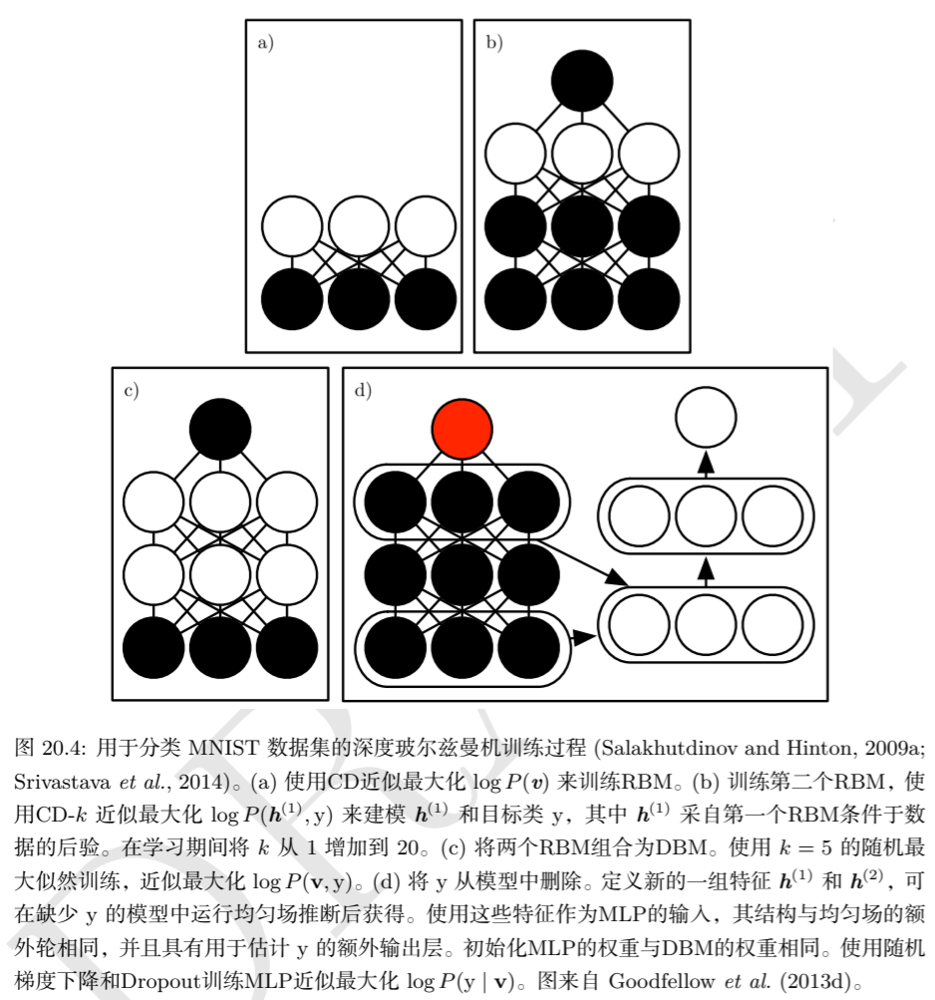
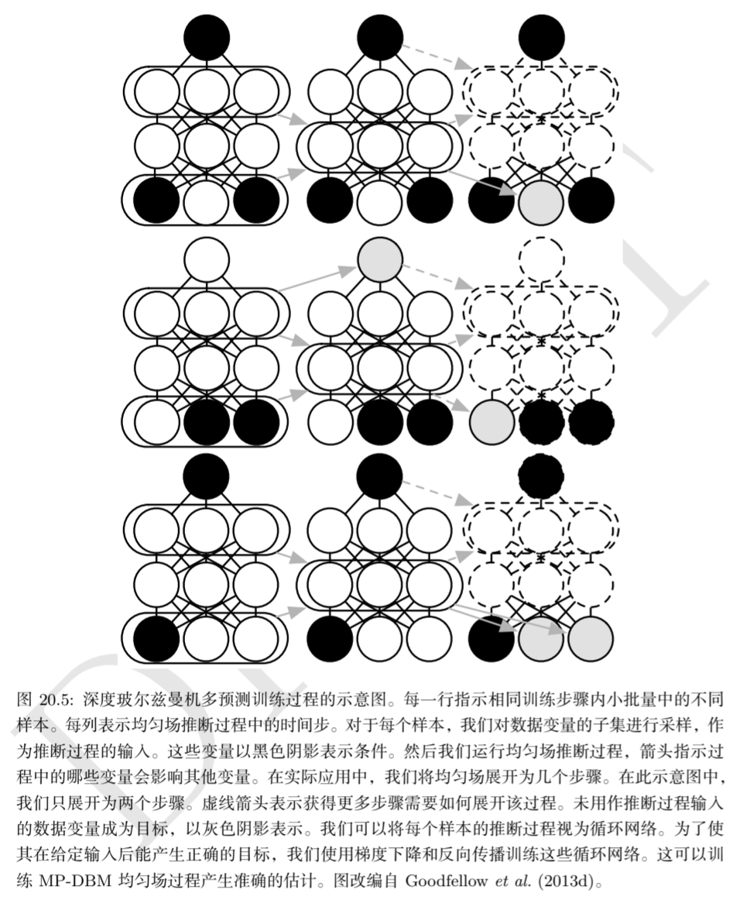

# Deep Generative Model

## 1 Boltzmann Machines

玻尔兹曼机是一类（通常为二值变量的）概率无向图模型，其联合概率分布基于能量定义：
$$
P(x)=\frac{\exp(-E(x))}{Z}
$$
其中 $E(x)$ 是能量函数，$Z$ 是确保 $\sum_xP(x)=1$ 的配分函数，玻尔兹曼机的能量函数定义为：
$$
E(x)=-x^\top Ux-b^\top x
$$
其中 $U$ 是模型参数的“权重”矩阵，$b$ 是偏置向量。这个能量函数可以表示为因子图的视角，将 $b^\top x$ 理解为单节点因子，$x^\top U x$ 理解为双节点因子，我们就可以得到概率无向图因子分解的等价形式。

在上面这种定义方式中，我们没有对变量的类型进行区分，如果我们将所有单元分解为两个子集：可见单元 $v$ 和潜在单元 $h$，然后将能量函数写为：
$$
E(v,h)=-v^\top Rv-v^\top Wh-h^\top Sh-b^\top v-c^\top h
$$
潜在变量的作用类似于 MLP 中的隐藏层，这使得玻尔兹曼机变成了离散变量分布上概率质量函数的万能近似器。

玻尔兹曼机有一个有趣的性质，当基于最大似然的学习规则训练时，连接两个单元的特定权重的更新仅仅取决于这两个单元在不同分布下收集的统计信息：$P_{model}(v)$ 和 $\hat P_{data}(v)P_{model}(h\mid v)$，网络的其余部分参与塑造这些统计信息，但权重可以在完全不知道网络其余部分或这些统计信息如何产生的情况下更新，这其实是能量基模型或概率无向图模型的一般的联合概率的正负相分解性质的体现。

## 2 Restricted Boltzmann Machines (RBM)

RBM 在传统玻尔兹曼机的基础上进行了限制，其不不允许同种类型的单元之间有连接，因此是一个二分图模型。因此，其能量函数可以写成下面的形式：
$$
E(v,h)=-v^\top Wh-a^\top v-b^\top h
$$
其中 $Z$ 是被称为配分函数的归一化常数：
$$
Z=\sum_v\sum\exp\{-E(v,h)\}
$$
计算配分函数的朴素方法是难以处理的，难解的配分函数 $Z$ 意味着归一化的联合概率分布 $P(v)$，也难以评估。

我们在 RBM 的框架下说明玻尔兹曼机联合概率分布的正负相分解性质，我们将能量函数中的矩阵乘法展开为求和的形式：
$$
E(v,h)=-\sum_{i,j}v_i^\top W_{ij}h_j-\sum_ia_i^\top v_i-\sum_jb_j^\top h_j
$$
当我们以极大似然的框架进行学习时，我们的优化目标可以写作：
$$
\theta^*=\arg\max_{\theta}L(\theta)=\arg\max_\theta\sum_{v\in D}\log P(v),\theta=\{a_i,b_j,\theta_{ij}\}
$$
如果对参数 $w_{ij}$ 求偏导：
$$
\begin{aligned}
\frac{\partial L}{\partial w_{ij}}&=\sum_{v\in D}\frac{\partial}{\partial w_{ij}}\log P(v)\\
&=\sum_{v\in D}\frac{\partial}{\partial w_{ij}}\left(\log\sum_he^{-E(v,h)}-\log Z\right)\\
&=\sum_{v\in D}\left(-\frac{\sum_h\frac{\partial E}{\partial w_{ij}}e^{-E(v,h)}}{\sum_h e^{-E(v,h)}}+\frac{\sum_{v',h'}\frac{\partial E}{\partial w_{ij}}e^{-E(v',h')}}{Z}\right)\\
&=-\sum_{v\in D}\mathbb E_{h\sim P(h\mid v)}\left[\frac{\partial E}{\partial w_{ij}}\right]+\mathbb E_{v',h'\sim P(v,h)}\left[\frac{\partial E}{\partial w_{ij}}\right]\\
\end{aligned}
$$
再考察能量函数的偏导数：
$$
\frac{\partial L}{\partial w_{ij}}=-v_ih_i
$$
代入似然梯度表达式：
$$
\frac{\partial L}{\partial w_{ij}}=\sum_{v\in D}\mathbb E_{h\sim P(h\mid v)}[v_ih_j]-\mathbb E_{v',h'\sim P(v,h)}[v'_ih_j']
$$
这种性质来源于能量模型的一般性质，除此之外，RBM 作为二分图还有一类特殊性质，其条件分布  $P(h\mid v)$ 和 $P(v\mid h)$  是因子的，计算和采样是相对简单的：
$$
\begin{aligned}
P(h\mid v)&=\frac{P(h,v)}{P(v)}\\
&=\frac{1}{P(v)}\frac{1}{Z}\exp\{b^\top v+c^\top hv^\top Wh\}\\
&=\frac{1}{Z'}\exp\{c^\top h+v^\top Wh\}\\
&=\frac{1}{Z'}\exp\left\{\sum_{j=1}^{n_h}c_j^\top h_j+\sum_{n_h}^{j=1}v^\top W_{:,j}h_j\right\}\\
&=\frac{1}{Z'}\prod_{j=1}^{n_h}\exp\{c_j^\top h_j+v^\top W_{:,j}h_j\}\\
\end{aligned}
$$
因此，我们可以将条件概率分布写成单独元素上分布的乘积，如果我们考察单独元素的概率分布：
$$
\begin{aligned}
P(h_j=1\mid v)&=\frac{\widetilde P(h_j=1\mid v)}{\widetilde P(h_j=0\mid v)\widetilde P(h_j=1\mid v)}\\
&=\frac{\exp\{c_j+v^\top W_{:,j}\}}{\exp\{0\}+\exp\{c_j+v^\top W_{:,j}\}}\\
&=\sigma(c_j+v^\top W_{:,j})
\end{aligned}
$$
进而我们可以将条件概率分布完全表达为因子形式：
$$
P(h\mid v)=\prod_{j=1}^{n_h}\sigma((2h-1)\circ(c+W^\top v))_j\\
P(v\mid h)=\prod_{j=1}^{n_v}\sigma((2v-1)\circ(b+W^\top h))_i\\
$$
由于 RBM 允许高效计算 $\widetilde P(v)$ 的估计和微分，并且允许高效地进行 MCMC 采样（吉布斯块采样），我们可以使用 CD、SML、比率匹配等方式训练 RBM。

## 3 Deep Belief Networks

深度信念网络是最先引入深度架构训练的非卷积模型之一，是具有若干潜在变量层的生成模型，潜在变量通常是二值或实数，通常，每层的每个单元连接到每个相邻层的每个单元，顶部两层的连接是无向的，而其他层间连接是有向的，箭头指向最接近数据的层。

具有 $l$ 个隐藏层的神经网络包含 $l$ 个权重矩阵：$W^{(1)},\dotsb,W^{(l)}$。同时也包含 $l+1$ 个偏置向量： $b^{(1)},\dotsb,b^{(l)}$，其中 $b^{(0)}$ 是可见层的偏置，DBN 的概率分布定义为：
$$
P(h^{(l)},h^{(l-1)})\propto \exp(b^{(l)\top} h^{(l)}+b^{(l-1)\top}h^{(l-1)}+h^{(l-1)}W^{(l)}h^{(l)})\\
P(h_i^{(k)}=1\mid h^{(k+1)})=\sigma(b_i^{(k)}+W_{:,i}^{(k+1)\top}h^{(k+1)}),\forall i,\forall k\in 1,\dotsb,l-2\\
P(v_i=1\mid h^{(1)})=\sigma(b_i^{(0)}+W_{:,i}^{(1)\top}h^{(1)}),\forall i
$$
或者可见单元为实数值时：
$$
v\sim \mathcal N(v;b^{(0)}+W^{(1)\top}h^{(1)},\beta^{-1})
$$
为了从 DBN 中采样，我们首先对顶部的两个隐藏层使用 Gibbs 采样，然后对其余部分使用单次原始采样。

由于每个有向层内部的相消解释效应，并且由于无向连接的两个隐藏层之间的相互作用，深度信念网络中的推断是难解的，评估或最大化对数似然的下界也是难以处理的，因为证据下界基于大小等于网络宽度的团的期望。

因此，评估或最大化 DBN 的似然需要同时处理来自前两个隐藏层的配分函数（无向图），和边缘化潜在变量时的推断问题。

DBN 的训练是逐层进行的，我们可以先使用 CD-k 或 SML 方法训练 RBM 以最大化  $\mathbb E_{v\sim p_{data}}\log p(v)$，RBM的参数定义了 DBN 第一层的参数，然后，第二个 RBM 的训练基于最大化：
$$
\mathbb E_{v\sim p_{data}}\mathbb E_{h^{(1)}\sim p^{(1)}(h^{(1)}\mid v)}\log p^{(2)}(h^{(1)})
$$
因此，第二个 RBM 被训练为模拟由第一个 RBM 隐藏单元采样定义的概率分布，而第一个 RBM 由数据驱动，这个过程可以无限重复。

再经过贪心逐层训练之后，DBN 通常能够取得较好的效果，但是使用醒眠算法对其进行微调是可能的。

训练好的 DBN 可以直接而做为生成模型进行采样，但是 DBN 的另一个用处是其改进分类模型的能力，我们可以从 DBN 中获取权重，并使用它们定义 MLP：
$$
h^{(1)}=\sigma(b^{(1)}+v^\top W^{(1)})\\
h^{(l)}=\sigma(b_i^{(i)}+h^{(l-1)\top}W^{(l)}),\forall l\in 2,\dotsb,m
$$
利用 DBN 的生成训练后获得的权重和偏置初始化该 MLP 之后，我们可以训练该 MLP 来执行分类任务。

## 4 Deep Boltzmann Machine (DBM)

深度玻尔兹曼机是另一种深度生成模型，其特点是完全无向，与 RBM 一样，DBM 通常仅包含二值节点，但是很容易就可以拓展至实值节点。

DBM 是基于能量的模型，这意味着模型变量的联合概率分布由能量函数定义，例如对于一个包含一个可见层 $v$ 和三个隐藏层的 $h^{(1)}$、$h^{(2)}$、$h^{(3)}$ 的情况，联合概率分布由下式给出（省略偏置）：
$$
P(v,h^{(1)},h^{(2)},h^{(3)})=\frac{1}{Z(\theta)}\exp(-E(v,h^{(1)},h^{(2)},h^{(3)};\theta))\\
E(v,h^{(1)},h^{(2)},h^{(3)};\theta)=-v^\top W^{(1)}h^{(1)}-h^{(1)\top}W^{(2)}h^{(2)}-h^{(2)\top}W^{(3)}h^{(3)}
$$
与 RBM 相比， DBM 的能量函数的定义中还增加了对隐藏层之间连接的表示。

尽管引入了层次化的结构，但是 DBM 还是可以像 RBM 一样改写为二分图的形式，其中奇数层位于一侧，偶数层位于另一侧，当我们条件于奇数层中的变量时，偶数层中的变量变得条件独立，当我们 条件于偶数层中的变量时，奇数层中的变量变得条件独立。

类似于 RBM，对于具有两个隐藏层的 DBM，我们可以这样表示激活概率（省略偏置）：
$$
P(v_1\mid h^{(1)})=\sigma(W^{(1)}_{i,:}h^{(1)})\\
P(h^{(1)}_i=1\mid v,h^{(2)})=\sigma(v^\top W^{(1)}_{:,i}+W_{i,:}^{(2)}h^{(2)})\\
P(h_k^{(2)}=1\mid h^{(k)})=\sigma(h^{(1)\top}W^{(2)}_{:,k})
$$
由于 DBM 的二分图结构，我们能够使用 Gibbs 块采样从中高效地获取样本，例如我们可以将所有单元分为两个块，其中一块包含所有的偶数层，另一块包含所有的奇数层。

与 DBN 相比，DBM 的后验分布 $P(h\mid v)$ 更简单，这使得更丰富的后验近似是可能的，DBM 的一个不理想的性质是从中采样是相对困难的。DBN 的采样过程仅涉及再前两层使用 MCMC 采样，其后只需要对剩余层使用高效的原始采样，但是要从 DBM 中生成样本，必须在所有层中使用 MCMC，并且模型的每一层都参与每个马氏链转移。

以带有两个隐藏层的 DBM 为例，相邻层条件下的单层条件概率分布是因子的（$P(v\mid h^{(1)}),P(h^{(1)}\mid h^{(2)},v),P(h^{(2)}\mid h^{(1)})$），而给定观测层在所有隐藏层上的条件概率分布不是因子的（$P(h^{(1)},h^{(2)}\mid v)$），这是由两个隐藏层之间的连接权重 $W^{(2)}$ 导致的。对于这种非因子的形式不良的分布，我们可以使用均匀场推断的方法进行简化。

所谓均匀场推断，指的是变分推断的一种特殊情况，即我们采用的变分分解的因子均为单变量的条件概率的情况，或者更具体地：
$$
Q(h^{(1)},h^{(2)}\mid v)=\prod_j Q(h^{(1)}_j\mid v)\prod_k Q(h^{(2)}_k\mid v)
$$
与一般的变分推断一致，均匀场推断的目标是最小化：
$$
KL(Q\|P)=\sum_hQ(h^{(1)},h^{(2)}\mid v)\log \left(\frac{Q(h^{(1)},h^{(2)}\mid v)}{P(h^{(1)},h^{(2)}\mid v)}\right)
$$
在二值 DBM 中，我么们将 $Q$ 作为伯努利分布的乘积进行参数化对于每个 $j$，我们定义：$\hat h_j^{(1)}=Q(h^{(1)}_j=1\mid v)$，同样的对于每个 $k$，$\hat h_k^{(2)}=Q(h^{(2)}_k=1\mid v)$，因此近似后验的形式可以写作：
$$
Q(h^{(1)},h^{(2)}\mid v)=\prod_j (\hat h_j^{(1)})^{h^{(1)}_j}(1-\hat h_j^{(1)})^{(1-h^{(1)}_j)}\times\prod_k (\hat h_k^{(1)})^{h^{(1)}_k}(1-\hat h_k^{(1)})^{(1-h^{(1)}_k)}
$$
使用变分推断的一般更新方程，我们可以对近似后验的因子进行轮流更新：
$$
h_j^{(1)}=\sigma\left(\sum_i v_iW_{i,j}^{(1)}+\sum_{k'}W_{j,k'}^{(2)}\hat h_{k'}^{(2)}\right),\forall j\\
h_k^{(2)}=\sigma\left(\sum_{j'}W_{j',k}^{(2)}\hat h_{j'}^{(2)}\right),\forall k
$$
由均匀场推断得出的变分后验的下界是：
$$
\mathcal L(Q,\theta)=\sum_i\sum_{j'}v_iW_{i,j'}^{(1)}\hat h^{(1)}_{j'}+\sum_{j'}\sum_{k'}h_{j'}^{(1)}W_{j',k'}^{(2)}\hat h^{(2)}_{k'}-\log Z(\theta)+\mathcal H(Q)
$$
变分下界的表达式中仍然包含配分函数，而计算 DBM 的配分函数的困难与 RBM 一致，因此评估 DAM 的概率质量函数需要使用近似方法，在 DBM 中通常使用 SML 方法，那些对非归一化的概率有直接依赖的方法并不适用于 DBM。

通常随机初始化之后使用极大似然方法训练 DBM 会导致失败，一般的解决方式是使用贪心逐层训练。在训练过程中，第一层被训练为对输入数据进行建模，每个后续 RBM 被训练为对来自前一 RBM 后验分布的样本进行建模，在以这种方式训练了所有 RBM 之后，它们可以被组合为 DBM，然后我们使用 SML 方法对 DBM 进行训练。

DBM 的贪心逐层预训练与 DBN 不同，每个单独的 RBM 的参数可以直接复制到相应的 DBN，但是在包含到 DBM 中必须进行修改。因为 RBM 的中间层仅使用自底向上的输入进行训练，但在栈组合形成 DBM 之后，该层将同时具有自底向上和自顶向下的输入。因此，在插入 DBM 之前，所有中间层的 RBM 的权重应该除以二，同时必须使用可见单元的两个“副本”训练底部RBM，两个副本的权重被约束为相等，这意味着向上传播的过程中权重可以有效地加倍。类似地，顶部 RBM 应该使用最顶层的两个副本来训练。

经典 DBM 需要无监督预训练，并且为了更好地分类，需要在它们提取的隐藏特征之上使用独立的基于 MLP 的分类器，使用这种预训练方式有若干弊端：

- 不能在训练第一个 RBM 时评估完整 DBM 的属性，所以在训练时难以跟踪其性能
- 实现需要很多不同的模块
- 玻尔兹曼机顶部的 MLP 失去了玻尔兹曼机概率模型的许多优点

有两个方法可以解决 DBM 的联合训练问题：

- **中心化深度玻尔兹曼机：**通过重参数化模型使其在开始学习的过程时代价函数的 Hessian 具有更好的条件数，使得模型无需经过贪心逐层预训练就可以使用 SML 进行训练。但是作为分类器仍不能与 MLP 竞争。
- **多预测深度玻尔兹曼机：**该模型的训练允许反向传播算法，以避免使用 MCMC 估计梯度的问题，会带来更好的分类性能和良好的推断缺失输入的能力。

对于一般的玻尔兹曼机，能量函数表示为：
$$
E(x)=-x^\top Ux-b^\top x
$$
通过在权重矩阵 $U$ 中使用不同的稀疏模式，我们可以实现不同架构的玻尔兹曼机。中心化玻尔兹曼机引入一个向量 $\mu$，并从所有状态中减去：
$$
E'(x,U,b)=-(x-\mu)^\top U(x-\mu)-(x-\mu)^\top b
$$
通常在 $\mu$ 开始训练时固定为一个超参数，当模型初始化时，通常选择为 $x-\mu\simeq0$，这种重参数化不改变模型可表示的概率分布的集合，但是它确实能够导致更好条件数的 Hessian 矩阵，并且等价于另一个玻尔兹曼机学习技术——增强梯度。

而多预测深度玻尔兹曼机（MP-DBM）将均匀场方程定义为一系列用于近似求解每个可能推断问题的循环网络，模型被训练为使每个循环网络获得对应推断问题的准确答案，而不是随机最大化似然。训练过程包括随机采样一个训练样本，随机采样推断网络的输入子集，然后训练推断网络来预测剩余单元的值。

这种用于近似推断，通过计算图进行反向传播的一般原理已经应用于其他模型，在这些模型和 MP-DBM 中，最终损失不是似然的下界，而是通常基于近似推断网络对缺失值施加的近似条件分布。

通过推断图的反向传播有两个优点：

- 通过近似推断，以模型真正被使用的方式训练模型，因此在 MP-DBM  中，进行如填充缺失的输入或执行分类（尽管存在缺失的输入）的近似推断比在原始 DBM 中更准确。原始 DBM 的分类是基于 DBM 提取的特征训练独立的分类器，而不是通过 DBM 中的推断来计算关于类标签的分布，而 MP-DBM 中使用均匀场推断作为分类器。
- 另一个优点是能够计算损失函数的准确梯度，这好于 SML 使用的近似梯度，因此在训练过程中的偏差及方差较小。

## 5 Boltzmann Machines for Real-Valued Data

### 5.1 Gaussian-Bernoulli RBM

Gaussian-Bernoulli RBM 具有二值隐藏单元和实值可见单元，其中可见单元上的分布是高斯分布（均值为隐藏单元的函数）。

Gaussian-Bernoulli RBM 的参数化形式很多，我们可以选择协方差矩阵或精度矩阵来参数化高斯分布，例如使用精度矩阵的形式：
$$
p(v\mid h)=\mathcal N(v\mid Wh,\beta^{-1})
$$
通过扩展未归一化的对数条件分布可以找到需要添加到能量分布中的项：
$$
\log \mathcal N(v\mid Wh,\beta^{-1})=-\frac12 (v-Wh)^\top\beta(v-Wh)+f(\beta)
$$
此处的 $f$ 的作用是归一化分布。

如果我们在能量函数中包含涉及 $v$ 的所有项，并且不添加其他涉及 $v$ 的项，那么我们的能量函数就能够表示想要的条件分布 $p(v\mid h)$ 。

 注意到高斯分布的对数形式中含有一项：
$$
\frac12 h^\top W^\top\beta Wh
$$
这一项不能全部包含于能量函数中，因为其中 $h_ih_j$ 的项表示了隐藏节点之间的连接，如果我们简单地将这些项包含入能量函数中，我们会得到一个线性因子模型而非 RBM ，因此我们简单地省略 $h_ih_j$ 的交叉项，省略这些项不会改变 $p(v\mid h)$ 的形式（因为 $h$ 是作为条件给出）。然而另一个因子是否应该保留是值得考虑的，假设精度矩阵为对角矩阵，那么对于每个隐藏单元 $h_j$ ，包含一项：
$$
\frac12 h_i\sum_j\beta_jW_{j,i}^2
$$
如果我们在能量函数中包含此项，则当该单元的权重较大且以高精度连接到可见单元时，偏置 $h_j$ 被自然关闭。是否包含该偏置项不会影响模型可以表示的分布族，但是它能够影响模型学习动态，包括该项可以帮助隐藏单元保持合理激活。

因此，在 Gaussian-Bernoulli RBM 中定义能量函数的一种方式是：
$$
E(v,h)=\frac12 v^\top(\beta\circ v)-(v\circ\beta)^\top Wh-b^\top h
$$
 Gaussian-Bernoulli RBM 形式上的变化的一个主要来源是如何处理精度矩阵，它可以被固定为常数或学习出来，可以是标量乘以单位矩阵或者对角矩阵，在此情况下，由于一些操作需要对矩阵求逆，我们通常不允许非对角的精度矩阵，因为一个对角矩阵通常可以非常容易地求逆。

### 5.2 Undirected Models of Conditional Covariance

 Gaussian-Bernoulli RBM 并不能捕捉实值中的条件协方差信息，而这类信息对于很多类型的实值数据是非常重要的。为了解决这个问题，有三类实值玻尔兹曼机模型：

- **均值和协方差 RBM（mean and covariance RBM, mcRBM）**
- **学生 t 分布均值乘积模型（mean product of Student t-distribution, mPoT）**
- **尖峰和平板 RBM（spike and slab RBM, ssRBM）**

mcRBM 使用隐藏单元独立地编码所有可观察单元的条件均值和协方差。mcRBM 分为两组单元：均值单元和协方差单元，建模条件均值的单元式简单的 Gaussian-Bernoulli RBM，另一半式协方差 RBM。

具体来说，在二值均值单元 $h^{(m)}$ 和二值协方差单元 $h^{(n)}$ 的情况下，mcRBM 模型被定义为两个能量函数的组合：
$$
E_{mc}(x,h^{(m)},h^{(n)})=E_m(x,h^{(m)})+E_c(x,h^{(n)})
$$
其中 $E_m$ 表示标准的 Gaussian-Bernoulli RBM 能量函数：
$$
E_{m}(x,h^{(m)})=\frac12 x^\top x-\sum_j x^\top W_{:,j}h_j^{(m)}-\sum_j b_j^{(m)}h_j^{(m)}
$$
而 $E_c$ 是 cRBM 建模条件协方差信息的能量函数：
$$
E_c(x,h^{(c)})=\frac12 \sum_j h_j^{(c)}(x^\top r^{(j)})^2-\sum_jb_j^{(c)}h_j^{(c)}
$$
参数 $r^{(j)}$ 与 $h_j^{(c)}$ 关联的协方差权重向量对应，$b^{(c)}$ 是一个协方差偏置向量。组合后的能量函数定义联合分布：
$$
P_{mc}(x,h^{(m)},h^{(c)})=\frac1Z \exp\{-E_{mc}(h^{(m)},h^{(c)})\}
$$
以及条件分布（多元高斯分布）：
$$
P_{mc}(x\mid h^{(m)},h^{(c)})=\mathcal N\left(x\mid C_{x\mid h}^{mc}\left(\sum_j W_{:,j}h_h^{(m)}\right),C_{x\mid h}^{mc}\right)
$$
注意协方差矩阵 $C_{x\mid h}^{mc}=\left(\sum_j h_j^{(c)}r^{(j)}r^{(j)\top}+I\right)^{-1}$ 是非对角的，且 $W$ 是与建模条件均值的 Gaussian-Bernoulli RBM 相关的权重矩阵。由于非对角的协方差结构，难以通过对比散度或持续性对比散度来训练 mcRBM ，因为从 $P_{mc}(x\mid h^{(m)},h^{(n)})$ 中抽样需要在学习的每个迭代计算 $(C^{mc})^{-1}$，这对于更大的观察数据可能是不切实际的计算负担。一些可行的办法是使用 mcRBM 自由能上的哈密顿蒙特卡洛直接从边缘分布 $P(x)$ 中采样。

学生 t 分布均值乘积模型以类似 mcRBM 扩展 cRBM 的方式扩展 PoT 模型。与 mcRBM 一样，观察值上 的 PoT 条件分布是多元高斯分布（非对角协方差），但是不同的是，隐藏变量的互补条件分布是由条件独立的 Gamma 分布给出的，Gamma 分布 $\mathcal G(k,\theta)$ 是关于正实数且均值为 $k\theta$ 的概率分布：
$$
E_{mPoT}(x,h^{(m)},h^{(n)})=E_m(x,h^{(m)})+\sum_j\left(h_j^{(c)}(1+\frac12 (r^{(j)\top}x)^2)+(1-\gamma_j)\log h_j^{(c)}\right)
$$
其中 $r^{(j)}$ 是与单元 $h_j^{(c)}$ 相关联的协方差权重向量，$E_m$ 的形式与 mcRBM 相同。

正如 mcRBM 一样，mPoT 模型能量函数指定一个多元高斯分布，其中关于 $x$ 的条件分布具有非对角的协方差。mPoT 模型中的学习由于无法从非对角高斯分布采样而变得复杂。

ssRBM 与 mcRBM 相比无需对矩阵求逆或使用哈密顿蒙特卡洛的方式采样，与前两个模型一样，ssRBM 的二值隐藏单元通过使用辅助实值。

ssRBM 有两类隐藏单元，二值尖峰单元 $h$ 和实值平板单元 $s$，条件于隐藏单元的可见单元均值由 $(h\circ s)W^\top$ 给出。换句话说，每列 $W_{:,i}$ 定义当 $h_i=1$ 时可出现在输入中的分量。相应的尖峰变量 $h_i$ 确定该分量是否存在，如果存在的话，平板分量 $s_i$ 确定分量的强度。当尖峰变量激活时，相应的平板变量将沿着 $W_{:,i}$ 定义的轴的输入方向增加方差，这允许我们对输入的协方差建模，幸运的是，使用 Gibbs 采样的对比散度和持续性对比散度方法仍然适用，此处无需任何矩阵求逆。

形式上，ssRBM 的能量函数表示为：
$$
E_{ss}(x,s,h)=-\sum_i x^\top W_{:,i}s_ih_i+\frac12x^\top\left(\Lambda +\sum_i\Phi_ih_i\right)x+\frac12 \sum_i\alpha_is_i^2-\sum_i\alpha_i\mu_is_ih_i-\sum_ib_ih_i+\sum_i\alpha_i\mu_i^2h_i
$$
其中  $b_i$ 是尖峰 $h_j$ 的偏置，$\Lambda$ 是观测值 $x$ 上的对角精度矩阵。参数 $\alpha>0$ 是实值平板向量  $s_i$ 的标量精度函数，参数 $\Phi_i$ 是定义在 $x$ 上的 $h$ 调制二次惩罚的非负对角矩阵。每个 $\mu_i$ 是平板变量 $s_i$ 的均值参数。

利用能量函数定义的联合概率分布，能相对容易地导出 ssRBM 条件分布。例如，通过边缘化平板变量 $s$，给定二值尖峰变量 $h$，关于观察量的条件分布由下式给出：
$$
P_{ss}(x\mid h)=\frac1{P(h)}\frac1Z\int\exp\{-E(x,s,h)\}\mathrm ds=\mathcal N\left(x\mid C_{x\mid h}^{ss}\sum_iW_{:,i}\mu_ih_i,C^{ss}_{x\mid h}\right)
$$
其中 $C_{x\mid h}^{ss}=(\Lambda +\sum_i\Phi_ih_i-\sum_i\alpha_i^{-1}h_iW_{:,i}W_{:,i}^\top)^{-1}$。最后的等式只有在协方差矩阵 $C_{x\mid h}^{ss}$ 正定的售后才成立。

由尖峰变量门控意味着 $h\circ s$ 上的真实边缘分布是稀疏的，不同于稀疏编码，其中来自模型的样本在编码中”几乎从不“包含零，并且需要 MAP 推断加强稀疏性。

ssRBM 以明显不同的方式参数化观察量的条件协方差。mmRBM 和 mPoT 都通过 $(\sum_jh_j^{(c)}r^{(j)}r^{(j)\top}+I)^{-1}$ 建模观察量的协方差结构，使用 $h_j>0$ 的隐藏单元的激活来对方向 $r^{(j)}$ 的条件协方差施加约束。相反，ssRBM 使用隐藏尖峰激活 $h_i=1$ 来指定观察结果的条件协方差，以沿着由相应权重向量指定的方向捏合精度矩阵。在过完备（指在表示系统中使用的基函数（或特征）数量超过原始信号的维度，从而提供更灵活、更稀疏的数据表示方式）的设定下，ssRBM参数化的稀疏激活仅允许在稀疏激活 $h_i$ 的所选方向上有显著方差（高于由 $\Lambda^{-1}$ 给出的近似方差），在 mcRBM 或 mPoT 模型中，过完备的表示意味着捕获观察空间中特定方向上的变化需要在该方向上的正交投影下去除潜在的所有约束，这表明这些模型不太适合过完备设定。

ssRBM 的主要缺点是参数的一些设置会对应于非正定的协方差矩阵。 这种协方差矩阵会在离均值更远的值上放置更大的未归一化概率，导致所有可能结果上的积分发散。

## 6 Back-Propagation through Random Operations

## 7 Directed Generative Nets

## 8 Drawing Samples from Autoencoders

## 9 Generative Stochastic Networks

## 9 Other Generation Schemes
