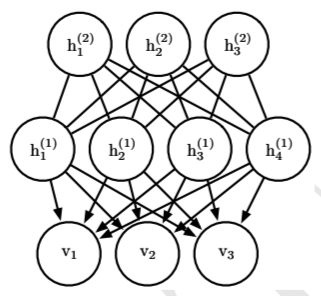
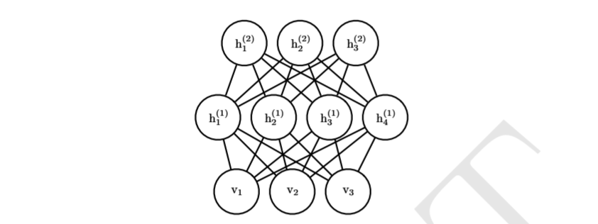

# Deep Generative Model

## 1 Boltzmann Machines

玻尔兹曼机是一类（通常为二值变量的）概率无向图模型，其联合概率分布基于能量定义：
$$
P(x)=\frac{\exp(-E(x))}{Z}
$$
其中 $E(x)$ 是能量函数，$Z$ 是确保 $\sum_xP(x)=1$ 的配分函数，玻尔兹曼机的能量函数定义为：
$$
E(x)=-x^\top Ux-b^\top x
$$
其中 $U$ 是模型参数的“权重”矩阵，$b$ 是偏置向量。这个能量函数可以表示为因子图的视角，将 $b^\top x$ 理解为单节点因子，$x^\top U x$ 理解为双节点因子，我们就可以得到概率无向图因子分解的等价形式。

在上面这种定义方式中，我们没有对变量的类型进行区分，如果我们将所有单元分解为两个子集：可见单元 $v$ 和潜在单元 $h$，然后将能量函数写为：
$$
E(v,h)=-v^\top Rv-v^\top Wh-h^\top Sh-b^\top v-c^\top h
$$
潜在变量的作用类似于 MLP 中的隐藏层，这使得玻尔兹曼机变成了离散变量分布上概率质量函数的万能近似器。

玻尔兹曼机有一个有趣的性质，当基于最大似然的学习规则训练时，连接两个单元的特定权重的更新仅仅取决于这两个单元在不同分布下收集的统计信息：$P_{model}(v)$ 和 $\hat P_{data}(v)P_{model}(h\mid v)$，网络的其余部分参与塑造这些统计信息，但权重可以在完全不知道网络其余部分或这些统计信息如何产生的情况下更新，这其实是能量基模型或概率无向图模型的一般的联合概率的正负相分解性质的体现。

## 2 Restricted Boltzmann Machines (RBM)

RBM 在传统玻尔兹曼机的基础上进行了限制，其不不允许同种类型的单元之间有连接，因此是一个二分图模型。因此，其能量函数可以写成下面的形式：
$$
E(v,h)=-v^\top Wh-a^\top v-b^\top h
$$
其中 $Z$ 是被称为配分函数的归一化常数：
$$
Z=\sum_v\sum\exp\{-E(v,h)\}
$$
计算配分函数的朴素方法是难以处理的，难解的配分函数 $Z$ 意味着归一化的联合概率分布 $P(v)$，也难以评估。

我们在 RBM 的框架下说明玻尔兹曼机联合概率分布的正负相分解性质，我们将能量函数中的矩阵乘法展开为求和的形式：
$$
E(v,h)=-\sum_{i,j}v_i^\top W_{ij}h_j-\sum_ia_i^\top v_i-\sum_jb_j^\top h_j
$$
当我们以极大似然的框架进行学习时，我们的优化目标可以写作：
$$
\theta^*=\arg\max_{\theta}L(\theta)=\arg\max_\theta\sum_{v\in D}\log P(v),\theta=\{a_i,b_j,\theta_{ij}\}
$$
如果对参数 $w_{ij}$ 求偏导：
$$
\begin{aligned}
\frac{\partial L}{\partial w_{ij}}&=\sum_{v\in D}\frac{\partial}{\partial w_{ij}}\log P(v)\\
&=\sum_{v\in D}\frac{\partial}{\partial w_{ij}}\left(\log\sum_he^{-E(v,h)}-\log Z\right)\\
&=\sum_{v\in D}\left(-\frac{\sum_h\frac{\partial E}{\partial w_{ij}}e^{-E(v,h)}}{\sum_h e^{-E(v,h)}}+\frac{\sum_{v',h'}\frac{\partial E}{\partial w_{ij}}e^{-E(v',h')}}{Z}\right)\\
&=-\sum_{v\in D}\mathbb E_{h\sim P(h\mid v)}\left[\frac{\partial E}{\partial w_{ij}}\right]+\mathbb E_{v',h'\sim P(v,h)}\left[\frac{\partial E}{\partial w_{ij}}\right]\\
\end{aligned}
$$
再考察能量函数的偏导数：
$$
\frac{\partial L}{\partial w_{ij}}=-v_ih_i
$$
代入似然梯度表达式：
$$
\frac{\partial L}{\partial w_{ij}}=\sum_{v\in D}\mathbb E_{h\sim P(h\mid v)}[v_ih_j]-\mathbb E_{v',h'\sim P(v,h)}[v'_ih_j']
$$
这种性质来源于能量模型的一般性质，除此之外，RBM 作为二分图还有一类特殊性质，其条件分布  $P(h\mid v)$ 和 $P(v\mid h)$  是因子的，计算和采样是相对简单的：
$$
\begin{aligned}
P(h\mid v)&=\frac{P(h,v)}{P(v)}\\
&=\frac{1}{P(v)}\frac{1}{Z}\exp\{b^\top v+c^\top hv^\top Wh\}\\
&=\frac{1}{Z'}\exp\{c^\top h+v^\top Wh\}\\
&=\frac{1}{Z'}\exp\left\{\sum_{j=1}^{n_h}c_j^\top h_j+\sum_{n_h}^{j=1}v^\top W_{:,j}h_j\right\}\\
&=\frac{1}{Z'}\prod_{j=1}^{n_h}\exp\{c_j^\top h_j+v^\top W_{:,j}h_j\}\\
\end{aligned}
$$
因此，我们可以将条件概率分布写成单独元素上分布的乘积，如果我们考察单独元素的概率分布：
$$
\begin{aligned}
P(h_j=1\mid v)&=\frac{\widetilde P(h_j=1\mid v)}{\widetilde P(h_j=0\mid v)\widetilde P(h_j=1\mid v)}\\
&=\frac{\exp\{c_j+v^\top W_{:,j}\}}{\exp\{0\}+\exp\{c_j+v^\top W_{:,j}\}}\\
&=\sigma(c_j+v^\top W_{:,j})
\end{aligned}
$$
进而我们可以将条件概率分布完全表达为因子形式：
$$
P(h\mid v)=\prod_{j=1}^{n_h}\sigma((2h-1)\circ(c+W^\top v))_j\\
P(v\mid h)=\prod_{j=1}^{n_v}\sigma((2v-1)\circ(b+W^\top h))_i\\
$$
由于 RBM 允许高效计算 $\widetilde P(v)$ 的估计和微分，并且允许高效地进行 MCMC 采样（吉布斯块采样），我们可以使用 CD、SML、比率匹配等方式训练 RBM。

## 3 Deep Belief Networks

深度信念网络是最先引入深度架构训练的非卷积模型之一，是具有若干潜在变量层的生成模型，潜在变量通常是二值或实数，通常，每层的每个单元连接到每个相邻层的每个单元，顶部两层的连接是无向的，而其他层间连接是有向的，箭头指向最接近数据的层。

具有 $l$ 个隐藏层的神经网络包含 $l$ 个权重矩阵：$W^{(1)},\dotsb,W^{(l)}$。同时也包含 $l+1$ 个偏置向量： $b^{(1)},\dotsb,b^{(l)}$，其中 $b^{(0)}$ 是可见层的偏置，DBN 的概率分布定义为：
$$
P(h^{(l)},h^{(l-1)})\propto \exp(b^{(l)\top} h^{(l)}+b^{(l-1)\top}h^{(l-1)}+h^{(l-1)}W^{(l)}h^{(l)})\\
P(h_i^{(k)}=1\mid h^{(k+1)})=\sigma(b_i^{(k)}+W_{:,i}^{(k+1)\top}h^{(k+1)}),\forall i,\forall k\in 1,\dotsb,l-2\\
P(v_i=1\mid h^{(1)})=\sigma(b_i^{(0)}+W_{:,i}^{(1)\top}h^{(1)}),\forall i
$$
或者可见单元为实数值时：
$$
v\sim \mathcal N(v;b^{(0)}+W^{(1)\top}h^{(1)},\beta^{-1})
$$
为了从 DBN 中采样，我们首先对顶部的两个隐藏层使用 Gibbs 采样，然后对其余部分使用单次原始采样。

由于每个有向层内部的相消解释效应，并且由于无向连接的两个隐藏层之间的相互作用，深度信念网络中的推断是难解的，评估或最大化对数似然的下界也是难以处理的，因为证据下界基于大小等于网络宽度的团的期望。

因此，评估或最大化 DBN 的似然需要同时处理来自前两个隐藏层的配分函数（无向图），和边缘化潜在变量时的推断问题。

DBN 的训练是逐层进行的，我们可以先使用 CD-k 或 SML 方法训练 RBM 以最大化  $\mathbb E_{v\sim p_{data}}\log p(v)$，RBM的参数定义了 DBN 第一层的参数，然后，第二个 RBM 的训练基于最大化：
$$
\mathbb E_{v\sim p_{data}}\mathbb E_{h^{(1)}\sim p^{(1)}(h^{(1)}\mid v)}\log p^{(2)}(h^{(1)})
$$
因此，第二个 RBM 被训练为模拟由第一个 RBM 隐藏单元采样定义的概率分布，而第一个 RBM 由数据驱动，这个过程可以无限重复。

再经过贪心逐层训练之后，DBN 通常能够取得较好的效果，但是使用醒眠算法对其进行微调是可能的。

训练好的 DBN 可以直接而做为生成模型进行采样，但是 DBN 的另一个用处是其改进分类模型的能力，我们可以从 DBN 中获取权重，并使用它们定义 MLP：
$$
h^{(1)}=\sigma(b^{(1)}+v^\top W^{(1)})\\
h^{(l)}=\sigma(b_i^{(i)}+h^{(l-1)\top}W^{(l)}),\forall l\in 2,\dotsb,m
$$
利用 DBN 的生成训练后获得的权重和偏置初始化该 MLP 之后，我们可以训练该 MLP 来执行分类任务。

## 4 Deep Boltzmann Machine (DBM)

深度玻尔兹曼机是另一种深度生成模型，其特点是完全无向，与 RBM 一样，DBM 通常仅包含二值节点，但是很容易就可以拓展至实值节点。

DBM 是基于能量的模型，这意味着模型变量的联合概率分布由能量函数定义，例如对于一个包含一个可见层 $v$ 和三个隐藏层的 $h^{(1)}$、$h^{(2)}$、$h^{(3)}$ 的情况，联合概率分布由下式给出（省略偏置）：
$$
P(v,h^{(1)},h^{(2)},h^{(3)})=\frac{1}{Z(\theta)}\exp(-E(v,h^{(1)},h^{(2)},h^{(3)};\theta))\\
E(v,h^{(1)},h^{(2)},h^{(3)};\theta)=-v^\top W^{(1)}h^{(1)}-h^{(1)\top}W^{(2)}h^{(2)}-h^{(2)\top}W^{(3)}h^{(3)}
$$
与 RBM 相比， DBM 的能量函数的定义中还增加了对隐藏层之间连接的表示。

尽管引入了层次化的结构，但是 DBM 还是可以像 RBM 一样改写为二分图的形式，其中奇数层位于一侧，偶数层位于另一侧，当我们条件于奇数层中的变量时，偶数层中的变量变得条件独立，当我们 条件于偶数层中的变量时，奇数层中的变量变得条件独立。

类似于 RBM，对于具有两个隐藏层的 DBM，我们可以这样表示激活概率（省略偏置）：
$$
P(v_1\mid h^{(1)})=\sigma(W^{(1)}_{i,:}h^{(1)})\\
P(h^{(1)}_i=1\mid v,h^{(2)})=\sigma(v^\top W^{(1)}_{:,i}+W_{i,:}^{(2)}h^{(2)})\\
P(h_k^{(2)}=1\mid h^{(k)})=\sigma(h^{(1)\top}W^{(2)}_{:,k})
$$
由于 DBM 的二分图结构，我们能够使用 Gibbs 块采样从中高效地获取样本，例如我们可以将所有单元分为两个块，其中一块包含所有的偶数层，另一块包含所有的奇数层。

与 DBN 相比，DBM 的后验分布 $P(h\mid v)$ 更简单，这使得更丰富的后验近似是可能的，DBM 的一个不理想的性质是从中采样是相对困难的。DBN 的采样过程仅涉及再前两层使用 MCMC 采样，其后只需要对剩余层使用高效的原始采样，但是要从 DBM 中生成样本，必须在所有层中使用 MCMC，并且模型的每一层都参与每个马氏链转移。

## 5 Boltzmann Machines for Real-Valued Data

## 6 Convolutional Boltzmann Machines

## 7 Boltzmann Machines for Structured or Sequential Outputs
## 8 Other Boltzmann Machines

## 9 Back-Propagation through Random Operations

## 10 Directed Generative Nets

## 11 Drawing Samples from Autoencoders

## 12 Generative Stochastic Networks

## 13 Other Generation Schemes
