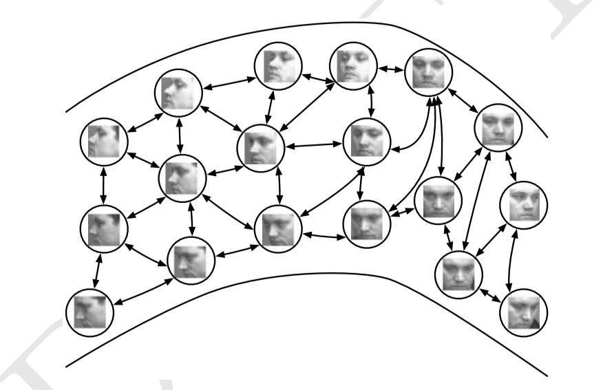

# Autoencoders

自编码器由编码器 $h=f(x)$ 和解码器 $r=g(h)$ 组成，$h$ 表自编码器的隐藏层，自编码器经过训练后能够根据输出产生编码，并由编码恢复输出。如果一个自编码器只是简单地学会将处处设置为 $g(f(x))=x$，那么这个自编码器就没有什么特别的用处，因此，我们不应该将自编码器设置为输入到输出完全相等，这通常需要向自编码器强加一些约束，使它只能近似地复制，并只能复制与训练数据相似的输出。

## 1 Undercomplete Autoencoder

欠完备自编码器是一类 $h$ 维度小于 $x$ 维度的模型，学习欠完备的表示将强制自编码器捕捉训练数据中最显著的特征。

欠完备自编码器的学习过程可以简单地描述为最小化一个损失函数：
$$
L(x,g(f(x)))
$$
当解码器是线性的且 $L$ 表示均方误差时，欠完备自编码器的生成子空间与 PCA 一致，这种情况下，自编码器学习恢复输入的同时学习到了训练数据的主元子空间。

具有非线性编码器函数和解码器函数的自编码器能够学习出更强大的 PCA 的非线性推广。但是不幸的是当编码器和解码器的容量过大时，自编码器会执行复制任务而不是捕捉关于数据分布的有价值的信息。

## 2 Regularized Autoencoders

如果隐藏编码的维度允许与输入相等，或者隐藏编码维数大于输入的过完备情况下，即使是线性的编码器和解码器也可以学会将输入复制到输出，而不学习任何有用信息。

正则自编码器使用的损失函数可以鼓励模型学习其他特性，而不必限制使用浅层的编码器和解码器以及小的编码维数来限制模型的容量，这些特性包括稀疏表示、较小的表征导数 、以及对噪声或输入缺失的鲁棒性。

几乎任何带有潜变量并配有一个推断过程的生成模型都可以看做是自编码器的一种特殊形式。

### 2.1 Sparse Autoencoders

稀疏自编码器简单地在训练时结合编码器层的稀疏惩罚 $\Omega(h)$ 和重构误差：
$$
L(x,g(f(x)))+\Omega(h)
$$
其中 $g(h)$ 是解码器的输出，通常 $h$ 是编码器的输出，即 $h=f(x)$ 。

稀疏正则化的自编码器必须反映训练数据集的独特统计特征，而不是简单地充当恒等函数。

稀疏惩罚不像其他正则项（如权重衰减 ），其他的正则惩罚可以与模型参数的先验概率分布建立关系，而稀疏惩罚没有直观的贝叶斯解释，我们认为它隐式地表达了对函数的偏好。

我们可以将整个稀疏自编码器框架看作是对带有潜在变量的生成模型的近似最大似然训练，而不将稀疏惩罚看作复制任务的正则化。假设我们有一个带有可见变量 $x$ 和潜在变量 $h$ 的模型，且具有明确的联合分布 $p_{model}(x,h)=p_{model}(h)p_{model}(x\mid h)$，我们将 $p_{model}(h)$ 视为模型关于潜变量的先验分布，表示模型看到 $x$ 的信念先验，对数似然可以分解为：
$$
\log p_{model}(x)=\log \sum_hp_{model}(h,x)
$$
我们可以认为自编码器使用一个高似然值的 $h$ 的点估计近似估计总和，这类似于稀疏编码生成模型，但是 $h$ 是参数编码器的输出而不是从优化结果推断出的最有可能的 $h$，从这个角度看，我们根据这个选择的 $h$，最大化如下：
$$
\log p_{model}(h,x)=\log p_{model}(h)+\log (x\mid h)
$$
$\log p_{model}(h)$ 项能被稀疏诱导，例如使用 Laplace 先验：
$$
p_{model}(h_i)=\frac{\lambda}{2}e^{-\lambda|h_i|}
$$
对应于 L1 正则化，我们将对数先验表示为绝对值惩罚：
$$
\Omega(h)=\lambda\sum_i|h_i|\\
-\log p_{model}(h)=\sum_i(\lambda|h_i|-\log \frac{\lambda}{2})=\Omega(h)+\mathrm{const}
$$
从稀疏性导致 $p_{model}(h)$ 学习成近似最大似然的结果来看，稀疏惩罚完全不是一个正则项。这仅仅影响模型关于潜变量的分布。这个观点提供了训练自编码器的另一个动机，即训练自编码器是近似训练生成模型的一种途径。

### 2.2 Denoising Autoencoders

去噪自编码器（DAE）的优化目标是：
$$
L(x,g(f(\widetilde x)))
$$
其中 $\widetilde x$ 是被噪声损坏的 $x$ 的副本，因此去噪自编码器必须撤销这些损坏而不是简单地复制输出。

DAE 的训练过程是：

- 从训练数据采样一个训练样本 $x$
- 从 $C(\widetilde x\mid x)$ 采样一个损坏样本
- 将 $(x,\widetilde x)$ 作为训练样本来估计自编码器的重构分布 $p_{reconstruct}(x\mid \widetilde x)=p_{encoder}(x\mid h)$，其中 $h$ 是编码器 $f(\widetilde x)$ 的输出，$p_{decoder}$ 根据解码函数定义

通常我们可以简单地对负对数似然 $-\log p_{decoder}(x\mid h)$ 进行基于梯度法（如小批量梯度下降）的近似最小化，只要编码器是确定的，去噪自编码器就是一个前馈网络，并且可以使用与其他前馈网络相同的方式训练。

因此我们可以认为 DAE 是在以下期望下进行随机梯度下降：
$$
-\mathbb E_{x\sim \widetilde p_{data}(x)}\mathbb E_{\widetilde x\sim C(\widetilde x\mid x)}\log p_{decoder}(x\mid h=f(\widetilde x))
$$
得分匹配可以作为最大似然的一种代替，它提供概率分布的一致估计，促使模型在各个数据点 $x$ 上获得与数据分布相同的得分，具体来说，得分被定义为一个特定的梯度场：
$$
\nabla_x\log p(x)
$$
DAE 的训练准则是让自编码器能学到估计数据分布得分的向量场 $(g(f(x))-x)$。

对一类采用高斯噪声和均方误差作为重构误差的特定去噪自编码器的去噪训练过程与训练 RBM 的过程是等价的。当 RBM 使用去噪得分匹配算法训练时，它的学习算法和训练对应的去噪自编码器是等价的。在一个确定的噪声水平下，正则化的得分匹配不是一致估计量，相反它会恢复分布的一个模糊版本，然而当噪声水平趋近于 $0$ 且训练样本数趋近于无穷时，一致性就会恢复。

自编码器和 RBM 之间存在其他联系，在 RBM 上应用得分匹配之后，其代价函数将等价于重构误差结合类似 CAE 惩罚的正则项。

对于连续的 $x$，高斯损坏和重构分布准则得到的得分估计适用于一般编码器和解码器的参数化。这意味着一个使用平方误差准则 $\|g(f(\widetilde x))\|^2$ 和噪声方差为 $\sigma^2$ 的损坏 $C(\widetilde x\mid x)=\mathcal N(x,\sigma^2I)$ 的通用编码器-解码器架构可以用来训练估计得分。

一般情况下不能保证重构函数 $g(f(x))$ 减去输入 $x$ 后对应某个函数的梯度，因此早期工作专用于特定的参数化形式。

### 2.3 Regularizing by Penalizing Derivatives

另一种正则化自编码器的策略是使用一个类似稀疏自编码器中的惩罚项 $\Omega$：
$$
L(x,g(f(x)))+\Omega(h,x)
$$
但是 $\Omega$ 的形式不再是绝对值惩罚，而是平方 Frobenius 范数，作用于编码器的函数相关偏导数的 Jacobian 矩阵：
$$
\Omega(h,x)=\lambda \sum_i\|\nabla_xh_i\|^2
$$
这迫使模型学习一个在 $x$ 变化小时对目标也没有太大变化的函数，这类自编码器被称为稀疏自编码器（CAE）。

去噪自编码器与收缩自编码器之间存在一定联系，在小高斯噪声的限制下，当重构函数将 $x$ 映射到 $r=g(f(x))$ 时，去噪重构误差与收缩惩罚项是等价的。换句话说，去噪自编码器能抵抗小且有限的输入扰动，而收缩自编码器使特征提取函数能抵抗极小的输入扰动。

分类任务中，基于 Jacobian 的收缩惩罚预训练特征函数 $f(x)$，将收缩惩罚应用于 $f(x)$ 而不是 $g(f(x))$ 能产生最好的分类精度。

收缩源于 CAE 弯曲空间的方式。具体来说，由于 CAE 训练为抵抗输入扰动，鼓励将输入点邻域映射到输出点处更小的邻域。我们认为这是将输入的邻域收缩到更小的输出邻域。

CAE 只在局部收缩——一个训练样本 $x$ 的所有扰动都映射到 $f(x)$ 的附近。全局来看，两个不同的点 $x$ 和 $x'$ 会被分别映射到远离原点的两个点 $f(x)$ 和 $f(x')$。$f$ 扩展到数据流形的中间或者远处是合理的。$\Omega(h)$ 应用于 sigmoid 单元时，收缩 Jacobian 的简单方式是令 sigmoid 趋向饱和的 $0$ 和 $1$，这鼓励 CAE 使用 sigmoid 的极值编码输入点，或许可以解释为二进制编码。它保证了 CAE 可以穿过大部分 sigmoid 隐藏单元能张成的超立方体，进而扩散其编码值。

$x$ 处的 Jacobian 矩阵 $J$ 能将非线性编码器近似为线性算子，在线性理论中，如果 $\forall |x|=1,|Jx|\leq1 $ ，$J$ 被称为一个收缩算子。我们可以认为 CAE 为鼓励每个局部线性算子具有收缩性，而在每个训练数据点处将 Frobenius 范数作为 $f(x)$ 的局部线性近似的惩罚。

CAE 的目标是学习流形结构，使 $Jx$ 很大的方向 $x$ 会快速改变 $h$，这可以被理解为近似流形切平面的方向。CAE 的收缩惩罚会导致 $J$ 中的大部分奇异值比 $1$ 小，因此是收缩的。然而，有些奇异值仍然比 $1$ 大，因为重构误差的惩罚鼓励 CAE 对最大局部变化的方向进行编码，对应于最大奇异值的方向被解释为收缩自编码器学习到的切方向。理想情况下，这些切方向应对应于数据的真实变化。

在深层的编码器中，收缩惩罚可能是难以处理的，一种策略是分别训练一系列的单层自编码器，并且每个被训练为重构前一个自编码器的隐藏层，这些自编码其的组合就组成了一个深度自编码器。

另一个问题是，如果我们不对解码器强加一些约束，收缩惩罚可能导致无用的结果，例如，编码器会将输入乘以一个小常数 $\epsilon$，随着 $\epsilon$ 趋向于 $0$，拜纳姆其会使收缩惩罚趋向于 $0$ 而不学到任何与分布有关的信息，同时解码器有完美的重构。

## 3 Stochastic Encoders and Decoders

随机自编码器将编码函数和解码函数的概念推广至编码分布和解码分布：
$$
p_{encoder}(h\mid x)=p_{model}(h\mid x)\\
p_{decoder}(x\mid h)=p_{model}(x\mid h)
$$
这意味着我们可以将编码器和解码器的输出看作来自分布的采样。

通常编码器和解码器的分布不需要是唯一一个与联合概率分布相容的条件分布。

## 4 Learning Manifolds with Autoencoders

流形的一个重要特征时切平面的集合，$d$ 维流形上的一点 $x$，切平面由能张成流形上允许变动的局部方向的 $d$ 维基向量给出，这些局部方向决定了我们能如何微小地变动 $x$ 而保持于流形上。

所有自编码器的训练过程涉及两种推动力的初衷：

- 学习训练样本 $x$ 的表示 $h$ 使得 $x$ 能够通过解码器近似地从 $h$ 中恢复。$x$ 是从训练数据中采样得到的，这很关键，因为这意味着自编码器不需要重构不属于数据生成分布下的输入。
- 满足约束或正则惩罚。这可以是限制自编码器容量的架构约束，也可以是加入到重构代价的一个正则项。

显然，单一的推动力是无用的——将输入复制到输出是无用的，忽略输入也是没用的。而当两种推动力结合时，它们驱使隐藏的表示能捕获有关数据分布结构的信息。

重要的原则是，自编码器必须有能力表示重构训练实例所需的变化，如果该数据生成分布集中靠近一个低维流形，自编码器能够隐式产生捕捉这个流形局部坐标系的表示：仅在 $x$ 周围关于流形的相切变化需要对应 $h=f(x)$ 中的变化。因此，编码器学习从输入空间 $x$ 到表示空间的映射，映射仅对沿着流形方向的变化敏感，并且对流形正交方向的变化不敏感。

学习表征流形最常见的是流形上（或附近）数据点的表示，对于特定的实例，这样的表示也被称为嵌入，它通常由一个低维向量给出，具有比这个流形的外围空间更少的维数，有些算法直接学习每个训练样例的嵌入（非参数流形学习算法），而其他更一般的算法学习更一般的映射（编码器或表示函数），将周围空间的任意点映射到它的嵌入。

最初始的流形学习算法是基于最近邻图的非参数学习方法，每个训练样例对应图中的一个节点，它的边连接近邻点对，这种方法将每个节点与张成实例和近邻之间的差向量变化方向的切平面相关联。

全局坐标系可以通过优化或求解线性系统获得。只要样本数量大到足以覆盖流形的弯曲和扭转，这些方法工作良好。

然而，这些局部非参数方法应用于流形学习有一些根本困难，当流形本身并不光滑时，我们可能需要非常多的训练样本以覆盖其中的每一个变化，导致没有能力泛化到没有出现的变化。实际上相邻实例之间流形的形状只能通过插值，但是不幸的是我们研究的问题中涉及的流形结构通常是相当复杂的，难以仅从局部插值获取特征。

## 5 Predictive Sparse Decomposition (PSD)

预测稀疏分解时稀疏编码和参数化自编码器的混合模型，参数化编码器被训练为能预测迭代推断的输出。与其他自编码器模型类似，这个模型也由一个编码器 $f(x)$ 和一个解码器 $g(x)$ 组成，并且都是参数化的，训练过程中 $h$ 由优化算法控制，优化过程最小化：
$$
\|x-g(h)\|^2+\lambda|h|_1+\gamma\|h-f(x)\|^1
$$
在上面的训练目标中 $\|x-g(h)\|^2$ 确保编码器输出与稀疏编码互相接近，$\lambda|h|_1$ 确保编码的稀疏性，$\gamma\|h-f(x)\|^1$ 减小重构损失。

就像稀疏编码，训练算法交替地相对 $h$ 和模型参数最小化上述目标。相对 $h$ 最小化较快，因为 $f(x)$ 提供 $h$ 良好的初始值以及损失函数将 $h$ 约束在 $f(x)$ 附近，因此迭代可以快速收敛。

在 PSD 的实际应用中，迭代优化仅仅在训练过程中使用。模型被部署之后，参数编码器 $f$ 用于计算已经习得的特征。相比于使用梯度下降推断 $h$，计算 $f$ 是容易的。