# Optimization for Training Deep Models

## 1 How Learning Differs from Pure Optimization

用于深度学习训练的优化算法与传统的优化算法的区别是，机器学习通常是间接作用于我们所关注的性能度量 $P$ 的，在学习的过程中，我们只是间接地优化 $P$，希望通过降低代价函数 $J(\theta)$ 来提高 $P$，而纯粹的优化算法直接最小化 $J$ 本身。

童话参观，代价函数可以写作训练集上的期望（平均）的形式：
$$
J(\theta)=\mathbb E_{(x,y)\sim \hat p_{data}}L(f(x;\theta),y)
$$
其中 $L$ 是每个样本的损失函数，$f(x;\theta)$ 是输入 $x$ 时所预测的输出，$\hat p_{data}$ 是经验分布。

通常，我们的目标并不是最小化经验分布上的期望，而是来自数据分布本身的期望：
$$
J^*(\theta)=\mathbb E_{(x,y)\sim p_{data}}L(f(x;\theta),y)
$$

### 1.1 Empirical Risk Minimization (ERM)

机器学习任务中，将 $J^*(\theta)$ 称为风险（risk），最小化风险是机器学习任务的根本目标。然而通常真实的数据分布 $p_{data}$ 对我们是不可见的，一种间接的优化方法是最小化经验风险：
$$
\mathbb E_{x,y\sim \hat p_{data}}[L(f(x;\theta),y)]=\frac1m\sum_{i=1}^mL(f(x^{(i)};\theta),y^{(i)})
$$
其中 $m$ 表示训练样本的数目。基于最小化这种平均训练误差的训练过程被称为经验风险最小化。在此情况下，机器学习仍然和传统的直接优化类似。

然而经验风险最小化很容易造成过拟合因此很多情况下并不可行。最有效的现代优化算法是基于梯度下降的，但是很多有用的损失函数，如 $0-1$ 损失，没有有效的导数。这两个问题说明，在深度学习方法中很少直接使用经验风险最小化作为优化目标。

### 1.2 Surrogate Loss Functions and Early Stopping

有时我们真正关心的损失函数并不能被高效地优化，通常优化代理损失函数作为代替，代理损失函数通常具备一些优点，例如可微、连续等。

某些情况下，使用代理损失函数比原损失函数学到的更多。例如，是应用负对数似然代替阶跃函数作为损失时，在训练集上的 $0-1$ 损失达到 $0$ 之后，在测试集上的 $0-1$ 损失还能持续下降很长时间，这是因为即使 $0-1$ 损失期望是 $0$ 时，我们还能拉开不同类别的距离以改进分类器的鲁棒性，获得一个更强壮的、更值得信赖的分类器，从而相对于简单地最小化训练集上的平均 $0-1$ 损失，它能够从训练数据中抽取更多信息。

一般的优化和我们用于训练算法的优化有一个显著的不同：训练算法通常不会停留在局部极小值点，反之，机器学习通常优化代理损失函数，但是基于提前终止的收敛条件满足时停止，而提前终止使用真实潜在损失函数，如验证集上的 $0-1$ 损失，这导致优化终止时代理函数仍有较大的导数，而纯优化终止时导数较小。

## 1.3 Batch and Minibatch Algorithms

机器学习优化和一般优化算法的另一个区别是，机器学习算法的目标函数通常可以分解为训练样本上的求和。机器学习中的优化算法在计算参数的每一次更新时通常使用整个代价函数中一部分项来估计代价函数的期望值。

最大似然估计问题可以在对数空间分解成各个样本的总和：
$$
\theta_{ML}=\arg\max_{\theta}\sum_{i=1}^m\log p_{model}(x^{(i)},y^{(i)};\theta)
$$
最大化这个总和等价于最大化训练集在经验分布上的期望：
$$
J(\theta)=\mathbb E_{x,y\sim\hat p_{data}}\log p_{model}(x,y;\theta)
$$
优化算法所用到的目标函数 $J$ 中的大多数属性也是训练集上的期望，例如，最常用的属性是梯度：
$$
\nabla_\theta J(\theta)=\mathbb  E_{x,y\sim \hat p_{data}}\nabla_{\theta}\log p_{model}(x,y;\theta)
$$
准确计算这个期望代价极大，因为我们需要首先在每个样本上评估模型，实践中，我们可以从数据集中随机采样少量的样本，然后计算这些样本上的平均值。

采用这种估计方式的另一个动机是，由于 $n$ 个样本均值的方差是 $\sigma/\sqrt{n}$，其中 $\sigma$ 是样本值真实的标准差，分母  $\sqrt n$ 表明使用更多样本估计梯度的方法的回报是低于线性的。

还有一个动机是训练集的冗余，最坏的情况下，训练集中所有的 $m$ 个样本都是彼此相同的拷贝。基于采样的梯度估计可以使用单个样本计算出正确的梯度，而比原来的做法少了 $m$ 倍时间。实践中，我们会发现大量样本对梯度做出的贡献是相似的。

使用整个训练集的优化算法被称为批量或确定性梯度算法，因为它们会在一个大批量中同时处理所有的样本。每次只使用单个样本的优化算法有时被称为随机或者在线算法。大多数深度学习算法介于二者之间，使用一个以上但并非全部的训练样本，传统上这被称为小批量（minibatch）或者小批量随机算法。

这类算法的典型是随机梯度下降，小批量的大小通常由以下几个因素决定：

- 更大的批量会计算更精确的梯度估计，但是回报是小于线性的
- 极小批量通常难以充分利用多核架构。这促使我们使用一些绝对最小批量，低于这个值的小批量不会减少计算时间
- 如果批量处理中的所有样本都可以并行地处理，那么内存消耗和批量大小成正比，对于很多硬件设施，这是批量大小的限制因素
- 在某些硬件上使用特定大小的数组时，运行时间会更少，尤其在使用 GPU 时，通常使用 $2$ 的幂次作为批量大小可以获得更少的运行时间
- 可能是由于小批量在学习过程中加入了噪声，它们会有一些正则化效果。泛化误差通常在批量为 $1$ 时最好，因为梯度估计的高方差，小批量训练需要较小的学习率以保持稳定性。因为降低的学习率和消耗更多的步骤来遍历整个数据集都会产生更多的步骤，所以总的运行时间会非常大。

不同的算法使用不同的方法从小批量中获得不同的信息。有些算法对采样误差比其他算法更加敏感，可能是由于：

- 它们使用了很难在少量样本上精确获得的信息
- 它们以放大采样误差的方式使用信息

仅使用梯度 $g$ 的更新方法相对鲁棒，并且能够使用较小的批量获得成功，使用 Hessian 矩阵的二阶方法通常需要更大的批量。

小批量是随机抽取的这点也很重要。从一组样本中计算出梯度期望的无偏估计要求这些样本是独立的。我们也希望两个连续的梯度估计是互相独立的，因此两个连续的小批量样本也应该是彼此独立的。因此，有必要在抽取之前打乱样本顺序，实践中我们只需要将样本打乱一次，然后按照这个顺序存储起来就够了。之后进行抽取的顺序是固定的，这种偏离真实随机采样的方式并没有大的有害影响。

很多机器学习上的优化方式可以分解为并行地计算呢不同样本上单独的更新，我们在计算小批量 $X$ 上最小化 $J(X)$ 的更新时，同时可以计算其他小批量上的更新。

使用小批量梯度下降的另一个动机是，直到重复使用样本之前，小批量梯度下降都会遵循着真实泛化误差的梯度。很多小批量随机梯度下降方法的实现都会打乱数据顺序依次，然后多次遍历数据来更新参数。第一次遍历时，每个小批量都用来计算真实泛化误差的无偏估计，第二次遍历时，估计将会是有偏的，因为它重新抽取的已经使用过的样本。

在 $x$ 和 $y$ 时离散的时，以上的等价性很容易得到。在这种情况下，泛化误差可以表示为：
$$
J^*(\theta)=\sum_x\sum_yp_{data}(x,y)L(f(x,\theta),y)
$$
上式的准确梯度是：
$$
g=\nabla_\theta J^*(\theta)=J^*(\theta)=\sum_x\sum_yp_{data}(x,y)\nabla_\theta L(f(x,\theta),y)
$$
在变量离散的情况下得到的结果是类似的。因此我们可以从数据生成分布 $p_{data}$ 抽取小批量样本 $\{x^{(1)},\dotsb,x^{(m)}\}$ 以及对应的目标 $y^{(i)}$，然后计算该小批量上损失函数关于 对应参数的梯度：
$$
\hat g=\frac1m\nabla_\theta\sum_iL(f(x^{(i)};\theta),y^{(i)})
$$
因此获得泛化误差准确梯度的无偏估计，最后在泛化误差上使用 SGD 方法在 $\hat g$ 上更新参数。

这个解释只能用于样本没有重复使用的情况，但是对训练数据的额外遍历也会由于减小训练误差而得到足够的好处，以抵消其带来的训练误差和测试误差间差距的增加。

## 2 Challenges in Neural Network Optimization

### 2.1 Ill-Conditioning

Hessian 矩阵的病态是优化凸函数时最常见的问题之一，其体现于随机梯度下降会在某些位置停滞，即使很小的更新步长也会导致代价函数的增加。

代价函数的二阶泰勒展开预测梯度下降中的 $\epsilon g$ 会增加 $\frac12 \epsilon^2 g^\top Hg-\epsilon g^\top g$ 到代价中，当 $\frac12 \epsilon^2 g^\top Hg$ 大于 $\epsilon g^\top g$ 时，梯度的病态会成为问题，在很多情况中，梯度范数不会再训练过程中显著减少，但是 $g^\top Hg$ 的增长会超过一个数量级，其结果是即使在梯度较强的区域，学习也会十分缓慢，因为学习率必须收缩以弥补更强的曲率。

尽管病态还存在于除了神经网络训练的其他情况中，有些适用于其他情况的解决病态的技术并不适用于神经网络。

### 2.2 Local Minima

凸优化的一个特点是其可以简化为寻找一个局部极小点的问题，任何一个局部极小点都是全局极小点。有些凸函数的底部是一个平坦的区域，而不是单一的全局最小点，但该平坦区域中的任意点都是一个可接受的解，优化一个凸问题时，若发现了任何形式的临界点，我们都会知道已经找到了一个不错的可行解。

对于非凸的优化问题例如神经网络来说，可能会存在多个局部极小值，但是这并不是主要的问题。

由于模型可辨识性的问题，神经网络和任意具有多个等效参数化潜变量的模型都会具有多个局部极小值。如果一个足够大的训练集可以唯一确定一组模型参数，那么该模型被称为可辨认的。带有潜变量的模型通常是不可辨认的，因为通过潜变量的交换我们可以得到等价的模型。这种不可辨认行称为权重空间的对称性。

除了权重空间的对称性，还有很多原因导致神经网络是不可辨认的，例如，在任意整流线性网络或者 maxout 网络中，我们可以将传入权重和偏置扩大 $\alpha$ 倍，然后将传出权重扩大 $1/\alpha$ 倍，而保持模型等价。这意味着如果代价函数不包括权重衰减这种直接依赖权重而非模型输出的项，那么整流线性网络或者 maxout 网络的每一个局部极小点都在等价的局部极小值的 $(m\times n)$ 维双曲线上。

由模型可辨识问题带来的多局部极小值都有相同的代价函数值，因此这些局部极小值并不是非凸带来的问题。

如果局部极小值相比全局最小点拥有很大的代价，局部极小值会带来很大的隐患。如果具有很大代价的局部极小值是常见的，那么这将给基于梯度的优化算法带来极大的问题。

对于实际中感兴趣的网络，是否存在大量代价很高的局部极小值，优化算法是否会碰到这些局部极小值，都是尚未解决的公开问题。

### 2.3 Plateaus, Saddle Points and Other Flat Regions

对于很多高维非凸函数而言，局部极小值远少于另一类梯度为零的点——鞍点。鞍点处 Hessian 矩阵同时具有正负特征值，位于正特征值对应的特征向量的方向的点比鞍点具有更大的代价，而位于负特征值对应的特征向量方向的点比鞍点有更大的代价，反之，位于负特征值对应的特征向量方向的点有更小的代价。

在多类随机函数中，鞍点和局部极小值的比率的期望随 $n$ 以指数级增长，而在很多神经网络中情况是类似的。

对于只使用梯度信息的一阶优化算法，优化轨迹可以迅速逃逸出鞍点，但是对于牛顿法而言，鞍点显然是一个问题，因为在梯度下降中，优化过程旨在寻找一条使得代价减小的路径，而不是明确寻找梯度为 $0$ 的点，而牛顿法的目的则是寻求梯度为 $0$ 的点，如果没有适当的修改，牛顿法就会跳进一个鞍点。因此这或许是高维空间中二阶方法无法成功取代一阶方法扩展到大型神经网络的一个原因。

也可能存在恒值的、宽且平坦的区域。在这些区域，梯度和 Hessian 矩阵都是零。这种退化的情形是所有数值优化算法的主要原因。

### 2.4 Cliffs and Exploding Gradients

多层神经网络通常存在向悬崖一样的斜率较大的区域，这是由于几个较大的权重相乘导致的，遭遇梯度较大的悬崖区域时，参数会在一轮内有极大的改变幅度，从而完全跳过悬崖结构。

我们使用梯度截断方式来避免悬崖区域的不良影响，当传统更新方式提议一个极大步长的更新时候，梯度截断会减小步长，使其不太可能走出梯度近似为最陡下降方向的悬崖区域。

### 2.5 Long-Term Dependencies

当计算图变得极深时，神经网络优化算法会面临另一个难题，即长期依赖问题——由于深层的结构使模型丧失了学习到先前信息的能力，优化变得极其困难。

假设某个计算图中包含一条反复与矩阵 $W$ 相乘的路径，那么 $t$ 步之后，相当于乘以 $W^t$，假设 $W$ 有特征值分解 $W=V\mathrm{diag}(\lambda)V^{-1}$，在此情况下，很容易看出：
$$
W^t=(V\mathrm{diag}(\lambda)V^{-1})^t=V\mathrm{diag}(\lambda)^tV^{-1}
$$
这个结构会导致梯度消失（$\lambda_i<1$）与爆炸（$\lambda_i>1$）问题，前者使得我们难以知道参数朝着哪个方向移动能改进代价函数，而梯度爆炸会使得学习不稳定。

此处描述的各时间步重复与 $W$ 相乘非常类似于寻求矩阵 $W$ 的最大特征值及对应特征向量的幂方法。从这个观点来看，$x^\top W^t$ 最终会丢弃 $x$ 中所有与 $W$ 的主特征向量正交的成分。

在前馈神经网络中，我们并不存在这种形式的参数共享，因此即使使用非常深层的前馈神经网络，也能很大程度上避免梯度消失与爆炸的问题，而在循环神经网络中则不然。

### 2.6 Inexact Gradients

大多数情况下我们用于优化的梯度或 Hessian 矩阵都会存在噪声甚至偏差。而在另一些情况下我们希望最小化的目标函数是难解的，在此情况下我们只能对梯度进行近似或者使用代理损失函数。

### 2.7 Poor Correspondence between Local and Global Structure

如果参数更新的方向在局部改进很大，但并没有指向代价低得多的遥远区域，那么我们有可能在单点处克服以上所有困难，但仍然表现不佳。

大多数优化研究的难点集中于训练是否找到了全局最小点、局部极小点或是鞍点，但在实践中神经网络不会到达任何一种临界点，甚至这些临界点不一定存在。

当目标函数有诸如病态条件或不连续梯度的问题，使得梯度为目标函数提供较好近似的区间非常小时，步长为 $\epsilon$ 的局部下降可能定义了到达解的合理的最短路径，但是我们只能计算步长为 $\delta\ll\epsilon$ 的局部下降方向，在这种情况下局部下降或许能定义通向解的路径，但是该路径包含的更新次数过多，计算代价过大。

当目标函数存在一个宽而平的区域时，局部信息不能为全局的优化提供任何指导。

其他情况下，局部移动可能过于贪心，只是单纯朝代价下降的方向移动，却和所有可行解南辕北辙。

许多现有研究方法在求解具有困难全局结构的问题时，旨在寻求良好的初始点， 而不是开发非局部范围更新的算法。

## 3 Basic Algorithms

### 3.1 Stochastic Gradient Descent

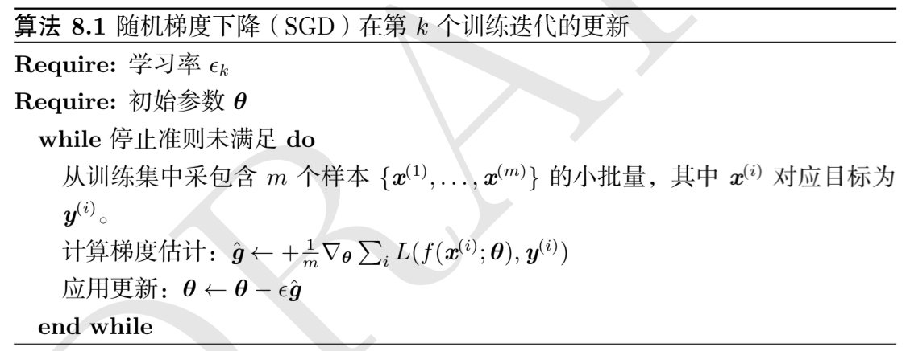

SGD 算法的一个关键参数是学习率，在实践中，有必要随时间推移逐渐降低学习率，因此我们将第 $k$ 步迭代的学习记作 $\epsilon_k$ 。这是因为 SGD 中梯度估计引入的噪声源（$m$ 个训练样本的随机采样）并不会在极小点处消失。相比之下，我们使用批量梯度下降到达极小点时，整个代价函数的真实梯度会变得很小，之后为 $0$，因此批量梯度下降可以使用固定的学习率。保证 SGD 充分收敛的一个充分条件是：
$$
\sum_{k=1}^\infty\epsilon_k=\infty
$$
且：
$$
\sum_{k=1}^\infty\epsilon_k^2<\infty
$$
一般会线性衰减学习率直到第 $\tau$ 次迭代：
$$
\epsilon_k=(1-\alpha)\epsilon_0+\alpha\epsilon_\tau
$$
其中 $\alpha=\frac k\tau$，在第 $\tau$ 步迭代之后，一般使 $\epsilon$ 为常数。学习率可以通过试验和误差来选取，通常最好的选择方法是监测目标函数值随时间变化的学习曲线。终止学习率通常被设置为起始学习率的 $1\%$，而初始学习率的设置相对复杂，如果过高，学习曲线将会剧烈震荡，如果太低，那么学习可能会卡在一个相当高的代价值。通常，就总训练时间和最终代价值而言，最优初始学习率的效果会好于大约迭代 $100$ 次左右后最佳的效果。因此通常最好检测最早几轮的迭代，选择一个比在效果上表现最佳的学习率更大的学习率，但又不能导致严重的震荡。

SGD 及类似的在线学习算法，一个重要的性质是每一步更新的计算时间不依赖于训练样本数量的多少，即使训练样本数目非常大时，它也可能收敛。对于足够大的数据集，SGD 可能在处理整个训练集之前就收敛到最优解。

我们通过额外误差 $J(\theta)-\min_\theta J(\theta)$，即当前代价函数超出最低可能代价的量研究优化算法的收敛率。SGD 用于凸问题时，$k$ 步迭代后的额外误差量级是 $O(\frac1 {\sqrt{k}})$ ，在强凸情况下是 $O(\frac1k)$，除非假定额外的条件，否则这些界限不能进一步改进。批量梯度下降在理论上比随机梯度下降有更好的收敛率，但是，Cramér-Rao 界限指出，泛化误差的下降速度不会快于 $O(\frac 1k)$。

渐近分析掩盖了随机梯度下降在少量更新步之后的很多优点，对于大数据集 SGD 只需要非常少的样本计算梯度从而实现初始快速更新，远远超过了其缓慢的渐近收敛。

### 3.2 Momentum

动量方法旨在加速学习过程，特别擅长处理高曲率、小但一致的梯度，或是带噪声的梯度。动量算法积累了之前梯度指数衰减的移动平均，并且继续沿该方向移动

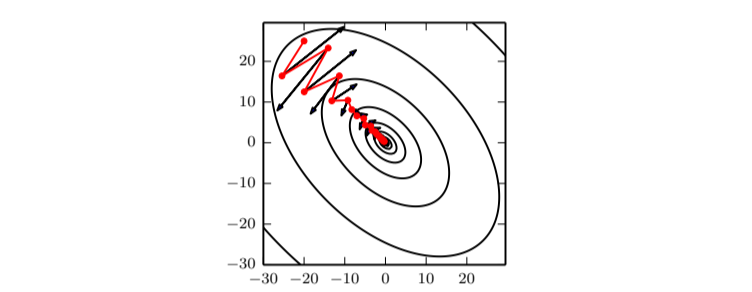

从形式上来看，动量算法引入变量 $v$ 充当速度角色——它代表参数在参数空间上移动的方向和速率。速度被设为负梯度的指数衰减平均，名为动量，动量梯度下降使用以下的参数更新规则：
$$
v\leftarrow \alpha v-\epsilon \nabla_\theta\left(\frac1m\sum_{i=1}^mL(f(x^{(i)};\theta),y^{(i)})\right)\\
\theta\leftarrow \theta+v
$$
超参数 $\alpha$ 决定了之前梯度的贡献的衰减速率，而动量积累了此前的梯度元素 $\nabla_\theta\left(\frac1m\sum_{i=1}^mL(f(x^{(i)};\theta),y^{(i)})\right)$，相对于 $\epsilon$，$\alpha$ 越大，之前梯度对现在方向的影响也越大。

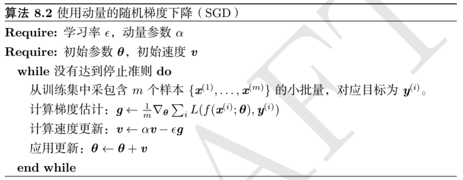

之前，步长只是梯度范数乘以学习率，现在步长取决于梯度序列的大小和排列。当许多连续的梯度指向相同的方向时，步长最大。如果动量算法总是观测到梯度 $g$，那么它会在方向 $-g$ 上不停加速，直到达到最终速度，其中步长大小为：
$$
\frac{\epsilon \|g\|}{1-\alpha}
$$
因此将动量的超参数视为 $\frac{1}{1-\alpha}$ 有助于理解。例如，$\alpha=0.9$ 对应着最大速度 $10$ 倍于梯度下降算法。

事件中，$\alpha$ 的一般取值为 $0.5$，$0.9$ 或 $0.99$，$\alpha$ 和学习率一样随时间不断调整，一般不断增加 $\alpha$ 的值，不断收缩 $\epsilon$ 的值。如果从粒子运动的角度理解动量算法，粒子在任意时间点的位置由 $\theta(t)$ 给定，粒子受到的净力是 $f(t)$，该力会导致粒子加速：
$$
f(t)=\frac{\partial^2}{\partial t^2}\theta(t)
$$
与其将其视作位置的二阶微分方程，我们不如引入表示粒子在时间 $t$ 处速度的变量 $v(t)$，将牛顿动力学重写为一阶微分方程：
$$
v(t)=\frac{\partial}{\partial t}\theta(t)\\
f(t)=\frac{\partial}{\partial t}v(t)
$$
由此，动量算法包括通过数值模拟求解微分方程，求解微分方程的一个简单方法是欧拉方法，通过在每个梯度方向上小且有限步来简单地模拟该等式定义的动力学。

在优化过程中，我们定义力 $f(t)$ 正比于代价函数的负梯度 $-\nabla_\theta J(\theta)$，该力推动粒子沿着代价函数下降的方向移动。同时我们定义一个粘性阻力，其正比于 $-v(t)$，粘性阻力存在的目的是使粒子随时间的推移失去能量，最终收敛至局部极小点，这种粘性阻力的形式既足够使梯度引起的运动直到达到终点。又足够强，使得坡度不够的时候可以阻止运动。

### 3.3 Nesterov Momentum

Nesterov 动量算法是动量算法的一个变种，这种情况下采用的更新规则是：
$$
v\leftarrow \alpha v-\epsilon \nabla_\theta\left(\frac1m\sum_{i=1}^mL(f(x^{(i)};\theta+\alpha v),y^{(i)})\right)\\
\theta\leftarrow \theta+v
$$
Nestrov 动量的改进在于，梯度计算在施加当前速度之后，因此 Nestrov 动量可以解释为在标准动量方法上添加一个校正因子。

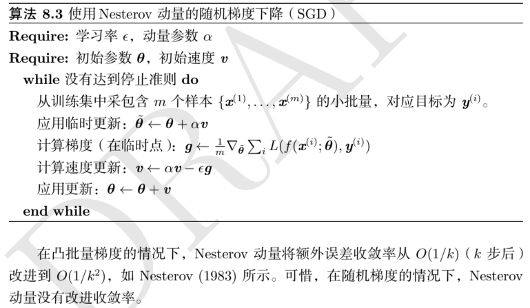

在凸批量梯度的情况下，Nestrov 动量将额外误差收敛率从 $O(1/k)$ 改进至 $O(1/k^2)$，但是在随机梯度的情况下，Nestrov 动量没有改进收敛率。

## 4 Parameter Initialization Strategies

优化的初始化对优化过程有很多影响：

- 优化是否能够收敛
- 优化收敛的速度
- 优化终点的代价水平
- 优化终点的泛化误差

现代的初始化策略是简单的、启发式的。由于神经网络的优化过程本身并没有被完全地正确认识，因此改进初始化策略是一项困难的任务。多数初始化策略基于在神经网络初始化时实现一些很好的性质，但是我们并没有很好地理解这些性质中的哪些会在学习开始进行后的哪些情况下得到保留。另一些情况是，有些初始点虽然有利于优化，但不利于模型的泛化。

一个完全确知的要求是初始参数需要在不同单元之间“破坏对称性”。如果具有相同激活函数的两个隐藏单元连接到相同的输出，那么这些单元必须具有不同的初始参数。如果它们具有相同的初始参数，然后应用到确定性损失和模型的确定性学习算法将一直以相同的方式更新这两个单元，即使模型或训练算法能够使用随机性为不同单元计算不同的更新，最好还是初始化每个单元使其和其他单元计算不同的函数。

我们几乎总是初始化权重为从高斯分布或均匀分布中随机抽取的值，这两种分布的选择不会有太大的差别。更大的初始权重有更强的破坏对称性的作用，有助于避免冗余的单元和在每层线性成分的前向或反向传播中丢失信号——矩阵中更大的值在矩阵乘法中有更大的输出。当初始权重太大时会在前向传播或反向传播中产生爆炸的值。在循环网络中，很大的权重也可能导致混沌（对输入的微小变化过于敏感，导致确定性的前行传播过程表现随机）。在一定程度上，梯度爆炸可以通过梯度截断来缓解。权重过大的另一个问题是激活函数饱和，导致饱和单元的梯度完全丢失。

正则化和优化对网络初始化的观点不同，优化观点认为权重应该足够大以成功传播信息，而正则化则希望权重足够小。我们可以将初始化参数 $\theta$ 为 $\theta_0$ 理解为强制均值为 $\theta_0$ 的高斯先验，因此从这个角度讲，选择 $\theta_0$ 接近 $0$ 是有道理的，这表明单元之间更可能互不交互，只有在目标函数的似然项表达出对交互很强的偏好时，单元才会交互。

一种初始化 $m$ 个输入和 $n$ 个输出的全连接层的权重的启发式方法是从分布 $U(-\frac{1}{\sqrt{m}},\frac{1}{\sqrt{m}})$ 中采样权重，另一种标准初始化方式选择：
$$
W_{i,j}\sim U\left(-\sqrt{\frac{6}{m+n}},\sqrt{\frac{6}{m+n}}\right)
$$
后者折衷于使其具有相同的激活方差和使其具有相同的梯度方差之间。

另一种初始化方式是将权重初始化为随机正交矩阵，仔细挑选负责每一层非线性缩放或增益因子 $g$。这种方法来自于这样的观点，即前馈网络中激活函数和梯度在每一步前向传播或反向传播中增大或减小遵循随机游走行为，如果该随机游走调整至保持范数，那么前馈网络能够很大程度上避免相同权重矩阵用于每层的梯度消失与爆炸问题。

这些初始化方式不一定会带来最佳效果，可能是因为：

- 使用了错误的标准，实际上这种初始化方式并不利于保持整个网络的范数
- 初始化强加的性质在开始学习之后不能保持
- 增加了泛化误差

稀疏初始化的方案解决了所有初始权重都具有相同标准差，使得层很大时每个单一权重会变得极小的问题。在稀疏初始化中，每个单元初始化为恰好有 $k$ 个非零权重。这个想法保持该单元输入的总数量独立于输出数目而不使但与权重元素的大小随 $m$ 缩小。稀疏初始化有助与使单元之间在初始化时更具多样性。

设置偏置的方法必须和设置权重的方法协调。设置偏置为 $0$ 在多数权重初始化方案中是可行的，同时也存在一些我们可能设置偏置为非零值的情况：

- 如果偏置是作为输出单元，那么初始化偏置以获取正确的输出边缘统计通常是有利的。
- 可以通过选择偏置以避免初始化引起过大饱和。
- 对于一些门控单元，通过设置非零的偏置可以将其他单元纳入学习过程中。

在计算资源允许的情况下，将每层权重的初始数值范围设置为超参数是一个好主意，结合一些超参数搜索算法可以确定合适的初始化方式。是否使用密集或稀疏初始化也可以设置为一个超参数，作为替代，我们可以手动搜索最优的初始范围。一个好的挑选初始数值范围的经验法则是观测单个小批量数据上的激活或梯度的幅度或标准差，如果权重太小，那么当激活值在小批量上前向传播时，激活值的幅度会缩小。

## 5 Algorithms with Adaptive Learning Rates

### 5.1 AdaGrad

AdaGrad 独立地适应所有模型参数的学习率，缩放每个参数使其反比于所有梯度历史平方值总和的平方根。具有损失最大偏导的参数相应的学习率快速下降，而具有小偏导的参数的学习率下降缓慢，净效果是参数空间中更平缓的倾斜方向会取得更大的进步。

在凸优化中，AdaGrad 算法具有一些优良的理论性质，但是在深度神经网络中，从训练开始时积累梯度平方会导致有效学习率过早和过量的减小。

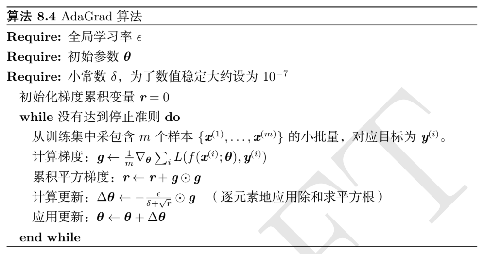

### 5.2 RMSProp

RMSProp 是对 AdaProp 的改进，其将梯度积累改编为指数加权的移动平均。AdaGrad 的设计旨在应用于凸问题时加速收敛，当应用于非凸问题时，学习轨迹可能穿过了很多不同的结构，最终到达一个局部是凸碗的区域，但是根据平方梯度的历史收缩学习率，可能使得学习率在达到凸区域之前就过小了。RMSProp 使用指数衰减平均以过于久远的历史，使其能够在找到凸碗状结构后快速收敛。

RMSProp 引入另一个超参数以控制移动平均的长度范围。

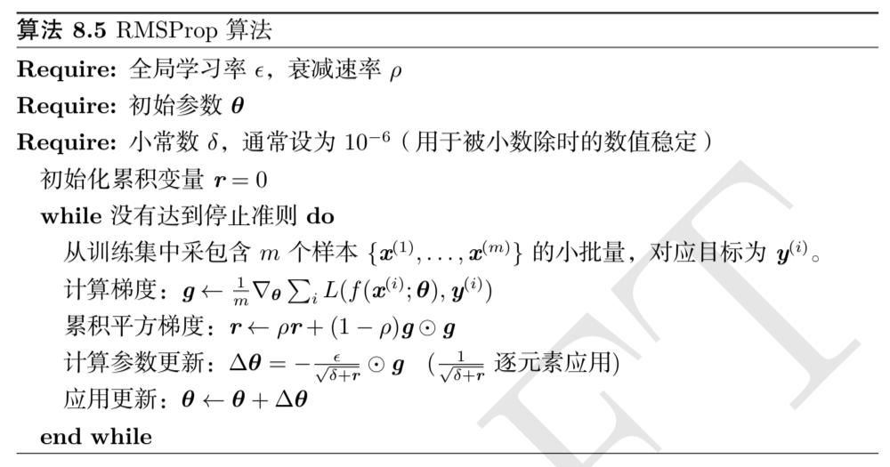

### 5.3 Adam

Adam 可以被看作结合了 RMSProp 和具有一些重要区别的动量算法的变种，Adam 直接将动量并入了梯度一阶矩（指数加权）的估计，将动量加入 RMSProp 最直观的方法是将动量应用于缩放之后的梯度。此外，Adam 进行了偏置修正，修正从原点初始化的一阶矩（动量）和（非中心的）二阶矩的估计 。RMSProp 同样采用了（非中心的）二阶矩估计，但是并没有进行修正。

Adam 通常对超参数的选择非常稳健，但是有时需要修改默认的超参数。

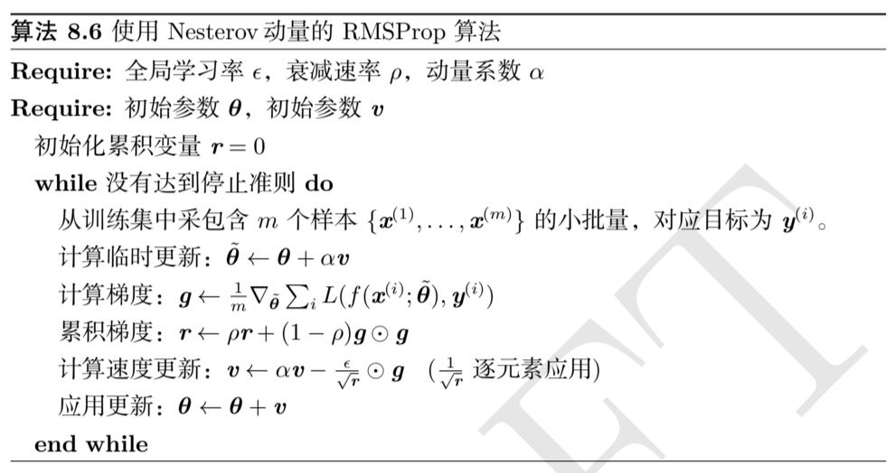

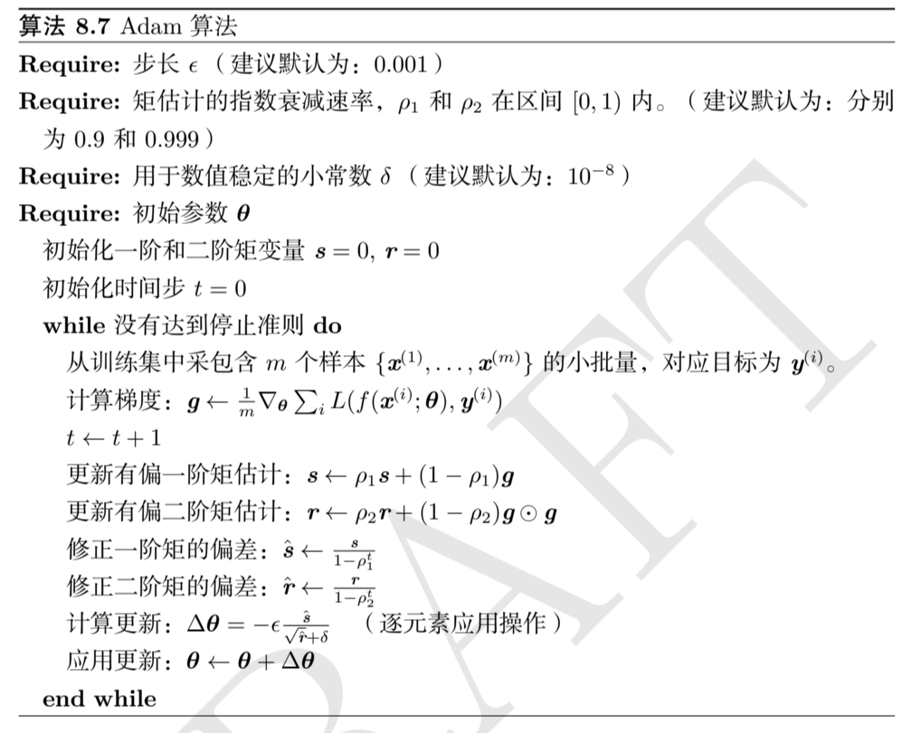

## 6 Approximate Second-Order Methods

### 6.1 Newton’s Method

牛顿法是基于代价函数在某点 $\theta_0$ 附近的二阶泰勒展开来近似 $J(\theta)$ 的优化方法，其忽略了高阶导数：
$$
J(\theta)\simeq J(\theta_0)+(\theta-\theta_0)^\top\nabla_\theta J(\theta_0)+\frac12(\theta-\theta_0)^\top H(\theta-\theta_0)
$$
其中 $H$ 是 $J$ 相对于 $\theta$ 的 Hessian 矩阵在 $\theta_0$ 处的估计，如果我们求解这个目标优化的一阶条件，我们就能得到：
$$
\theta^*=\theta_0-H^{-1}\nabla_\theta J(\theta_0)
$$
因此，对于局部的二次函数（$H$ 正定），用 $H^{-1}$ 重新调整梯度，可以直接得到极小值。如果目标函数是非二次的凸函数，那么更新会是迭代的。

对于非二次的表面，只要 Hessian 矩阵保持正定，牛顿法能够迭代地应用。这意味着一个两步的迭代过程，即轮流更新 Hessian 矩阵的逆和参数。

在深度学习中，目标函数的表面通常是非凸的，有很多特征，例如鞍点，因此使用牛顿法是由问题的。如果 Hessian 矩阵的特征值并不都是正的，例如靠近鞍点处，牛顿法实际上会导致错误的方向移动，，这种情况可以通过 Hessian 矩阵的正则化避免，常用的正则化策略包括在 Hessian 矩阵对角线上增加 $\alpha$，正则化更新变为：
$$
\theta^*=\theta_0-[H(f(\theta_0))+\alpha I]^{-1}\nabla_\theta f(\theta_0)
$$
在这种正则化之下，只要 Hessian 矩阵的负特征值仍然相对接近于零就可以取得较好的效果。在曲率极端的情况下，$\alpha$ 的值必须足够大，以抵消负特征值。但是如果 $\alpha$ 的值过大，Hessian矩阵就会由对角矩阵 $\alpha I$ 主导，通过牛顿法所选择的方向会收敛至普通梯度除以 $\alpha$，以至于牛顿法比选择合适学习率的梯度下降的步长更小。

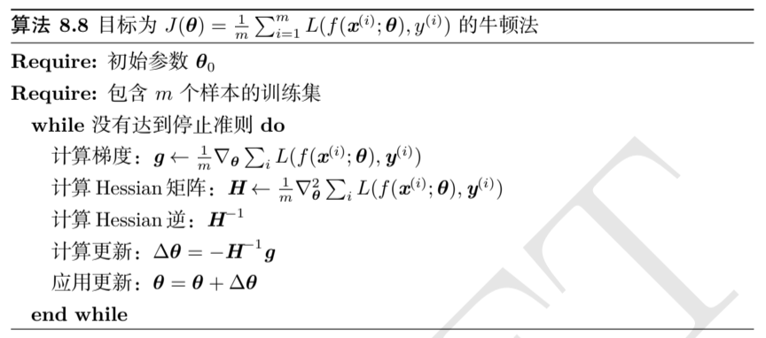

除了目标函数的非凸性质带来的挑战，牛顿法在大型神经网络中的应用还显著受制于其计算负担。对于参数量 $k$ 的模型，Hessian 矩阵需要计算 $k\times k$ 的矩阵的逆，其计算复杂度为 $O(k^3)$。

此外，由于参数每次更新都需要计算 Hessian 矩阵的逆，其结果是只有参数很少的网络才能在实际中使用牛顿法训练。

### 6.2 Conjugate Gradients

共轭梯度是一种通过迭代下降的共轭方向以有效避免 Hessian 矩阵求逆计算的方法。

共轭梯度法是一种对最速下降法的改进，在最速下降法的每个步骤中，优化路径沿着初始点处梯度定义的优化方向抵达最低代价的点，然后取与当前优化方向正交的方向作为下一次的更新方向，如此往复。在这样的优化过程中，每次搜索过程都在某种程度上撤销了在之前线搜索的方向上取得的进展。

在共轭梯度法中，我们寻求一个和先前搜索方向共轭而非正交的搜索方向以避免撤销之前搜索的进展，搜索方向可以递推地表示为：
$$
d_t=\nabla_\theta J(\theta)+\beta_t d_{t-1}
$$
其中，系数 $\beta_t$ 的大小控制我们应该沿方向 $d_{t-1}$ 加回多少到当前的收缩方向上。

如果 $d_t^\top Hd_{t-1}=0$，其中 $H$ 是 Hessian 矩阵，则两个方向 $d_t$ 和 $d_{t-1}$ 被称为共轭的。

这种优化策略的直接计算涉及到 $H$ 特征向量的计算以选择 $\beta_t$，这是相当昂贵的，但是存在不进行这些计算而计算 $\beta_t$ 的方法：
$$
\beta_t=\frac{\nabla_\theta J(\theta_t)^\top\nabla_\theta J(\theta_t)}{\nabla_\theta J(\theta_{t-1})^\top\nabla_\theta J(\theta_{t-1})}
$$
或者：
$$
\beta_t=\frac{(\nabla_\theta J(\theta_t)-\nabla_{\theta_{t}}J(\theta_{t-1}))^\top\nabla_\theta J(\theta_t)}{\nabla_\theta J(\theta_{t-1})^\top\nabla_\theta J(\theta_{t-1})}
$$
对于二次曲面而言，共轭方向确保梯度沿着前一方向大小不变。因此，我们在前一方向上仍是极小值，其结果是在 $k$ 维参数空间中，共轭梯度只需要至多 $k$ 次线性搜索就能达到极小值。

而为了匹配深度神经网络这类非二次目标函数的情况，共轭梯度法需要进行一些修改，非线性共轭梯度算法会包括一些偶尔的重设，即共轭梯度法沿未修改的梯度重启线搜索。

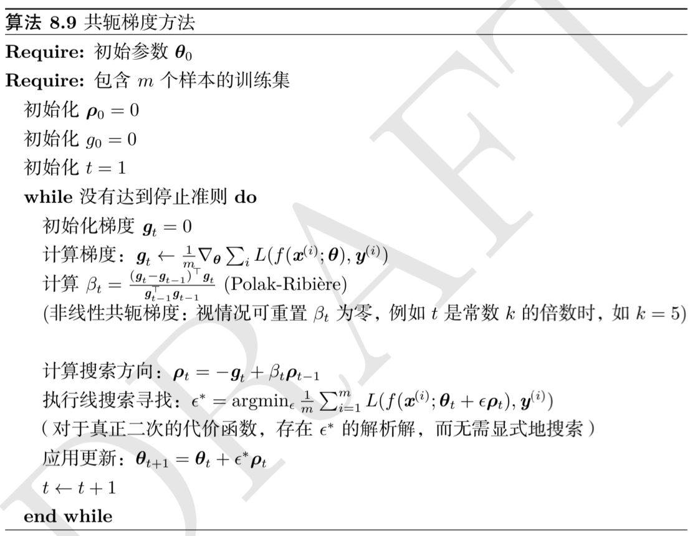

### 6.3 BFGS

Broyden-Fletcher-Goldfarb-Shanno（BFGS）算法是一类拟牛顿法的代表，具有牛顿法的一些优点，但是抛弃了计算负担。其最核心的处理是使用矩阵 $M_t$ 近似 Hessian 矩阵的逆。

当 Hessian 逆近似 $M_t$ 更新时，下降方向为 $\rho_t=M_tg_t$，该方向上的线搜索用于决定该方向上的步长 $\epsilon^*$，参数最后更新为：
$$
\theta_{t+1}=\theta_t+\epsilon^*\rho_t
$$
BFGS 和共轭梯度法一样迭代一系列线搜索，其方向包含二阶信息，但是该方法的成功并不严重依赖于线搜索寻找该方向上和极小值很近的一点。

BFGS 算法必须存储 Hessian 矩阵的逆矩阵，需要 $O(n^2)$ 的存储空间，使 BFGS 不适用于大多数参数量极大的深度学习模型。

## 7 Optimization Strategies and Meta-Algorithms

### 7.1 Batch Normalization

  非常深的模型会涉及多个函数或层组合，实践中，我们同时更新所有层的参数，这可能导致意想不到的结果，这是因为许多组合在一起的函数同时改变时，计算更新的假设是其他函数保持不变。二阶优化算法通过引入 Hessian 矩阵考虑参数更新时的二阶交叉影响，但是通常需要大量近似，此外在深层的网络中，更高阶的影响也会更加显著，而建立更高阶的优化方法是不可行的。

批标准化提出了一种几乎可以重参数化所有深度网络的优雅方法。重参数化显著减少了多层之间协调更新的问题。批标准化可应用于网络的任何输入层或者隐藏层。设 $H$ 是需要标准化的某层的小批量激活函数，排布为设计矩阵，每个样本的激活出现在矩阵的每一行中。为了标准化 $H$，我们将其替换为：
$$
H'=\frac{H-\mu}{\sigma}
$$
其中 $\mu$ 是包含每个单元均值的向量，$\sigma$ 是包含每个单元标准差的向量，在训练阶段：
$$
\mu=\frac1m\sum_iH_{i,:}\\
\sigma=\sqrt{\delta+\frac1m\sum_i(H-\mu)^2_i}
$$
其中 $\delta$ 是个很小的正值，比如 $10^{-8}$，以强制避免遇到 $\sqrt{z}$ 的梯度在 $z=0$ 处未定义的问题。更重要的是，我们通过这些操作反向传播来计算均值和标准差，并使用它们标准化 $H$。这意味着梯度不会再简单地增加 $h_i$ 的标准差或均值，标准化操作会去除这一影响。

测试阶段 $\mu$ 和 $\sigma$ 可以被替换为训练阶段收集的运行均值，使得模型可以对单一样本进行评估，而无需使用定义于整个小批量的 $\mu$ 和 $\sigma$。

标准化一个单元的均值和标准差会降低包含该单元的神经网络的表达能力。为了保持网络的表现力，通常会将批量隐藏单元激活 $H$ 替换为 $\gamma H'+\beta$ 而不是简单地使用批量标准化的 $H'$。变量 $\gamma$ 和 $\beta$ 是允许新变量有任意均值和标准差的可学习参数。

多数神经网络都可以表达为 $\phi(XW+b)$ 的形式，其中 $\phi$ 是某个固定的非线性激活函数。一个问题是应该将批量标准化应用于 $X$ 还是变换之后的 $XW+b$ 。后者是更推荐的做法，而且偏置项应该被忽略，因为参数 $\beta$ 会在重参数化时覆盖其作用。一层的输入通常是前一层的非线性激活函数的输出，因此，输入的统计量更符合非高斯而更不服从线性操作的标准化。

### 7.2 Coordinate Descent

在一些情况下，将一个优化问题分解成几部分可以更快地解决原问题。例如我们在所有变量之间进行循环优化，能够保证到达（局部）极小值。这种做法被称为坐标下降，因为我们一次优化一个目标。更一般地，块坐标下降指对于某个子集的变量同时最小化。

当优化问题中的不同变量能够清楚地分成相对独立的组，或是当优化一组变量明显比优化所有变量效率更高时，坐标下降最有意义。当一个变量的值很大程度上地影响另一个变量的最优值时，坐标下降不是一个很好的方法。

### 7.3 Polyak Averaging

Polyak 平均会平均优化算法在参数空间访问轨迹中的几个点，如果 $t$ 次迭代梯度下降访问了点 $\theta^{(1)},\dotsb,\theta^{(t)}$，那么 Polyak 平均算法的输出是 $\hat\theta^{(t)}=\frac1t\sum_i\theta^{(i)}$，这种方法在某些问题中，如梯度下降应用于凸问题时，具有较强的收敛保证。当应用于神经网络时，其验证更多是启发式的，但在实践中表现良好。

非凸问题中，优化轨迹的路径可以非常复杂，并且经过了许多不同的区域，包括参数空间中遥远过去的点，可能与当前点在代价函数上相隔很大的障碍，因此 Polyak 平均似乎不像是一个有用的行为，但是结果是当应用 Polyak 平均于非凸问题时，通常会使用指数衰减计算平均值：
$$
\hat\theta^{(t)}=\alpha\hat\theta^{(t-1)}+(1-\alpha)\theta^{(t)}
$$

### 7.4 Supervised Pretraining

直接训练模型求解目标问题之前，训练简单模型简化问题的方法统称为预训练。

贪心算法将问题分解为若干部分，然后独立地在每个部分上求解最优值。令人遗憾的是，结合各个最佳的部分不能保证得到一个最佳的完整解。但是贪心算法的计算过程通常更加高效，并且贪心算法的解即使并非最优也是可以接受的。贪心算法也可以紧接一个精调阶段，联合优化算法搜索全局问题的最优解。可以理解为贪心解为联合优化算法提供了高质量的初始化。

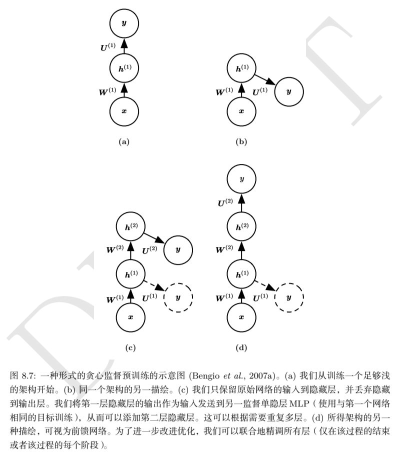

贪心监督预训练有益于训练的机制可能是其有助于更好地指导深层结构的中间层的学习，一般来说预训练对优化和泛化都是有帮助的。

### 7.5 Designing Models to Aid Optimization

在实践中，选择一族容易优化的模型比使用一个强大的优化算法更重要。

现代神经网络的设计方案旨在使其局部梯度信息合理地对应着移向一个遥远的解。

其他模型设计策略有助于使优化更加简单，例如层之间的线性路径或是跳跃连接减少了从较低层参数到输出的最短路径的长度，因而缓解了梯度消失的问题。另一个和跳跃连接相关的想法是添加和网络中间隐藏层相连的输出的额外副本。

### 7.6 Continuation Methods and Curriculum Learning

延拓法（continuation method）是一族通过挑选初始点使优化更容易的方法，以确保局部优化花费大部分时间在表现良好的空间。延拓法的背后想法是构造一系列具有相同参数的目标函数，为了最小化代价函数 $J(\theta)$，我们构建新的代价函数 $\{J^{(0)},\dotsb,J^{(n)}\}$，这些代价函数优化的难度逐步提高，其中 $J^{(0)}$ 是最容易最小化的，$J^{(n)}$ 是最难的（所谓的难易指的是代价函数在多大的参数空间上表现良好）。

延拓法通常基于平滑目标函数，也和参数中加入噪声的模拟退火紧密相关。

延拓法传统上用于克服局部极小值的问题，具体来说，它被设计来在有很多局部极小值的情况下求解一个全局最小点。这些连续方法会通过“模糊”原来的代价函数构建更易于优化的代价函数，这些模糊操作可以是用采样来近似：
$$
J^{(i)}(\theta)=\mathbb E_{\theta'\sim \mathcal N(\theta';\theta,\sigma^{(i)2})}J(\theta')
$$
一个直觉是有些代价函数在模糊之后会转变为近似凸的，在许多情况下，这种模糊保留了全局极小值的足够信息，我们可以通过逐步求解模糊更少的问题来求解全局极小值。这个方法可能失败的原因是：

- 逐步逼近全局最小值的过程需要多次逐步迭代，代价较大
- 无论采用何种模糊方式，函数都不能真正转化为凸的
- 模糊函数的最小值可能会追踪到一个局部最小值而非原始代价函数的全局最小值

此外，延拓法引入的简单化目标函数能够消除平坦区域，减少梯度估计的方差，提高 Hessian 矩阵的条件数，使局部更新更容易计算，或是改进局部更新方向与朝向全局解方向之间的对应关系。