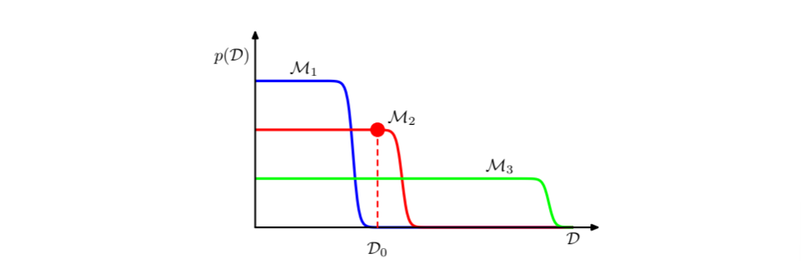

# Linear Regression

## 1 Least Square Estimate

对于一个数据集 $\mathcal{D}=\{\langle x_1,y_1\rangle\langle x_2,y_2\rangle\dotsb\langle x_N,y_N\rangle\}$，其中 $x_i\in\mathbb{R}^p$，$y_i\in\mathbb{R}$，$i=1,2,\dotsb,N$，以矩阵的形式表示样本和标签:
$$
X=\begin{pmatrix}
    x_1&x_2\dotsb&x_N
\end{pmatrix}^\top=\begin{pmatrix}
    x_{11}&x_{12}&\dotsb&x_{1p}\\
    x_{21}&x_{22}&\dotsb&x_{2p}\\
    \vdots&\vdots&\ddots&\vdots\\
    x_{N1}&x_{N2}&\dotsb&x_{Np}\\
\end{pmatrix}
$$

$$
Y=\begin{pmatrix}
    y_1\\y_2\\\dotsb\\y_N
\end{pmatrix}
$$

最小二乘估计（LSE）旨在寻找一个权重向量 ${\boldsymbol{w}}$ 使之满足如下的损失函数最小化：
$$
\ell({\boldsymbol{w}})=\sum_{i=1}^N\Vert{\boldsymbol{w}}^\top x_i-y_i\Vert^2_2
$$

对损失函数进行如下变形：
$$
\begin{aligned}
    \ell({\boldsymbol{w}})&=\sum_{i=1}^N({\boldsymbol{w}}^\top x_i-y_i)^2\\
    &=({\boldsymbol{w}}^\top X^\top-Y^\top)(X{\boldsymbol{w}}-Y)\\
    &={\boldsymbol{w}}^\top X^\top X{\boldsymbol{w}}-{\boldsymbol{w}}^\top X^\top Y-Y^\top X{\boldsymbol{w}}+Y\top Y\\
    &={\boldsymbol{w}}^\top X^\top X{\boldsymbol{w}}-2{\boldsymbol{w}}^\top X^\top Y+Y^\top Y\\
\end{aligned}
$$

优化目标可以写作：
$$
\begin{aligned}
    {\boldsymbol{w}}^*=\arg\min_{\boldsymbol{w}} \ell({\boldsymbol{w}})
\end{aligned}
$$

对损失函数求偏导：
$$
\begin{aligned}
    \frac{\partial \ell({\boldsymbol{w}})}{\partial {\boldsymbol{w}}}&=2X^\top X{\boldsymbol{w}}-2X^\top Y
\end{aligned}
$$

因此，${\boldsymbol{w}}^*=(X^\top X)X^\top Y$，其中 $(X^\top X)X^\top$ 被称作矩阵 $X$ 的伪逆。

以上是对 $X$ 行空间的理解，还可以从列空间角度理解线性回归，即寻找向量 $Y$ 在 $X$ 列空间上的投影 $X\beta$，可以列方程：
$$
X^\top(Y-X\beta)=0
$$

即得 $\beta=(X^\top X)^{-1}X^\top={\boldsymbol{w}}$。

从概率论的视角理解 LSE，我们假定估计结果的噪声符合高斯分布：
$$
y=f({\boldsymbol{w}})+\epsilon={\boldsymbol{w}}^\top x+\epsilon,\epsilon\sim\mathcal{N}(0,\sigma^2)
$$

则有条件概率：
$$
y\mid x;{\boldsymbol{w}}\sim\mathcal{N}({\boldsymbol{w}}^\top x,\sigma^2)
$$

以极大似然的角度来看：
$$
\begin{aligned}
    \mathcal{J}({\boldsymbol{w}})&=\log P(Y\mid X;{\boldsymbol{w}})\\
    &=\sum_{i=1}^N \log p(y_i\mid x_i;{\boldsymbol{w}})\\
    &=\sum_{i=1}^N(\log \frac{1}{\sqrt{2\pi}\sigma}-\frac{1}{2\sigma^2}(y_i-{\boldsymbol{w}}^\top x_i)^2)\\
\end{aligned}
$$

$$
\begin{aligned}
    {\boldsymbol{w}}^*&=\arg\max_{\boldsymbol{w}} \mathcal{J}({\boldsymbol{w}})\\
    &=\arg\min_{\boldsymbol{w}} (y_i-{\boldsymbol{w}}^\top x_i)^2\\
    &=(X^\top X)X^\top Y\\
\end{aligned}
$$

因此，**最小二乘估计等价于噪声为高斯分布的极大似然估计**。

## 2 Regularization —— Ridge Regression

当输入的特征维度极大或样本量极小时，可能会出现所谓的“维度灾难”，在这种情况下，模型易发生过拟合，在数学上体现为 ${\boldsymbol{w}}^*$ 表达式中 $X^\top X$ 不可逆，因此无法得到解析解在这种情况下有三种解决思路：

- 增加样本数量
- 降维/特征选择/特征提取
- 正则化

正则化的一般模式是在传统的损失函数上增加对参数空间的限制：
$$
{\boldsymbol{w}}^*=\arg\min_{\boldsymbol{w}} \ell({\boldsymbol{w}})+\lambda P({\boldsymbol{w}})
$$

当 $P({\boldsymbol{w}})=\Vert{\boldsymbol{w}}\Vert^2_2$ 时，称为岭回归（ridge regression）或 L2 正则化，而当 $P({\boldsymbol{w}})=\Vert{\boldsymbol{w}}\Vert$ 时，称为套索回归（Lasso regression）或 L1 正则化。

采用 L2 正则化时，优化的目标函数可以改写为：
$$
\begin{aligned}
    \ell({\boldsymbol{w}})&=\sum_{i=1}^N \Vert{\boldsymbol{w}}^\top x_i-y_i\Vert^2_2+\lambda\Vert{\boldsymbol{w}}\Vert_2^2\\
    &={\boldsymbol{w}}^\top X^\top X{\boldsymbol{w}}-2{\boldsymbol{w}}^\top X^\top Y+Y^\top Y+\lambda {\boldsymbol{w}}^\top {\boldsymbol{w}}\\
    &={\boldsymbol{w}}^\top (X^\top X+\lambda I){\boldsymbol{w}}-2{\boldsymbol{w}}^\top X^\top Y+Y^\top Y\\
\end{aligned}
$$

$$
\begin{aligned}
    \frac{\partial \ell({\boldsymbol{w}})}{\partial {\boldsymbol{w}}}&=2(X^\top X+\lambda I){\boldsymbol{w}}-2{\boldsymbol{w}}^\top Y\\
\end{aligned}
$$

因此，${\boldsymbol{w}}^*=(X^\top X+\lambda I)^{-1}X^\top Y$，在此情况下，$X^\top X+\lambda I$ 为一正定矩阵，因此一定可逆。

从贝叶斯角度来看 L2 正则化，我们同样认为预测噪声服从正态分布 $\mathcal{N}(0,\sigma^2)$，同时，认为权重服从正态分布 ${\boldsymbol{w}}\sim\mathcal{N}(0,\sigma^2_{\boldsymbol{w}})$。

列贝叶斯方程：
$$
P({\boldsymbol{w}}\mid y)=\frac{P(y\mid {\boldsymbol{w}})P({\boldsymbol{w}})}{P(y)}
$$

其中：
$$
P(y\mid {\boldsymbol{w}})=\frac{1}{\sqrt{2\pi}\sigma}\exp(-\frac{(y-{\boldsymbol{w}}^\top X)^2}{2\sigma^2})
$$

$$
P({\boldsymbol{w}})=\frac{1}{\sqrt{2\pi}\sigma_{\boldsymbol{w}}}\exp(-\frac{{\boldsymbol{w}}^\top {\boldsymbol{w}}}{2\sigma^2_{\boldsymbol{w}}})
$$

从贝叶斯学派极大后验估计的方法来看，最小二乘可以转化成以下优化问题：
$$
\begin{aligned}
    {\boldsymbol{w}}^*&=\arg\max_{\boldsymbol{w}} P({\boldsymbol{w}}\mid y)\\
    &=\arg\max_{\boldsymbol{w}} P(y\mid {\boldsymbol{w}})P({\boldsymbol{w}})\\
    &=\arg\max_{\boldsymbol{w}} \frac{1}{2\pi\sigma\sigma_{\boldsymbol{w}}}\exp(-\frac{(y-{\boldsymbol{w}}^\top X)^2}{2\sigma^2}-\frac{{\boldsymbol{w}}^\top {\boldsymbol{w}}}{2\sigma^2_{\boldsymbol{w}}})\\
    &=\arg\min_{\boldsymbol{w}} \frac{(y-{\boldsymbol{w}}^\top X)^2}{2\sigma^2}+\frac{{\boldsymbol{w}}^\top {\boldsymbol{w}}}{2\sigma^2_{\boldsymbol{w}}}\\
    &=\arg\max_{\boldsymbol{w}} (y-{\boldsymbol{w}}^\top X)^2+\frac{\sigma^2}{\sigma^2_{\boldsymbol{w}}}{\boldsymbol{w}}^\top {\boldsymbol{w}}\\
\end{aligned}
$$

即与带有 L2 正则化的最小二乘优化目标一致，因此，**噪声和参数先验为高斯分布的极大后验估计等价于带有 L2 正则化的最小二乘估计**。

类似地，**噪声服从 Laplace 分布时的极大后验估计等价于带有 L1 正则化的最小二乘估计。**

L1 正则化会引起模型参数的稀疏性，表现为一些权重会随着优化趋近于 0。从几何上来看，这是因为 L1正则化的约束区域为凸多面体（高维菱形），其顶点位于坐标轴上。优化过程中，损失函数与L1约束的交互使得解更倾向于落在这些顶点上，导致部分权重精确为零。

## 3 The Bias-Variance Decomposition

偏差-方差分解是频率学派考虑模型复杂度的框架。使用变分法可以得到，在平方和损失下，我们可以给出最优的预测结果为：
$$
h(x)=\mathbb{E}[y\mid x]=\int yp(y\mid x)\mathrm{d}y
$$
对于一个模型 $\hat{y}(x)$，平方损失函数的值可以写做：
$$
\begin{aligned}
\{\hat{y}(x)-y\}^2&=\{\hat{y}(x)-h(x)+h(x)-y\}^2\\
&=\{\hat{y}(x)-h(x)\}^2+2\{\hat{y}(x)-h(x)\}\{h(x)-y\}+\{h(x)-y\}^2
\end{aligned}
$$
那么平方损失函数的期望可以写做：
$$
\mathbb{E}[L]=\int\{\hat{y}(x)-h(x)\}^2p(x)\mathrm{d}x+\iint\{h(x)-y\}^2p(x,y)\mathrm{d}x\mathrm{d}t
$$
第二个积分项是由数据本身的噪声导致的，表示期望损失能够达到的最小值，第一项与 $\hat{y}(x)$ 有关，我们要找到一个 $\hat{y}(x)$ 的解，使得这一项足够小。

如果使用参数向量 $\omega$ 控制的函数 $\hat{y}(x,\omega)$ 对 $h(x)$ 进行建模，那么从贝叶斯的观点来看，模型的不确定性是通过 $\omega$ 后验概率表示的，但是频率派的观点涉及根据数据集 $D$ 对 $\omega$ 进行点估计，然后通过下面的思想实验建模估计的不确定性：

对于一个特定的数据集 $D$，第一个积分项可以写作：
$$
\{\hat{y}(x;D)-h(x)\}^2
$$
由于这个量与特定的数据集 $D$ 有关，因此我们对所有的数据集取期望得到 $\mathbb{E}[y(x;D)]$，然后进行下面的变形：
$$
\begin{aligned}
&\{\hat{y}(x;D)-h(x)\}^2\\
=&\{\hat{y}(x;D)-\mathbb{E}[\hat{y}(x;D)]+\mathbb{E}[\hat{y}(x;D)]-h(x)\}^2\\
=&\{\hat{y}(x;D)-\mathbb{E}[\hat{y}(x;D)]\}^2+\{\mathbb{E}[\hat{y}(x;D)]-h(x)\}^2+2\{\hat{y}(x;D)-\mathbb{E}[\hat{y}(x;D)]\}\{\mathbb{E}[\hat{y}(x;D)]-h(x)\}
\end{aligned}
$$
现在关于 $D$ 求期望，注意最后一项等于零，可得：
$$
\mathbb{E}_D[\{\hat{y}(x;D)-h(x)\}^2]=\{\mathbb{E}[\hat{y}(x;D)]-h(x)\}^2+\{\hat{y}(x;D)-\mathbb{E}_D[\hat{y}(x;D)]\}^2
$$
因此，$\hat{y}(x;D)$ 与回归函数 $h(x)$ 的差的平方的期望可以写作两项的和，第一项被称为平方偏差（bias），表示所有数据集的平均预测与预期的回归函数之间的差异；第二项，被称为方差（variance），度量了对于单独的数据集，模型给出的解在平均值附近波动的情况，因此度量了函数 $\hat{y}(x;D)$ 对于特定数据集选择的敏感程度。

对于非常灵活的模型来说，偏差较小，方差较大；对于相对固定的模型来说，偏差较大，方差较小。有最佳性能的模型是在两者之间取得平衡的模型。

## 4 Linear Basis Function Models

线性基函数模型是线性回归模型的扩展，它避免了模型本身是自变量的线性函数的局限性，其形式为：
$$
\hat{y}(x,{\boldsymbol{w}})={\boldsymbol{w}}_0+\sum_{j=1}^{M-1}{\boldsymbol{w}}_j\phi_j(x)
$$
其中 $\phi_j(x)$ 被称为基函数，模型的总参数量为 $M$。

定义一个额外的基函数代替偏置项是很方便的：
$$
\hat{y}(x,{\boldsymbol{w}})=\sum_{j=0}^{M-1}{\boldsymbol{w}}_j\phi_j(x)={\boldsymbol{w}}^\top\phi(x)\\
{\boldsymbol{w}}=({\boldsymbol{w}}_0,\dotsb,{\boldsymbol{w}}_{M-1})^\top\\
\phi=(\phi_0,\dotsb,\phi_{M-1})^\top
$$
通过使用非线性基函数，我们能够让函数 $y(x,{\boldsymbol{w}})$ 称为输入向量的一个非线性函数。多项式拟合是线性基函数模型的一个例子，所有的基函数都是 $x$ 的幂函数的形式，多项式基函数的一个局限是它们是输入变量的全局函数，因此输入空间中一个区域的改变会影响其他所有的区域。

此外还有一些其他的基函数选择，例如高斯基函数：
$$
\phi_j(x)=\exp\left\{-\frac{(x-\mu_j)^2}{2s^2}\right\}
$$
高斯基函数有很强的局部性，在远离中心的区域，其值会迅速衰减。

另一种选择是使用 sigmoid 函数：
$$
\phi_j(x)=\sigma\left(\frac{x-\mu_j}{s}\right)
$$
另一个选择是使用傅里叶基函数，每一个基函数表示一个具体的频率。

与之前一样，考虑线性基函数模型的极大似然估计：
$$
y=\hat{y}+\epsilon={\boldsymbol{w}}^\top \phi(x)+\epsilon,\epsilon\sim\mathcal{N}(0,\Lambda^{-1})\\
y\mid x\sim\mathcal{N}(y\mid \hat{y}(x,{\boldsymbol{w}}),\Lambda^{-1})
$$
使用与之前类似的方法，我们可以得到与线性回归形式类似的解：
$$
{\boldsymbol{w}}^*=(\Phi^\top\Phi)^{-1}\Phi^\top Y,\Phi_{nj}=\phi_{j}(x_n){\boldsymbol{w}}i
$$

我们也可以对噪声精度 $\Lambda$ 极大化似然函数：
$$
\Lambda^{-1}=\frac{1}{N}\sum_{n=1}^N\{y_n-{\boldsymbol{w}}^{*\top}\phi(x_n)\}^2
$$
可见噪声精度的估计由估计残差的平均平方和的倒数给出。

这种方式的局限在于我们假设基函数在观测到任何数据之前就固定了，结果导致基函数的数量随着输入空间的维度而以指数方式增长。

真实数据的两个性质有助于缓解这个问题：

- 数据向量通常位于一个非线性流形内部，流形本身的维度小于输入空间的维度，如果我们使用局部基函数，那么我们可以让基函数只分布在输入空间中包含数据的区域
- 目标变量可能只依赖于数据流形中的少量可能的方向

## 5 Sequential Learning

直接计算解析解的方式涉及一次性处理整个数据集，这种求解方式对于大规模数据是困难的。在数据集足够大的情况下使用顺序算法或许更有意义。在顺序算法中，每次只考虑一个数据点，模型的参数在每观测到一个数据点之后进行更新。

一个顺序学习算法是随机梯度下降。如果误差函数由数据点的和组成：$E=\sum_nE_n$，那么在观测到模式 $n$ 之后，随机梯度下降算法使用下式更新参数向量 ${\boldsymbol{w}}$：
$$
{\boldsymbol{w}}^{(\tau+1)}={\boldsymbol{w}}^{(\tau)}-\eta\nabla E_n
$$
对于平方和误差：
$$
{\boldsymbol{w}}^{(\tau+1)}={\boldsymbol{w}}^{(\tau)}-\eta(y_n-\hat y)\phi_n
$$

## 6 Bayesian Linear Regression

现在考虑线性基函数模型的贝叶斯视角，此前讨论的 MAP 虽然假定了参数的先验分布，但是实际上还是一种点估计方式，并没有对参数的后验分布进行求解，贝叶斯线性回归则直接显式地表示参数的后验分布。

我们假定参数有高斯分布作为共轭先验：
$$
p({\boldsymbol{w}})=\mathcal{N}({\boldsymbol{w}}\mid \boldsymbol m_0,\boldsymbol S_0)
$$
然后，我们计算后验分布，它正比于似然函数与先验分布的乘积，由于我们使用了高斯分布作为先验，后验分布也是高斯分布的形式：
$$
p({\boldsymbol{w}}\mid y)=\mathcal{N}({\boldsymbol{w}}\mid \boldsymbol m_N,\boldsymbol S_N)
$$
这使得我们可以通过对指数项进行配方的方式解析后验分布的参数：
$$
\boldsymbol m_N=\boldsymbol S_N(\boldsymbol S_0^{-1}\boldsymbol m_0+\Lambda\boldsymbol \Phi^\top y)\\
\boldsymbol S_N^{-1}=\boldsymbol S_0^{-1}+\Lambda\boldsymbol \Phi^\top\boldsymbol \Phi
$$
关于噪声的精度矩阵 $\Lambda$ 的来源，可以是预设值，或者使用一个 Gauss-Gamma 分布作为 ${\boldsymbol{w}},\beta$ 的联合先验进行联合后验估计。

由于后验分布是高斯分布，它的众数恰好与均值相等，因此 MAP 得到的权重结果 ${\boldsymbol{w}}_{MAP}=\boldsymbol m_N$。

如果我们考虑一个无限宽的先验 $\boldsymbol S_0=\alpha^{-1}I$，其中 $\alpha\rightarrow0$，那么后验分布的均值就等于极大似然估计的权重结果 ${\boldsymbol{w}}_{MLE}=\boldsymbol m_N$。

如果 $N=0$，那么后验分布就与先验分布一致。

如果数据是顺序到达的，那么任何一个阶段的后验分布都可以看做下一个阶段的先验分布。

考虑一个具体的先验分布 $p({\boldsymbol{w}}\mid \alpha)=\mathcal{N}({\boldsymbol{w}}\mid 0,\alpha^{-1}I)$，对应的后验概率分布参数为：
$$
\boldsymbol m_N=\Lambda S_N\boldsymbol \Phi^\top Y\\
\boldsymbol S_N^{-1}=\alpha I+\Lambda \Phi^\top\Phi
$$
后验概率分布的对数由对数似然与对数先验求和的方式得到：
$$
\ln p({\boldsymbol{w}}\mid y)=-\frac{\Lambda}{2}\sum_{n=1}^{N}\{y_n-{\boldsymbol{w}}^\top\phi(x_n)\}^2-\frac{\alpha}{2}{\boldsymbol{w}}^\top {\boldsymbol{w}}+\mathrm{const}
$$
于是后验分布的对数似然等价于最小化带有 L2 正则化的平方误差函数，这与 MAP 中得到的结论一致。

通常我们感兴趣的是对于一个新观测 $x$ 给出的估计，这需要计算预测分布：
$$
p(y \mid Y, \alpha, \Lambda) = \int p(y \mid {\boldsymbol{w}}, \Lambda) p({\boldsymbol{w}} \mid Y, \alpha, \Lambda) \, \mathrm{d}{\boldsymbol{w}}
$$
预测分布有这样的形式：
$$
p(y \mid \boldsymbol{x}, \alpha, \Lambda) = \mathcal{N}(y \mid \boldsymbol{m}_N^T \boldsymbol{\phi}(\boldsymbol{x}), \sigma_N^2(\boldsymbol{x}))\\
\sigma_N^2(\boldsymbol{x}) = \Lambda^{-1} + \boldsymbol{\phi}(\boldsymbol{x})^T \boldsymbol{S}_N \boldsymbol{\phi}(\boldsymbol{x})
$$
可见预测方差的不确定性包括两部分，一部分来自噪声，另一部分来自权重估计的不确定性。

如果我们使用局部的基函数（例如高斯基函数），那么在距离基函数中心较远的区域，预测方差的第二项会趋近于零，因此只剩余噪声分布的贡献，因此在对基函数所在区域之外的部分进行外插时，模型做出的预测会十分确定，这并不是我们想要的，通过使用被称为高斯过程的另一种回归方式可以避免。

## 7 Equivalent Kernel

通过向预测均值中代入后验均值，我们可以得到下面的形式：
$$
y(\boldsymbol{x},\boldsymbol m_N)=\boldsymbol m_N^\top\phi(\boldsymbol{x})=\Lambda\phi(\boldsymbol{x})^\top\boldsymbol{S}_N\boldsymbol \Phi^\top \boldsymbol Y=\sum_{n=1}^N\Lambda\phi(\boldsymbol{x})^\top\boldsymbol S_N\phi(x_n)y_n
$$
那么我们不妨定义：
$$
y(\boldsymbol{x},\boldsymbol m_N)=\sum_{n=1}^Nk(\boldsymbol x,x_n)y_n\\
k(\boldsymbol x,x_n)=\Lambda\phi(\boldsymbol x)^\top\boldsymbol S_N \phi(x')
$$
$k(\boldsymbol x,x_n)$ 被称为等价核或平滑矩阵，这样的回归函数通过对训练集里目标值进行线性组合做预测，被称为线性平滑。等价核依赖于来自数据集的输入值 $x_n$，因为这些输入值出现在了 $\boldsymbol S_N$ 的定义中。

用核函数表示线性回归给出了解决回归问题的另一种方法，我们不引入一组基函数，而是定义了一个局部的核函数，然后在给定观测数据集的条件下，使用这个核函数对新的输入变量做预测。

考虑两个预测的协方差：
$$
\mathrm{cov}[y(x),y(x')]=\mathrm{cov}[\phi(x)^\top,w^\top\phi(x')]=\phi(x)^\top\boldsymbol S_N\phi(x')=\Lambda^{-1}k(x,x')
$$
根据等价核的形式，可以看出输入接近的点预测均值的相关性较高，对于距离较远的点对，相关性较低。

一个核函数给出了模型的权值，通过这个权值，训练集中的样本被加权组合，并作为对新的观测的预测，可以证明的是这些权重之和为 1：
$$
\sum_{n=1}^Nk(x,x_n)=1
$$

核函数有一个重要的性质，它可以表示为非线性函数的向量 $\psi(x)$ 的内积的形式：
$$
k(x,z)=\psi(x)^\top\psi(z)\\
\psi(x)=\Lambda^{1/2}\boldsymbol S_N^{1/2}\phi(x)
$$

## 8 Bayesian Model Comparison

相较于频率派偏差-方差分解的角度，贝叶斯派使用概率建模模型选择的不确定性。假设我们要比较 $L$ 个模型 $\{\mathcal{M}_i\}$，其中 $i=1,\dotsb,L$，我们将模型解释为观测数据 $D$ 上的概率分布，我们假定数据是由这些模型之一生成的，但是不确定是哪一个，不确定性通过先验概率分布 $p(\mathcal{M_i})$ 表示，给定一个训练数据集 $D$，我们想对后验概率进行估计：
$$
p(\mathcal{M}_i\mid D)\propto p(\mathcal{M}_i)p(D\mid \mathcal{M}_i)
$$
先验分布是对模型优先级的一种启发式建模，我们先简单地认为所有模型都有相同的先验概率。$p(D|\mathcal{M}_i)$ 被称为模型证据或边缘似然（marginal likelyhood），它表达了数据展现出的不同模型的优先级。两个模型证据的比值 $\frac{p(D\mid \mathcal{M}_i)}{p(D\mid \mathcal{M}_j)}$ 被称为贝叶斯因子。

在获得模型的后验分布之后，我们可以建模预测分布：
$$
p(y\mid\boldsymbol{x},D)=\sum_{i=1}^Lp(y\mid\boldsymbol{x},\mathcal{M}_i,D)p(\mathcal{M}_i\mid D)
$$
这是混合分布的一个例子，在公式中，整体的预测分布由对各模型的预测分布 $p(y\mid\boldsymbol{x},\mathcal{M}_i,D)$ 加权平均得到，权值为这些模型的后验概率 $p(\mathcal{M}_i\mid D)$。对模型求平均的一个近似方法是使用一个最可能的模型自己做预测，这被称为模型选择（model selection）。

对于一个由参数 $\boldsymbol w$ 控制的模型，模型证据为：
$$
p(D\mid\mathcal{M}_i)=\int p(D\mid \boldsymbol{w}, \mathcal{M}_i)p(\boldsymbol w\mid \mathcal{M}_i)\mathrm d\boldsymbol w
$$
从采样的角度来看，边缘似然可以看作从一个模型中生成数据集 $D$ 的概率，模型的参数是从先验分布中随机采样得到的。同时有趣的是，模型证据恰好是估计参数后验分布时出现在贝叶斯定理的分母归一化项：
$$
p(\boldsymbol w \mid D,\mathcal{M}_i)=\frac{p(D\mid\boldsymbol w,\mathcal{M}_i)p(\boldsymbol w\mid \mathcal{M}_i)}{p(D|\mathcal{M}_i)}
$$
我们对在参数上的积分进行近似。首先假设模型只有一个参数，这个参数的后验概率正比于 $p(D\mid \boldsymbol{w}, \mathcal{M}_i)p(\boldsymbol w\mid \mathcal{M}_i)$，假设后验分布在最大似然值附近是一个尖峰，宽度为 $\Delta\boldsymbol w_{posterior}$，然后我们用被积函数的值乘以尖峰的宽度来近似积分。如果我们假设先验分布是平坦的均匀分布，宽度为 $\Delta \boldsymbol w_{prior}$，函数值为 $p(\boldsymbol w)=\frac{1}{\Delta \boldsymbol w_{prior}}$，那么我么们有：
$$
p(D\mid\mathcal{M}_i)\simeq p(D|\boldsymbol w_{MAP})\frac{\Delta\boldsymbol w_{posterior}}{\Delta \boldsymbol w_{prior}}
$$
或者取对数：
$$
\ln p(D\mid\mathcal{M}_i)\simeq \ln p(D|\boldsymbol w_{MAP})+\ln\frac{\Delta\boldsymbol w_{posterior}}{\Delta \boldsymbol w_{prior}}
$$
第一项拟合由最可能参数给出的数据，在平坦先验的情况下等价于对数似然。第二项用于对模型的复杂度惩罚模型，其值为负数。

对于有 $M$ 个参数的模型，我们可以对每个参数进行类似的估计，假设所有参数的 $\frac{\Delta\boldsymbol w_{posterior}}{\Delta \boldsymbol w_{prior}}$ 都相等，则有：
$$
\ln p(D\mid\mathcal{M}_i)\simeq \ln p(D|\boldsymbol w_{MAP})+M\ln\frac{\Delta\boldsymbol w_{posterior}}{\Delta \boldsymbol w_{prior}}
$$
通常增加模型的复杂度，第一项会增大，而第二项会减小，反之类似，因此最优的模型复杂度需要在这两个竞争的分量中进行折中。

考虑三个模型 $\{\mathcal{M}_i\},i=1,2,3$，它们的复杂度依次增加，假设我们首先从先验分布 $p(\boldsymbol w)$ 中采样参数，然后使用具体的参数从 $p(D\mid \boldsymbol w)$ 生成数据。简单的模型基本没有变化性，因此生成的数据集彼此相似，于是其分布 $p(D\mid \mathcal{M}_1)$ 被限制在一个很小的区域内。复杂的模型可生成变化相当大的数据集，因此其分布 $p(D)$ 遍布了数据集空间中相当大的区域。由于概率归一化的性质，因此特定的数据集 $D_0$ 对中等复杂度的模型有最高的模型证据。

贝叶斯模型的一个隐含的假设是，生成数据的概率分布包含在考虑的模型集合中，当这个假设成立时，可以证明，贝叶斯模型倾向于选择正确的模型。假设我们要对两个模型 $\mathcal{M}_1$、$\mathcal{M}_2$ 进行比较，其中真实的数据来自于 $\mathcal{M}_1$，那么贝叶斯因子可以表示为 $\frac{p(D\mid\mathcal{M}_1)}{p(D\mid\mathcal{M}_2)}$，对于有限的数据集，可能由于噪声原因导致贝叶斯隐私的值异常，以至于错误选择，但是如果我们考虑在整个数据集上的平均：
$$
\int p(D\mid\mathcal{M}_1)\ln \frac{p(D\mid\mathcal{M}_1)}{p(D\mid\mathcal{M}_2)}\mathrm d D=D_{KL}(p(D\mid\mathcal{M}_1)\Vert p(D\mid\mathcal{M}_2))
$$
由于 KL 散度总是不小于零的，因此贝叶斯模型总是倾向于选择正确的模型。

贝叶斯方法的局限在于需要对模型的形式做出假设，并且当假设不合理时，结果就无意义。例如，模型对先验分布的很多方面都很敏感，对于反常的先验分布，模型证据是无法定义的。实际应用中，一个明智的做法是保留一个独立的数据集用于评估系统的整体表现。

## 9 The Evidence Approximation

