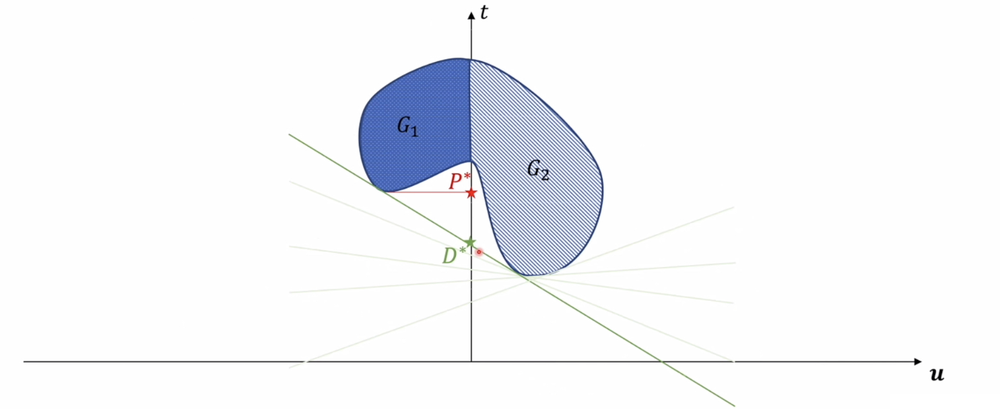
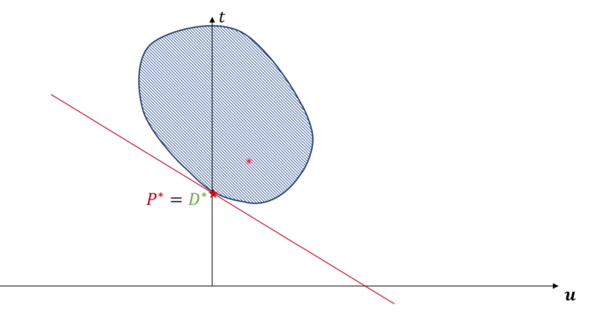

# Support Vector Machine

## 1 Constraint Optimization

一个约束优化问题的通式可以写作：
$$
\begin{cases}
    \min_{x\in\mathbb{R}^p}f(x)\\
    \mathrm{s.t.}~m_i(x)\leq0,i=1,2,\dotsb,M\\
    \ ~~~~~~n_j(x)=0,j=1,2,\dotsb,N
\end{cases}
$$

这称为一个约束优化问题的原问题，我们可以写出原问题等价的拉格朗日函数形式：
$$
\begin{cases}
    \min_x\max_{\lambda,\eta}\mathcal{L}(x,\lambda,\eta)=\min_x\max_{\lambda,\eta}f(x)+\sum_{i=1}^M\lambda_im_i\sum_{j=1}^N\eta_jn_j\\
    \mathrm{s.t.}~\lambda_i\geq0
\end{cases}
$$

根据原问题，我们可以定义原问题的对偶问题：
$$
\begin{cases}
    \max_{\lambda,\eta}\min_x\mathcal{L}(x,\lambda,\eta)=\max_{\lambda,\eta}\min_xf(x)+\sum_{i=1}^M\lambda_im_i\sum_{j=1}^N\eta_jn_j\\
    \mathrm{s.t.}~\lambda_i\geq0
\end{cases}
$$

通常情况下，原问题和对偶问题具有弱对偶性，即满足：
$$
\min_x\max_{\lambda,\eta}\mathcal{L}(x,\lambda,\eta)\geq\max_{\lambda,\eta}\min_x\mathcal{L}(x,\lambda,\eta)
$$

然而，当原问题是凸优化问题且满足 **Slater 条件**时，我们认为原问题和对偶问题具有强对偶性，即：
$$
\min_x\max_{\lambda,\eta}\mathcal{L}(x,\lambda,\eta)=\max_{\lambda,\eta}\min_x\mathcal{L}(x,\lambda,\eta)
$$

考虑以下形式的凸优化问题：
$$
\begin{cases}
    \min_{x\in\mathbb{R}^p}f(x)\\
    \mathrm{s.t.}~m_i(x)\leq0,i=1,2,\dotsb,M\\
    \ ~~~~~~n_j(x)=0,j=1,2,\dotsb,N
\end{cases}
$$

其中：

- $f: \mathbb{R}^p \rightarrow \mathbb{R}$ 是凸目标函数。
- $m_i: \mathbb{R}^p \rightarrow \mathbb{R}, i = 1, ..., M$ 是凸不等式约束函数。
- $n_j: \mathbb{R}^p \rightarrow \mathbb{R}, j = 1, ..., N$ 是仿射（线性加常数项）等式约束函数。

Slater条件要求存在一个点 $x \in \text{relint}(\mathcal{D})$，即定义域相对内部的一个点，满足以下严格不等式约束：
$$
m_i(x) < 0, \quad \forall i = 1, ..., M
$$

对于仿射不等式约束，允许等于号成立。所有等式约束仍需严格满足：
$$
n_j(x) = 0, \quad \forall j = 1, ..., N
$$

如果这样的点存在，则称该问题满足Slater条件。对于仿射形式的不等式约束，可以允许条件放松至不严格不等式，这称为放松的 Slater 约束。

Slater 条件是强对偶性成立的充分条件，单并非必要条件。对于大部分凸优化问题 Slater 条件均成立。**由于 SVM 中涉及的优化问题为凸二次规划（即目标函数为凸函数，约束均为仿射约束）问题，因此天然满足放松的 Slater 条件，因此强对偶性成立**。

**KKT 条件（Karush-Kuhn-Tucker 条件）** 是用于描述非线性规划问题的最优解所必须满足的一组必要条件，当原问题为凸优化问题且强队偶关系成立时，KKT 条件为最优解的充要条件。

KKT 条件可以分为以下几个部分：

- **平稳条件（Stationarity）：** 拉格朗日该函数的梯度为零

$$
\frac{\partial \mathcal{L}(x,\lambda^*,\eta^*)}{\partial x}\Big\mid _{x=x^*}= 0
$$

- **原始可行性条件（Primal Feasibility）：** 满足不等式和等式约束

$$
m_i(x^*) \leq 0, \quad \forall i = 1, ..., M
$$

$$
n_j(x^*) = 0, \quad \forall j = 1, ..., N
$$

- **对偶可行性条件（Dual Feasibility）：** 对于每个不等式约束，拉格朗日乘子非负

$$
\lambda_i^* \geq 0, \quad \forall i = 1, ..., M
$$

- **互补松弛条件（Complementary Slackness）：** 如果某个不等式约束不是紧约束，则对应的拉格朗日乘子为零

$$
\lambda_i^* m_i(x^*) = 0, \quad \forall i = 1, ..., M
$$

## 2 SVM

（传统的）支持向量机是一类硬间隔分类模型，其直接输出数据标签，其优化目标类似于 PLA，是寻找一个超平面将数据点分割为标签不同的两部分，不同的是 SVM 在的优化目标为间隔最大化，其优化结果与模型初始化通常无关，而 PLA 在正确区分所有数据点之后就会丧失继续优化的能力，其优化结果通常与初始化有关。

SVM 模型可以表示为以下形式：
$$
f(w)=\mathrm{sign}(w^\top x+b)
$$

SVM 定义“间隔”为与超平面距离最近的点到超平面的距离，对于一个给定的超平面，间隔可以表示为：
$$
\mathrm{margin}(w,b)=\min_{x_i,\forall i\in \{1,\dotsb,N\}}\frac{1}{\Vertw\Vert}\mid w^\top x_i+b\mid
$$

那么 SVM 的优化问题可以被表示为：
$$
\begin{cases}
    \max_{w,b}\min_{x_i,\forall i\in \{1,\dotsb,N\}}\frac{1}{\Vertw\Vert}\mid w^\top x_i+b\mid \\
    \mathrm{s.t.}~y_i(w^\top x_i+b)>0,\forall i\in \{1,\dotsb,N\}
\end{cases}
$$

或者将优化目标改写为：
$$
\begin{cases}
    \max_{w,b}\frac{1}{\Vertw\Vert}\min_{x_i,\forall i\in \{1,\dotsb,N\}}\mid w^\top x_i+b\mid \\
    \mathrm{s.t.}~\exist r>0,\min y_i(w^\top x_i+b)=r,\forall i\in \{1,\dotsb,N\}
\end{cases}
$$

由于 $r$ 的值本身并不影响优化结果，我们直接规定 $r=1$：
$$
\begin{cases}
    \min_{w}\Vertw\Vert\\
    \mathrm{s.t.}~y_i(w^\top x_i+b)\geq1,\forall i\in \{1,\dotsb,N\}
\end{cases}
$$

改写为便于优化的形式：
由于 $r$ 的值本身并不影响优化结果，我们直接规定 $r=1$：
$$
\begin{cases}
    \min_{w}\frac{1}{2}w^\top w\\
    \mathrm{s.t.}~y_i(w^\top x_i+b)\geq1,\forall i\in \{1,\dotsb,N\}
\end{cases}
$$

此即带有 $N$ 个约束条件的凸二次优化问题，我们可以写出原问题的拉格朗日形式：
$$
\begin{cases}
    \min_{w,b}\max_\lambda\frac{1}{2}w^\top w+\sum_{i=1}^N\lambda_i(1-y_i(w^\top x_i+b))\\
    \mathrm{s.t.}~\lambda_i\geq0\\
\end{cases}
$$

根据此前的分析，该问题具有强对偶性，写出原问题的对偶问题：
$$
\begin{cases}
    \max_\lambda\min_{w,b}\frac{1}{2}w^\top w+\sum_{i=1}^N\lambda_i(1-y_i(w^\top x_i+b))\\
    \mathrm{s.t.}~\lambda_i\geq0\\
\end{cases}
$$

根据 KKT 条件中的平滑条件，我们可以写出：
$$
\begin{cases}
    \frac{\partial \mathcal{L}}{\partial w}=w-\sum_{i=1}^N\lambda_iy_ix_i\triangleq0\\
    \frac{\partial \mathcal{L}}{\partial b}=\sum_{i=0}^N\lambda_iy_i\triangleq0
\end{cases}
$$

由此得出 $w=\sum_{i=1}^N\lambda_iy_ix_i$，$\sum_{i=0}^N\lambda_iy_i=0$，代入拉格朗日函数进行化简：
$$
\begin{aligned}
    \mathcal{L}(w,b,\lambda)&=\frac{1}{2}(\sum_{i=1}^N\lambda_iy_ix_i)^\top(\sum_{i=1}^N\lambda_iy_ix_i)+\sum_{i=1}^N\lambda_i
-\sum_{i=1}^N\lambda_iy_i(\sum_{j=1}^N\lambda_iy_ix_i)^\top x_i+b\sum_{i=0}^N\lambda_iy_i\\
&=-\frac{1}{2}\sum_{i=1}^N\sum_{j=1}^N\lambda_i\lambda_jy_iy_jx_i^\top x_j+\sum_{i=1}^N\lambda_i\\
\end{aligned}
$$

因此原问题可以改写为：
$$
\begin{cases}
    \min_\lambda\frac{1}{2}\sum_{i=1}^N\sum_{j=1}^N\lambda_i\lambda_jy_iy_jx_i^\top x_j+\sum_{i=1}^N\lambda_i\\
    \mathrm{s.t.}~\lambda_i\geq0
\end{cases}
$$

那么 $w^*=\sum_{i=1}^{N}\lambda^*_iy_ix_i$。

根据 KKT 条件中的互补松弛条件：
$$
\lambda_i(1-y_i(w^\top x_i+b))=0
$$

那么 $\exist(x_k,y_k),\lambda_k\not ={0}$，则 $b^*=y_k-w^{*\top}x_k=y_k-\sum_{i=1}^{N}\lambda^*_iy_ix_ix_k$

硬间隔 SVM 对与正确分类施加了较强的约束条件，而软间隔 SVM 允许一定的错误(最小距离之内的样品点)存在，并对这些错误施加惩罚。

一种可能的惩罚项设计是使用指示函数，但是由于其间断的特性以至于其并不可微，不利于优化：
$$
\mathrm{loss}=\sum_{i=1}^NI\{y_i(w^\top x_i+b)<1\}
$$

令一种做法是使用 Hinge 函数对错误样品点到支持向量的距离施加惩罚：
$$
\mathrm{loss}=\sum_{i=1}^N\max\{0,1-y_i(w^\top x_i+b)\}
$$

这种情况下，令 $\xi_i=\max\{0,1-y_i(w^\top x_i+b)\}$ 优化目标可以改写为：
$$
\begin{cases}
    \min_{w,b}\frac{1}{2}w^\top w+c\sum_{i=1}^N\xi_i\\
    \mathrm{s.t.}~y_i(w^\top x_i-b)\geq1-\xi_i,\xi_i\geq0
\end{cases}
$$
