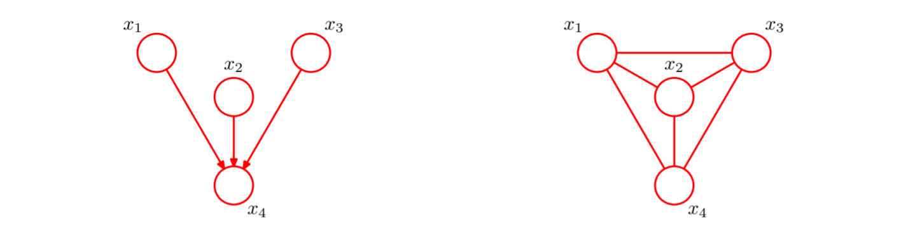

# Probabilistic Graphical Model

## 1 Basic Concepts

在概率图模型中，每个结点表示⼀个随机变量（或⼀组随机变量），链接表示这些变量之间的概率关系。这样，**图描述了联合概率分布在所有随机变量上能够分解为⼀组因子的乘积的方式**，每个因子只依赖于随机变量的⼀个子集。

传统上，从概率图的表示形式上，可以将其分为概率有向图模型，即*贝叶斯网络*（Bayesian network），和概率无向图模型，即*马尔科夫随机场*（Markov random fields）。

## 2 Bayesian Network

### 2.1 Concepts of Probabilistic Directed Graphs

贝叶斯网络以有向图的形式描述联合概率的分解方式，例如，对于一个一般的联合概率分布 $p(a,b,c)$，可以将其分解为：
$$
p(a,b,c)=p(a)p(b|a)p(c|a,b)
$$

然后，我们为每个变量分配一个节点，并以有向边的形式描述变量之间的依赖关系，这就形成了有向概率图：

关于上述分解方式，有趣的一点是左侧是对称的，而右侧是非对称的，这就说明我们为这三个变量指定了一个隐含的顺序。

对于一个更一般的有 $K$ 个节点的有向概率图，其表示的联合概率分布可以写作：

$$
p(\mathbf{x})=\prod_{k=1}^Kp(x_k|\mathrm{pa}_k)
$$

其中 $\mathrm{pa}_k$ 表示节点 $x_k$ 的父节点的集合。

贝叶斯网络的图结构需要满足的一个性质是无环，即所有贝叶斯网络均是有向无环图（DAG）。

### 2.2 Patterns of Subgraphs

贝叶斯网络中有三种基本的子图模式：

#### 2.2.1 Tail-to-Tail

根据有向图的联合概率分解方式，该概率图表示的联合概率可以写作：
$$
p(a,b,c)=p(a|c)p(b|c)p(c)
$$

那么，根据上式，我们可以写出：
$$
p(a,b)=\int_cp(a,b,c)\mathrm{d}c=\int_cp(a|c)p(b|c)p(c)\mathrm{d}c\not ={p(a)p(b)}
$$

$$
p(a,b|c)=\frac{p(a,b,c)}{p(c)}=p(a|c)p(b|c)
$$

这说明，通常情况下变量 $a$ 与 $b$ 并不独立。而给定变量 $c$ 的条件下变量 $a$ 与 $b$ 条件独立。

#### 2.2.2 Tail-to-Head

对于这种情况，可以类似地对联合概率进行分解：
$$
p(a,b,c)=p(a)p(c|a)p(b|c)
$$

同样地，根据上式写出：
$$
p(a,b)=\int_cp(a,b,c)\mathrm{d}c=p(a)\int_cp(c|a)p(b|c)\mathrm{d}c=p(a)p(b|a)\not ={p(a)p(b)}
$$

$$
p(a,b|c)=\frac{p(a,b,c)}{p(c)}=\frac{p(a)p(c|a)p(b|c)}{p(c)}=\frac{p(a,c)}{p(c)}p(b|c)=p(a|c)p(b|c)
$$

这显示该子图的性质与第一种子图模式类似，即在通常情况下变量 $a$ 与 $b$ 并不独立。而给定变量 $c$ 的条件下变量 $a$ 与 $b$ 条件独立。

#### 2.2.3 Head-to-Head

进行类似的联合概率分解处理：
$$
p(a,b,c)=p(a)p(b)p(c|a,b)
$$

这种子图模式与前两种存在显著的区别：
$$
p(a,b)=\int_cp(a,b,c)\mathrm{d}c=p(a)p(b)\int_cp(c|a,b)\mathrm{d}c=p(a)p(b)
$$

这表明在通常情况下变量 $a$ 和变量 $b$ 就是独立的。
$$
p(a,b|c)=\frac{p(a,b,c)}{p(c)}=\frac{p(a)p(b)p(c|a,b)}{p(c)}\not ={p(a|c)p(b|c)}
$$

这表明在以观测到的 $c$ 值作为条件时，变量 $a$ 和变量 $b$ 之间反而不独立了。

更一般的结论是，在这类的子图中，如果 $c$ 节点或者它的任何一个后继被观测到，那么变量 $a$ 和变量 $b$ 之间就不再独立，或者说路径“解除阻隔”。

### 2.3 d-Separation

d-separation 刻画了变量之间的条件独立关系与其概率图的拓扑结构的等价关系，提供了一种更通用的从有向概率图中提取条件独立性的框架。d-separation 将有向图的节点划分为三个节点集合 $A$、$B$ 和 $C$，当以下条件均被满足时，认为 $A$ 中节点和 $B$ 中节点在给定 $C$ 中节点时条件独立：

- $A$ 中任意节点到 $B$ 中任意节点的路径中，head-to-tail 和 tail-to-tail 型的节点均位于集合 $C$ 中
- $A$ 中任意节点到 $B$ 中任意节点的路径中，head-to-head 型的节点及其后继均不位于集合 $C$ 中

我们称 $C$ 是对 $A$、$B$ 的 d-separation。

### 2.4 Markov Blanket

对于一个含有 $D$ 个节点的概率图，根据联合概率的因子分解性质，我们可以将某个节点的条件概率写作：
$$
p(x_i|x_{\{j\not ={i}\}})=\frac{p(x_1,x_2,\dotsb,x_D)}{\int_{x_i}p(x_1,x_2,\dotsb,x_D)\mathrm{d}x_i}=\frac{\prod_kp(x_k|\mathrm{pa}_k)}{\int_{x_i}\prod_kp(x_k|\mathrm{pa}_k)\mathrm{d}x_i}
$$

观察上式，形如 $p(x_i|\mathrm{pa}_i)$ 的因式依赖于节点 $x_i$ 的父节点，而形如 $p(x_j|\mathrm{pa}_j),i\not ={j},x_i\in\mathrm{pa}_j$ 的因式依赖于 $x_i$ 的子节点及配偶节点，我们把由某个节点的父节点、子节点、配偶节点组成的节点集合称为该节点的马尔可夫毯，一个节点的条件概率分布独立于除其马尔可夫毯中节点外的所有节点。

## 3 Markov Random Fields

马尔可夫随机场是无向的概率图模型，在贝叶斯网络中，我们首先讨论了联合概率的分解规则，然后讨论了与之对应的条件独立性（d-separation），在无向图模型中，首先对条件独立性进行讨论更加方便。

### 3.1 Conditional Independence

类似于 d-separation 我们考虑三个节点集合，$A$、$B$ 和 $C$。由于马尔可夫随机场中边的无向性，head-to-head 型节点的特殊性不能体现，因此，无向图中只满足对于连接 $A$、$B$ 中任意节点的任意路径，其途径的节点均位于 $C$ 中，且不存在连接二者的直接路径，即可认为 $A$ 中节点和 $B$ 中节点在给定 $C$ 中节点时条件独立。

由此，我们可以推出无向图模型中的 Markov blanket 只包括相邻节点，即节点的条件概率只依赖于相邻节点，与其他节点无关。

### 3.2 Decomposition Property

通过无向图的条件独立性，我们可以推出，对于图中任意两个没有直接相连的节点 $x_i$、$x_j$，在给定其他节点的情况下，这两个节点一定是条件独立的，因为连接这两个节点的所有路径均被观测节点阻隔：
$$
p(x_i,x_j|\mathbf{x}_{\backslash\{i,j\}})=p(x_i|\mathbf{x}_{\backslash\{i,j\}})p(x_j|\mathbf{x}_{\backslash\{i,j\}})
$$

因此，联合概率的分解规则需要满足不使 $x_i$、$x_j$ 出现在同一因子中，从而使属于这个图的所有可能的概率分布均满足条件独立性质。由此我们使用*团块*（clique）的概念，团块是图中节点的一个子集，且集合中任意两个节点之间均存在直接连接，*最大团块*（maximal clique）是指无法新纳入任何一个图中节点使得团块仍然符合定义要求。于是，我们可以将联合概率分布分解的因子定义为（最大）团块的函数，将团块记作 $C$，将团块中的元素记作 $\mathbf{x}_C$，联合概率分布可以写作图的最大团块的势函数 $\psi_C(\mathbf{x}_C)$ 的乘积的（归一化）形式：
$$
p(\mathbf{x})=\frac{1}{Z}\prod_C\psi_C(\mathbf{x}_C)
$$

其中，$Z$ 为划分函数（partition function），$Z=\sum_\mathbf{x}\prod_C\psi_C(\mathbf{x}_C)$，其意义是保证联合概率分布被正确地归一化，划分函数的存在主要是由于在无向图模型中我们并不对势函数的形式进行限制，并不假定其具有具体的概率意义。划分函数的计算是无向图的一个主要缺点其计算复杂度为 $O(m^n)$，$m$ 为节点状态数，$n$ 为图中的节点数。对于局部条件概率的计算，归一化常数是不需要的。

由于势函数被限制为严格大于零，因此使用指数形式的势函数是合理的：
$$
\psi_C(\mathbf{x}_C)=\exp\{-E(\mathbf{x}_C)\}
$$

其中，$E(\mathbf{x}_C)$ 称为能量函数，该指数表示被称为*玻尔兹曼分布*（Boltzmann distribution），联合概率被定义为势函数的乘积，因此总能量可以通过将每个最大团的能量相加得到。

由于势函数并不具有概率意义，因此选择势函数的自由度较大，但是这也使得选择合适的势函数成为了一个问题。

Hammersley-Clifford 定理保证了划分性质和条件独立性质对概率分布的约束是等价的。

### 3.3 Relationship to Directed Graphs

考虑如何将一个有向概率图转化为无向概率图，只需要找到两者联合概率因子分解之间的关系，然后将无向概率图中的势函数以有向概率图中联合概率的因子分解中的条件概率因式表示即可，首先是一种最简单的情况：

那么，在有向图中的因子分解可以写作：
$$
p(\mathbf{x})=p(x_1)p(x_2|x_1)\dotsb p(x_{N}|x_{N-1})
$$

而无向图表示中，最大团为两个相邻的节点，其因子分解应当满足以下的形式：
$$
p(\mathbf{x})=\frac{1}{Z}\psi_{1,2}(x_1,x_2)\psi_{2,3}(x_2,x_3)\dotsb\psi_{N-1,N}(x_{N-1},x_N)
$$

那么我们么只需要简单地令：
$$
\psi_{1,2}(x_1,x_2)=p(x_1)p(x_2|x_1)
$$

$$
\psi_{1,2}(x_2,x_3)=p(x_3|x_2)
$$

$$
\dotsb
$$

$$
\psi_{1,2}(x_N,x_{N-1})=p(x_N|x_{N-1})
$$

同时令 $Z=1$ 即可满足要求。

对于更一般的有向图，我们需要确保因子分解中的每个条件概率因式至少出现在一个势函数中，即每个因式中的节点至少属于同一个最大团，对于父节点单一的节点，这是易于保证的，可以简单地将有向边直接替换为无向边，但是对于 head-to-head 型的节点，由于其条件概率因式同时依赖于所有父节点，而这些父节点往往并不能直接属于同一个最大团，因此，我们需要在这些父节点之间建立新的连接，确保它们是全连通的。

以此方式形成的无向概率图称为道德图（moral graph）。将有向图转换为无向图之后，图中的节点失去了部分条件独立性质。

### 3.4 Denpendency Map、Independence Map、Perfect Map

如果一个概率分布中的所有条件独立性质都通过一个图反映出来，那么这个图被称为这个概率分布的 D 图（dependency map），因此，一个完全非连接的图是任何概率分布的平凡 D 图，因为其反映所有形式的条件独立性质。

如果一个图中的每个条件独立性质都由某个概率分布满足，那么称这个图这这个概率分布的 I 图（independence map），因此，一个全连接的图是任何概率分布的平凡 I 图，因为其不反应任何形式的条件独立性质。

如果概率分布的每个条件独立性质都由可以由图反映出来，反之也成立，那么这个图被称为是概率分布的完美图（perfect map），一个完美图既是 I 图又是 D 图。

## 4 Inference

将图中的一些节点限制为观测值，尝试求出其他节点的后验概率分布，这类问题称为推断（inference）问题。概率图的推断方式可以分为精确推断、近似推断两种。

### 4.1 Inference for Chain Structure

对于一个链结构的有向图，我们可以将其转化为等价的无向图，并给出其联合概率的因子分解形式：
$$
p(\mathbf{x})=\frac{1}{Z}\psi_{1,2}(x_1,x_2)\psi_{2,3}(x_2,x_3)\dotsb\psi_{N-1,N}(x_{N-1},x_N)
$$

为了解决求边缘概率分布 $p(x_n)$ 的推断问题，我们可以通过求和或积分的形式在联合概率中消去其余变量：
$$
p(x_n)=\sum_{x_1}\sum_{x_2}\dotsb\sum_{x_{n-1}}\sum_{x_n}\dotsb\sum_{x_N}\frac{1}{Z}\psi_{1,2}(x_1,x_2)\psi_{2,3}(x_2,x_3)\dotsb\psi_{N-1,N}(x_{N-1},x_N)
$$

这种计算方式称为变量消除，以这种方式直接进行计算，计算复杂度为 $O(K^N)$，$K$ 为节点状态数，$N$ 为节点数，因此计算代价是极大的。

考察上式对各节点状态的依赖形式，我们可以写出以下变形：
$$
p(x_n)=\frac{1}{Z}\left[\sum_{x_{n-1}}\psi_{n-1,n}(x_{n-1},x_{n})\left[\sum_{x_{n-2}}\psi_{n-2,n-1}(x_{n-3},x_{n-2})\dotsb\left[\sum_{x_1}\psi_{1,2}(x_1,x_2)\right]\dotsb\right]\right]\left[\sum_{x_{n+1}}\psi_{n,n+1}(x_{n},x_{n+1})\dotsb\left[\sum_{x_{N}}\psi_{N-1,N}(x_{N-1},x_{N})\right]\dotsb\right]
$$

这种简化形式的基本原理是乘法分配律：
$$
ab+ac=a(b+c)
$$

使用这种形式进行计算，计算复杂度为 $O(NK^2)$。

直接使用上式进行计算的问题是，如果需要对多个节点的边缘概率分布进行计算，需要计算大量重复的因式，计算效率低。观察上式，可见，一个节点的边缘概率分布可以被写作两个部分，我们给出以下定义：
$$
\mu_\alpha(x_n)=\sum_{x_{n-1}}\psi_{n-1,n}(x_{n-1},x_{n})\left[\sum_{x_{n-2}}\dotsb\right]=\sum_{x_{n-1}}\psi_{n-1,n}(x_{n-1},x_{n})\mu_\alpha(x_{n-1})
$$

$$
\mu_\beta(x_n)=\sum_{x_{n+1}}\psi_{n,n+1}(x_{n},x_{n+1})\left[\sum_{x_{n+2}}\dotsb\right]=\sum_{x_{n+1}}\psi_{n,n+1}(x_{n},x_{n+1})\mu_\beta(x_{n+1})
$$

那么边缘概率分布可以表示为：
$$
p(x_n)=\frac{1}{Z}\mu_\alpha(x_n)\mu_\beta(x_n)
$$

这种推断方式将边缘概率分布表示为了前后向的信念的乘积。

特别地，如果有变量的值被观测到，那么其值只需要限制为观测值即可，无需求和处理。

对于两个相邻节点的联合概率分布，求法是类似的：
$$
p(x_{n-1},x_n)=\frac{1}{Z}\mu_\alpha(x_{n-1})\psi_{n-1,n}(x_{n-1},x_{n})\mu_\beta(x_n)
$$

### 4.2 Inference for Tree Structure

树是一种特殊的图结构：

- 在无向图中，树是指任意一对节点之间只有一条路径的图
- 在有向图中，树是指仅有一个节点无父节点（根节点），其余节点均只有一个父节点的图

因此，一个有向树对应的道德图不会增加任何边，同时是无环的。

如果有向图不满足父节点数量的限制，但是任意两个节点之间只有一条路径（忽略边的方向），这样的图被称为多树（polytree）。

#### 4.2.1 Factor-Graph

因子图将联合概率分布的因子分解方式纳入了图的显式表示中，如果将联合概率分布表示为一组因子的乘积：
$$
p(x)=\prod_sf_s(\mathbf{x_s})
$$

$\mathbf{x_s}$ 表示与因子相关的变量的集合，这个表述对于有向图和无向图是统一的。在因子图中，除了使用节点表示变量之外，还使用另一组节点表示因子本身，例如对一个因子分解为 $p(\mathbf{x})=f_a(x_1,x_2)f_b(x_1,x_2)f_c(x_2,x_3)f_d(x_3)$ 的概率分布对应的因子图为：

因子图是二分图，因为其是异质图，含有两类节点，同时所有边均位于两类节点之间。

一个图可以对应多个等价的因子图形式，将一个有向树或无向树转化为因子图，生成的因子图也是树。

#### 4.2.2 Sum-Product Algorithm

加和-乘积算法是一种精确推断算法，在无环图中，其相当于信念传播（belief propagation）算法。

首先将图转化为因子图，使得我们可以统一地处理有向图和无向图，根据定义，边缘概率分布通过对所有 $x$ 之外的变量上的联合概率分布进行求和的方式得到：
$$
p(x)=\sum_{\mathbf{x}\backslash x}p(\mathbf{x})
$$

对于有树结构的图，我们可以将联合概率中的因子划分为若干组：
$$
p(\mathbf{x})=\prod_{s\in\mathrm{ne}(x)}F_s(x,X_s)
$$

$\mathrm{ne}(x)$ 表示与变量节点 $x$ 相连的因子节点集合，$X_s$ 表示所有通过因子节点 $f_s$ 与变量节点 $x$ 相关联的变量节点，$F_s(x,X_s)$ 表示分式中所有与 $f_s$ 相关联的因式的乘积：

带入边缘概率的表达式，同时类似与链结构中的操作，交换加法与乘积的位置，得到：
$$
p(x)=\sum_{\mathbf{x}\backslash x}\prod_{s\in\mathrm{ne}(x)}F_s(x,X_s)=\prod_{s\in\mathrm{ne}(x)}\left[\sum_{X_s}F_s(x,X_s)\right]=\prod_{s\in \mathrm{ne}(x)}\mu_{f_s\rightarrow x}(x)
$$

称 $\mu_{f_s\rightarrow x}(x)$ 为因子节点 $f_s$ 传递至变量节点 $x$ 的信息（message）。
